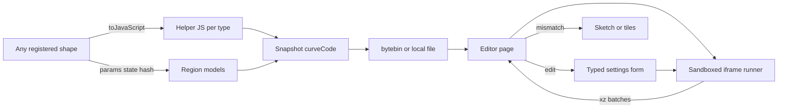
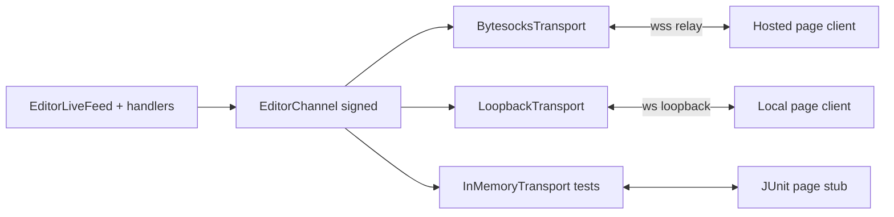

# Requirements

### Overview & Goals
The main target is the **hosted editor at `https://dailystruggle.github.io/RTP/editor/`**, which works the way LuckPerms' editor does. `/rtp editor` uploads one gzip snapshot to bytebin (`EditorCmd` -> `EditorSessionManager.createPayloadJson()` -> `EditorHttpTransport.postPayload`), and the static page reads it once. There is no live feed, no path tiles and no loopback. Today a hosted user gets only the 2,048-point sketch of the path and an export-time hazard grid.

The core problem is that **shapes are registered at runtime** (`RTP.addShape(Shape)`, add-on jars, `ChunkyRTPShape` created on the fly from Chunky borders). So the page cannot ship its own model of the shapes, and a build-time compile of this repo's shapes would miss them.

The approach for now is that each shape supplies its own curve as JavaScript through a `toJavaScript()` helper. Automating that step (translating the shape's Java to JS or WASM) is noted as later work. The goal is for the hosted page to draw the complete walk path and the hazards at any zoom, for any shape that provides a helper, from very little data:
- **Curve code, once per shape type:** the helper JS, run in a sandbox. It takes the shape's settings (radius, centerRadius, centerX, ...) as inputs and doesn't bake them in as constants. So when the user edits a value in the region editor, the page redraws the path itself.
- **Typed settings form:** after the shape dropdown, the page builds the settings form from the shape's declared parameters (`getParameters()`: `DistanceParameter`, `IntegerParameter`, `FloatParameter`, `BooleanParameter`, `EnumParameter`, with descriptions and suggestions). Add-on shapes get a form too.
- **Per region in the snapshot:** the current settings, a few runtime state values (for example the effective radius under `expand`), a check hash and compact hazard runs in curve-position space.

The hosted page should also be **two-way, like LuckPerms**. The plugin opens a channel on a WebSocket relay (bytesocks) and puts the channel id and its public key in the snapshot. Every message is signed, and the plugin acts on edits only from browser keys the operator has trusted in game. Over that channel, the plugin sends live updates (curve changes, hazard deltas, sharper land bins), and the page sends view focus, walk-path preview requests and Hot-Apply.

The local export (`/rtp editor local`, and the automatic fallback when the upload fails) uses **exactly the same snapshot format and the same signed protocol**, carried over the existing loopback socket. An in-memory transport runs the same protocol code in unit tests, so local mode and tests exercise everything hosted mode does except the relay hop.

### Scope
**In scope**
- An ADR describing the shape curve helper contract, the sandbox, the curve-space run layers and the two-way editor channel. Translating shapes to JS automatically is recorded there as future work.
- **Shape SPI:**
  - `MemoryShape.toJavaScript()` returns the curve helper source, or `null` when there is none.
  - The default implementation loads `editor-curve/<SimpleClassName>.js` through the shape class's own classloader, so an add-on only needs to ship one resource file (or override the method).
  - `MemoryShape.curveState()` returns the runtime values the curve depends on that are not settings.
- **Built-in helpers** for every built-in shape: CIRCLE/SQUARE dual-layer, the legacy spirals, Rectangle, Ellipse, Polygon and the Normal variants. They are ported from the client models removed from `index.html` earlier (in git HEAD) and checked against the Java code by a parity test. The shapes' Java code is not changed.
- **Typed shape settings in the schema** (`buildSchemaJson`): kind, description and suggestions from `getParameters()`, plus defaults. The page uses them to build the settings form after the shape dropdown.
- The **uploaded snapshot** carries:
  - `curveCode: {SHAPE: {sha256, js}}` once per shape type in use;
  - per region, `curve: {shape, params, state, hash}`.
  - The page draws from the helper and falls back to the 2,048-point sketch (hosted) or the path tiles (local) on any failure or mismatch.
- The snapshot's region models carry hazard runs `[deltaStart, len, cause]`, replacing the export-time 2D RLE grid for regions drawn from code. uniquePlacement spacing marks are hidden.
- **One signed editor protocol that doesn't depend on its transport**:
  - Envelope `{msg, signature}`, SHA256withRSA, the LuckPerms format.
  - Handshake and trust: `hello` / `hello-reply`, `/rtp editor trust <nonce>`, trusted key fingerprints persisted.
  - Message types: `feed`, `curve`, `curve-state`, `hazard-delta`, `land`, `focus`, `walkpath`, `apply` / `apply_ack`, `ping` / `pong`.
  - Three transports: the bytesocks relay (hosted), the existing `EditorLoopbackChannel` (local) and an in-memory pair (tests).
- **Hosted live session:**
  - `/rtp editor` creates a relay channel, joins it outbound and keeps it for the session lifetime (30 minutes, as for the local feed).
  - Over it: curve changes, hazard run deltas, focus-driven land bins, walk-path previews of edited shapes, and Hot-Apply through the same validation as `/rtp editor apply`.
- The trust prompt and channel status messages are configurable in `messages.yml`, with locale parity (REQ-RTP-F-013, S-007).

**Out of scope (later)**
- Generating `toJavaScript()` automatically from the shape's bytecode (JVM-to-JS/WASM translation). The helper contract is designed so a generator can fill it in later without changing the page.
- A helper for `ChunkyRTPShape` and other add-on shapes that ship none: they keep the sketch or tiles.
- Biome and landing runs, viewport-interval queries, binary frames and deflate (described in the ADR, not built yet).
- Landing-heat streaming over the channel, which stays on the local feed files for now.
- A self-hosted RTP relay. The relay URL is configurable, but no relay is built.
- Removing the local `feed.js` file polling. It stays as the one-way fallback for a page copied off the server machine.
- Loading `editor-data.json` (shipped configs, field docs, synonyms) from the site instead of uploading it in every snapshot: noted in the ADR as the next traffic saving.

### Functional Requirements
- On the **hosted page**, the walk path of every region whose shape has a helper is complete at every zoom, drawn from the snapshot with no further requests. The local export behaves the same way.
- **Editing the settings redraws the path locally:**
  - Changing a setting in the generated form (for example the radius) redraws the path immediately from the helper.
  - Runtime state (`state`) that depends on the edited settings is refreshed over the channel with a small `curve-state` request, which is evaluated on a temporary shape the way `EditorWalkPathPreview` builds one.
  - With no channel connected, the helper falls back to its own rule for missing state (for example `rEff = radius`, P derived from the radius), and the preview is labelled "estimated".
- **Settings form:** after the shape dropdown, the page shows one input per shape setting, typed from the schema:
  - distance values accept the unit suffixes (`b`/`c`/`r`/`km`/`mi`);
  - integers and numbers get number inputs with the suggestions as presets;
  - booleans get a checkbox, and enums a select.
  - Settings the shape doesn't declare are not shown, and add-on shapes work the same way.
- The page never draws a wrong curve. It falls back to the sketch (hosted) or the tiles (local) when:
  - there is no helper;
  - the helper's SHA-256 doesn't match its `sha256`;
  - the helper throws, times out or returns malformed output;
  - its hash of `locationToXZ` over 256 fixed sample positions differs from the plugin's.
  - The status badge names the shape and the reason.
- **Helper code never runs with page privileges.** It runs in a sandboxed iframe with an opaque origin (`sandbox="allow-scripts"`, CSP `default-src 'none'`), inside a Worker where available. It has no access to the page DOM, its storage, its WebCrypto keys or the network, communicates only through `postMessage` with numbers, and is stopped on timeout. A crafted bytebin upload therefore can't run script on the `dailystruggle.github.io` origin (ADR-104 section 4.5).
- Hazards in the snapshot line up with the path by design, and spacing marks are not shown. Locally, a hazard change shows up within one feed cycle.
- After `expand` changes the effective radius, the channel sends the new curve settings and the page redraws (snapshot only, if no channel is connected).
- **Channel security:**
  - The page accepts only messages signed by the plugin key named in its snapshot.
  - The plugin accepts page messages other than `hello` / `ping` only from trusted editor keys, with valid signatures and increasing sequence numbers.
  - An untrusted key gets one in-game prompt, sent to the operator who created the session, with a clickable `/rtp editor trust <nonce>`.
  - Apply still runs the full `/rtp editor apply` validation pipeline.
- **Relay failure is never silent (S-004):** a failed create or connect, a disconnect or the expiry is logged and shown in the page's status badge, and the page keeps working from the snapshot.
- Local mode follows the identical handshake and messages over the loopback, so a local session is a faithful test of the hosted flow.
- The shapes' Java curve code is not touched, so curve positions and existing `.bin` data stay valid.

### Non-Functional Requirements
- Helper size is capped at 32 KiB per shape type (refused and logged above that), and the built-in helpers are a few KB each. Each shape type's code is sent once per snapshot, however many regions use it.
- The sandbox handles batches of locations (for example 16k per `postMessage`), so drawing the viewport stays within a frame budget.
- Snapshot size: per region, the curve fields are about 100-200 bytes and the hazard runs about 2-4 bytes per run. For regions drawn from code, the snapshot no longer carries the 2,048-point sketch (about 30 KB of JSON per region). The sketch is kept only for regions that fall back.
- No main-thread work (S-005). Building the payload stays async (`CompletableFuture.supplyAsync` in `EditorCmd`). The relay client is the JDK `java.net.http.WebSocket` on the existing `HttpClient` (no new dependency, no raw threads). Per-tick channel work is driven by `RTP.scheduler`, the same as `EditorLiveFeed`.
- Relay frames are capped at 32 KiB, with an outbound cap of 2 MiB per session per minute. Anything bigger (for example a large apply) goes through bytebin and is referenced by key, the LuckPerms pattern.
- No inbound listener is added. The relay connection is outbound, so ADR-104's "zero inbound attack surface" still holds.
- The `file://` export works offline because the helpers travel in the embedded payload.

# Technical Design

### Current Implementation
- **Shapes are open-ended.** `RTP.addShape(Shape)` registers built-ins in `RTP` (lines 1206-1216), add-on shapes, and `ChunkyRTPShape` instances created at runtime (`ChunkyChecker`, `ChunkyBorderChecker`).
- Each shape declares typed settings in `getParameters()`, a `Map<String, CommandParameter>` (for example `Circle.subParameters`: `DistanceParameter` radius with suggestions 64-1024, `IntegerParameter` uniquePlacements and so on), plus defaults in `getData()`. `EditorSessionManager.buildSchemaJson` / `describeParam` currently sends only `{type, default, options}`, inferred from the defaults.
- The curve math reads its settings at call time (`getNumber(GenericMemoryShapeParams.radius, 256L)` in `CircleOptimizedDualLayer.xzToLocation`) and also uses runtime state:
  - `getEffectiveRadius()` grows with `badPrefixSumsCache` when `expand` is on;
  - `AbstractDualLayerShape.getPointEdgeChunks()` is a cache that only ratchets up.
- **Hosted path:** `EditorCmd.onCommand` calls `EditorSessionManager.createPayloadJson()`, which holds configs, schema, docs, the `editor-data.json` members, `buildRegionModelsJson()` (per region from `generateVisualizationPayload`: a 2D hazard RLE from `CoordinateRunEncoder`, the 2,048-point walk-path sketch and histograms) and `buildWorldBiomesJson(false)`. `EditorHttpTransport.postPayload` gzips it to bytebin. The page at `DEFAULT_EDITOR_URL` fetches it once.
- **Local path** (`/rtp editor local`, or the fallback when the upload fails): the same payload is embedded in the file. `EditorLiveFeed` adds per-chunk path tiles (`WalkPathTiles`), `HazardTiles` (a 2D `causeAt` rescan) and the loopback channel.
- MkDocs (`docs_dir: docs`) publishes `docs/editor/` as static files, so `editor-data.json` already sits beside the hosted page.
- **Existing message handling (local only):**
  - `EditorLoopbackChannel` (`Listener.onMessage`, `broadcast`) carries unsigned JSON: `feed` push, `focus` (`EditorLiveFeed` page-message queue), `walkpath` (`EditorWalkPathPreview`) and `apply` / `apply_ack` (`EditorLoopbackApply`, token-gated).
  - These handlers parse their own messages and are tied to the loopback.

### Key Decisions
1. **The shape owns its JS (`toJavaScript()`), for today.** It works the same for built-in, add-on and runtime-created shapes, and needs no build tooling or changes to the curve math. The cost is a hand-written helper per shape. That is guarded by a Java/JS parity test for built-ins and by the runtime hash for everything. A later generator only has to produce the same contract.
2. **Settings are inputs, not constants.** The helper receives `params` (keyed by the shape's setting names, values already normalised to chunks and numbers by the plugin's own parsers) and `state` (from `curveState()`, for example `{rEff, p}`). It must derive the state itself when it's missing. This lets the page redraw on edits.
3. **Helper contract** (one JS expression; numbers are doubles, exact below 2^53, and the hash catches overflow):
   ```js
   ({ range(params, state),            // number of curve positions
      locationToXZ(loc, params, state), // [x, z] chunk, or null
      xzToLocation(x, z, params, state) // position, or -1
   })
   ```
4. **Untrusted code runs in a sandbox, not on the page origin.** Payload JS is never `eval`'d on the page. A sandboxed iframe (opaque origin, no network through CSP) runs the helper in a Worker when available, receives batches through `postMessage` and is killed on timeout. Hosted and local use the same runner.
5. **Fail closed.** The plugin sends `hash32(locationToXZ(s_i))` over 256 fixed sample positions per region. On a mismatch, or on any runner failure, the page draws the sketch (hosted) or the tiles (local).
6. **Hosted-first, snapshot-carried.** Helpers, settings, state, hash and hazard runs go in the uploaded snapshot. The channel reuses the same format for updates, so the hosted page works fully without a feed.
7. **LuckPerms-style signed channel over a public relay.**
   - The plugin creates a bytesocks channel (default `https://bytesocks.lucko.me`, configurable next to the bytebin URL in `EditorHttpTransport`) and joins it over `wss`.
   - The snapshot carries `channel: {relay, id, pluginKey}`. The plugin generates an RSA-2048 key pair per server, persisted in `<dataFolder>/editor/keys/`.
   - The page generates a non-extractable WebCrypto RSA key, kept in IndexedDB so the same browser stays trusted.
   - SHA256withRSA (RSASSA-PKCS1-v1_5) works the same in Java and WebCrypto with no signature-format conversion.
8. **One protocol, pluggable transports.** `EditorChannel` holds the envelope, signing, trust, sequence numbers and routing. `ChannelTransport` is just `send(String)` plus an inbound callback. The existing handlers (`EditorWalkPathPreview`, `EditorLoopbackApply`, feed focus) register with `EditorChannel` instead of the loopback, so local, hosted and test runs share every line except the socket.

### Proposed Changes
- `MemoryShape`:
  - `public String toJavaScript()` loads `editor-curve/<SimpleClassName>.js` from `getClass()`, walking up the superclasses so subclasses inherit the helper, and caches the result. Missing returns `null`; over 32 KiB is refused and logged.
  - `public Map<String, Object> curveState()` defaults to an empty map.
  - `AbstractDualLayerShape` and `CircleOptimizedDualLayer` override it to return `{p: getPointEdgeChunks(), rEff: getEffectiveRadius()}`, and the others as needed.
  - New `CurveHash.of(MemoryShape)`: 256 positions spread over `[0, getRange())`, FNV-1a over the `(x, z)` pairs.
- Resources `rtp-core/src/main/resources/editor-curve/*.js`: `CircleOptimizedDualLayer.js` and `SquareOptimizedDualLayer.js` (with a shared Hilbert/orientation part inlined in each, so every helper stays self-contained), `Circle.js`, `Square.js`, `Rectangle.js`, `Ellipse.js`, `Polygon.js`, `Circle_Normal.js`, `Square_Normal.js`.
- `EditorSessionManager`:
  - `describeParam` and `factoryParams` add `kind` (`distance | integer | number | boolean | enum`), `description` and `suggestions` from `getParameters()`, plus `curveParams` (the setting names the helper reads).
  - `generateVisualizationPayload` adds `curve: {shape, params, state, hash}` and `hazardRuns: {v, runs: base64 varints [deltaStart, len, cause]}` from `badLocationsSnapshot`, with uniquePlacement filtered out.
  - `createPayloadJson` adds `curveCode` for the shape types in use. Regions whose shape has a helper drop the 2D hazard RLE and the 2,048-point sketch; the others keep both.
- `EditorWalkPathPreview`: also answers `curve-state` (the temporary shape's `curveState()` and hash for edited settings), sharing its build and size limits.
- `EditorLiveFeed`:
  - Publish `curve` changes (for example on expansion) and `hazard-delta` (added/removed runs against the last version sent) to the session's `EditorChannel`.
  - Publish focus-driven `land` bin batches the same way.
  - Locally it also keeps writing the feed files as the one-way fallback.
  - Skip `WalkPathTiles` and `HazardTiles` for regions whose helper passed the check (the page reports this through `focus`).
- New in `rtp-core/.../commands/editor/channel/`:
  - `EditorChannel`: envelope, sign/verify, `hello` handshake, trust, sequence numbers, routing by `type`, outbound caps.
  - `ChannelTransport`, with three implementations: `LoopbackTransport` (wraps `EditorLoopbackChannel`), `BytesocksTransport` (create channel over HTTP, then `java.net.http.WebSocket`, reconnect with backoff, S-004 logging) and `InMemoryTransport` (test pair).
  - `EditorKeys`: the plugin key pair. `TrustedEditors`: fingerprints persisted with an atomic write.
  - `TrustCmd`: `/rtp editor trust <nonce>`, permission `rtp.editor`.
- `EditorCmd`: create the relay channel before upload, add `channel` to the payload, and start the session's live producers. If the relay fails, the upload still goes ahead as a snapshot-only session, and the reason is logged.
- **Hosted startup never blocks on a future.** `RTPArchitectureTest.no_blocking_future_calls_in_core_or_api` bans `CompletableFuture.get/join` in core, so no exclusion is added for the editor classes. Instead:
  - `ChannelTransport.start(Listener)` returns `CompletableFuture<Void>`, which completes when the transport is open. Loopback and in-memory return an already completed future.
  - `EditorChannel.start()` returns `CompletableFuture<EditorChannel>`.
  - `EditorChannelWiring.openHosted(...)` returns `CompletableFuture<EditorChannel>`, chaining `BytesocksTransport.createChannel(...)` into `start(...)`. It completes with `null` (snapshot-only, logged and told to the operator) on failure or timeout (`orTimeout` / `completeOnTimeout`), and never completes exceptionally.
  - `EditorCmd` chains `openHosted(...).thenCompose(ch -> payload + postPayload)` instead of calling it inside `supplyAsync`.
- `EditorLocalSubCmd` / local export: the same `channel` block, using the loopback address as the relay.
- `messages.yml`, `lang/*`, `messages.lang.yml`: trust prompt, trusted / rejected, and channel opened / lost / expired.
- `docs/editor/index.html`:
  - `CurveSandbox`: builds the sandboxed iframe from a fixed `srcdoc` runner (page code only), loads each helper after checking its SHA-256 (`crypto.subtle`), and offers `toXZ(shape, params, state, Float64Array locs)` with batching and a timeout. It checks each region's hash before use.
  - A generic settings form after the shape dropdown, built from the schema's `kind` / `suggestions` / `description`, replaces the fixed radius and centre inputs. Edits redraw the path through `CurveSandbox` and send `curve-state` over the channel when connected.
  - Draw the path at any zoom within a time budget per frame: sample fewer positions when zoomed out, and every position in view when zoomed in.
  - Draw hazard runs by mapping their positions through the helper's `locationToXZ`, and paint by coverage when zoomed out.
  - On any failure, use the existing sketch or tile rendering.
  - One `EditorChannelClient` (signing, verifying, handshake, reconnect) connects to `snapshot.channel.relay`, which is `wss://` bytesocks for hosted sessions or the loopback `ws://` locally. The existing `focus` / `walkpath` / `apply` callers move onto it, and the status badge shows the channel state (connected, awaiting trust, snapshot only).

### Architecture Diagram


Two-way channel (same protocol for every transport):


### Risks
- **A hand-written helper drifts from its Java shape.** Mitigated by the parity test for built-ins and the runtime hash for every shape (including add-ons), with a visible fallback. Future automation removes this risk.
- **Sandbox escape or abuse.** Opaque origin plus CSP blocks DOM, storage and network access. An infinite loop is handled by the Worker timeout. Where a Worker can't be created inside the opaque origin (to be confirmed per browser in the probe), the iframe runs small batches, and the timeout removes the iframe. Helper code is never `eval`'d on the page origin.
- **Double precision.** Positions above 2^53, and `Math.sin`/`atan2` differing by 1 ulp from Java, would show up as a hash mismatch, and the page falls back.
- **The parity test needs a JS engine.** Java 21 has no built-in one, so a test-only GraalJS (`org.graalvm.polyglot:polyglot` + `js-community`) is added to rtp-core's test classpath. It is never shipped.
- **Depending on a third-party relay** (`bytesocks.lucko.me`, as with bytebin today). Mitigated by making the URL configurable, by the snapshot-only fallback and by the frame caps. The relay sees message contents, which are signed but not encrypted (the same as LuckPerms), so no secrets go over the channel: no tokens, and applied YAML only.
- **A stolen channel id gives read access to live map data.** It is as sensitive as the bytebin key, which is already unlisted. Writes need a trusted, signed key.

# Testing

### Validation Approach
Targeted `:rtp-core:test` runs (editor, channel and shapes tests, including the GraalJS helper parity test), `:rtp-plugin:test --tests "*LocaleParityTest*"` for the new messages, the Python generator tests, and headless-Chrome probes of the page. No module is added, so module-level runs are enough. Protocol behaviour is unit-tested through `InMemoryTransport`. The local loopback, which runs the same code, is the end-to-end check, and the public relay is not contacted in tests.

### Key Scenarios
- **Helper parity:** for every built-in shape, across several radii, centre radii, centres (including negative) and P sizes, with `expand` on and off, `toJavaScript()` run in GraalJS with `params` + `curveState()` matches Java `locationToXZ` / `xzToLocation` on random and boundary positions, and `CurveHash` agrees.
- **Missing state:** with `state` left out, the helper's own rule matches a freshly built shape with the same settings.
- **Add-on route:** a test shape outside the shapes package, with only an `editor-curve/<Name>.js` resource, is picked up; one without a resource gets no `curve` and keeps the sketch.
- **Schema:** each shape setting carries `kind`, `description` and `suggestions` from `getParameters()`, for example `radius` as `distance` with 64-1024.
- **Settings form:** the headless page builds the form from the schema. Editing the radius redraws the path from the helper with no server request.
- **Hosted mode:** a headless probe serves `docs/editor/` over `http://localhost` (the Pages layout) and feeds the page a captured `createPayloadJson()` snapshot, the way a bytebin fetch would. The path is complete at overview zoom with no further requests, and hazards come from the runs.
- **Sandbox and fallbacks:** in the headless probe, a crafted helper that tries `parent.document`, `localStorage`, `indexedDB` or `fetch` gets nothing and causes no request. One that loops forever is stopped by the timeout. Helpers that throw, return wrong output, have a SHA-256 mismatch or a hash mismatch each draw the sketch with a badge reason and no page script error.
- **Local mode:** the same runner works from `file://`. Live hazard deltas apply correctly (add, then remove, then resync), and uniquePlacement is filtered out.
- **Snapshot size:** each helper appears once per shape type, regions drawn from code carry no sketch, and their curve fields stay under a byte cap.
- **Channel protocol (in-memory):**
  - Handshake leading to an untrusted state and a trust prompt, then `trust <nonce>` and a trusted state.
  - A forged signature, a replayed sequence number or an unknown type is dropped and logged.
  - Apply from an untrusted key is refused. Apply from a trusted key reaches the `/rtp editor apply` pipeline.
  - Oversized frames are refused, and the outbound cap holds.
- **Same code over loopback:** a headless page talks to a real `EditorLoopbackChannel` through `EditorChannelClient`: handshake, `walkpath` reply, `hazard-delta` applied, and Hot-Apply acknowledged.
- **Relay transport:** `BytesocksTransport` against a local stub server (create endpoint plus WebSocket echo pairing) covers connect, message order, reconnect and expiry. A failed create still gives a snapshot-only session with a logged reason.
- **No blocking futures:** `RTPArchitectureTest` passes with no new exclusions. A failed first connect completes `start()` exceptionally, and `openHosted` turns that into `null` without blocking.
- **JS and Java signature interop:** a WebCrypto signature verifies in Java, and a Java signature verifies in WebCrypto.

### Edge Cases
- `r <= cr` (empty range), negative coordinates (`floorDiv`), expansion changes mid-session (new `state`), an edited radius that crosses a P boundary (estimated with no channel, exact after `curve-state`), a `ChunkyRTPShape` with no helper, and a helper over 32 KiB (refused and logged).
- Channel: the relay drops mid-session (page shows snapshot only, then reconnects), the session expires, two browser tabs connect at once, plugin disable while connected, a trust nonce that has expired or is unknown, and the trusted-editors file is corrupt (logged, treated as empty).

# Delivery Steps

### ✓ Step 1: Write the shape-curve-helper and editor-channel ADR
An ADR documents the `toJavaScript()` shape helpers, the sandbox, curve-space run layers and the signed two-way channel.

- Check `docs/adr/README.md` for the next number and add the ADR plus its index row. Cross-link it from ADR-104 sections 4.2, 4.4 and 4.6, and update ADR-104's consequences (hosted live updates).
- Cover: the `toJavaScript()` / `curveState()` contract (params as inputs, state optional), the resource convention for add-ons, the sandboxed runner, the 256-sample hash, the fallbacks and hazard runs.
- Cover the channel: the LuckPerms-style envelope and trust, message types (including `curve-state`), the three transports, frame caps, the bytebin hand-off for large data, and relay failure behaviour.
- Note the later phases: generating helpers automatically from bytecode, landing-heat and biome runs, viewport intervals, binary frames and a self-hosted relay.

### ✓ Step 2: Shape curve helper SPI with built-in helpers and parity tests
Every built-in shape returns a JS curve helper from `toJavaScript()` that matches its Java curve, and add-ons can supply one with a resource file.

- `MemoryShape.toJavaScript()` (resource lookup through the class's own loader, inherited by subclasses, cached, 32 KiB cap) and `curveState()`. Overrides in `AbstractDualLayerShape` / `CircleOptimizedDualLayer`.
- Add `CurveHash.of(shape)`.
- Resources `editor-curve/*.js` for the dual-layer, legacy spiral, Rectangle, Ellipse, Polygon and Normal shapes, ported from the client models in git HEAD's `index.html`.
- Test-only GraalJS dependency in `rtp-core/build.gradle`, plus a parity test across settings, `expand` and the missing-state rule. Add-on resource pickup test.

### ✓ Step 3: Typed shape settings and curve data in the snapshot
The snapshot carries each shape's typed settings, its helper once per type, and per-region curve settings, state, hash and hazard runs.

- `buildSchemaJson` / `describeParam`: add `kind`, `description`, `suggestions` (from `getParameters()`) and `curveParams`.
- `generateVisualizationPayload`: add `curve {shape, params, state, hash}` and `hazardRuns` (uniquePlacement filtered out). Drop the sketch and the 2D RLE for regions whose shape has a helper.
- `createPayloadJson`: add a `curveCode` map with `{sha256, js}` for each shape type in use.
- `EditorWalkPathPreview`: a `curve-state` answer for edited settings.
- Tests in `WebEditorStagingDiffAndWebSocketTest` and `EditorWalkPathPreviewTest`: fields, de-duplication and byte caps.

### ✓ Step 4: Sandboxed curve runner, settings form and drawing from code on the page
The hosted and local page draws the full path and hazards from the helpers at any zoom, redraws on setting edits and falls back safely.

- `docs/editor/index.html`: `CurveSandbox` (sandboxed `srcdoc` iframe plus a Worker, SHA-256 check, batched `postMessage`, timeout) and a per-region hash check.
- A generic typed settings form after the shape dropdown, replacing the fixed shape inputs. Edits redraw through the sandbox.
- Path drawn within a frame budget. Hazard runs drawn through the helper's `locationToXZ` and painted by coverage when zoomed out. The sketch or tiles are the fallback, with a badge reason.
- Headless-Chrome probe over `http://localhost` and `file://`: the form, an edit redraw, and sandbox escape, loop and mismatch attempts.

### ✓ Step 5: Introduce the signed editor channel and move local messaging onto it
The local page talks to the plugin through `EditorChannel` over the loopback, using exactly the protocol the hosted page will use, and is unit-tested in memory.

- Add `channel/` (`EditorChannel`, `ChannelTransport`, `LoopbackTransport`, `InMemoryTransport`, `EditorKeys`, `TrustedEditors`) and `TrustCmd` (`/rtp editor trust <nonce>`).
- Re-register the `focus`, `walkpath` (`EditorWalkPathPreview`) and `apply` (`EditorLoopbackApply`) handlers on `EditorChannel`. Add `channel {relay, id, pluginKey}` to the local export.
- Page: an `EditorChannelClient` with WebCrypto keys in IndexedDB, signing and verifying, the handshake and the status badge. Existing callers move onto it.
- Trust prompt and channel messages in `messages.yml` and all locales.
- Tests: in-memory protocol tests, Java/WebCrypto signature interop, a headless loopback end-to-end run, and `LocaleParityTest`.

### ✓ Step 6: Hosted two-way sessions over the bytesocks relay with live deltas
`/rtp editor` sessions on `dailystruggle.github.io` receive live updates and can preview and Hot-Apply edits through the relay.

- `BytesocksTransport`: create the channel, connect over `wss` on the existing `HttpClient`, reconnect with backoff, expire after 30 minutes, and log every failure (S-004). The relay URL is configurable in `EditorHttpTransport`.
- `EditorCmd`: open the channel before upload, add the `channel` block to the payload, and start the session's live producers. A relay failure gives a snapshot-only session.
- **Fix the failing architecture test (user log: 22 tests, 1 failed).** Remove the two blocking waits the rule flagged, at `EditorChannelWiring.java:63` (create) and `BytesocksTransport.java:181` (first connect):
  - `ChannelTransport.start` and `EditorChannel.start` become future-returning.
  - `openHosted` is a future chain that completes with `null` on failure.
  - `EditorCmd` composes it.
  - Update `BytesocksTransportTest`, `EditorChannelWiringTest`, `EditorChannelProtocolTest`, `ChannelPageStub` and the loopback callers in `EditorLiveFeed` / `EditorLocalSubCmd` for the new signatures.
  - Back up each dirty code file with `.bak` first.
- `EditorLiveFeed`: publish `curve` changes (new `state` or settings), `hazard-delta` (added/removed against the last version) and focus-driven `land` batches to the channel. Frames are capped at 32 KiB, and anything larger goes through bytebin by key. Skip `WalkPathTiles` and `HazardTiles` for verified regions.
- The page sends `curve-state` for edited settings over the channel and replaces the "estimated" preview with the exact one.
- Tests: transport against a local stub relay (connect, order, reconnect, expiry, create failure), hazard delta add/remove/resync, and the frame and outbound caps.
- Verification uses the user's logs, written by the user: `RTPArchitectureTest` must pass, and it runs with every `:rtp-core:test --tests` filter. Then the channel, transport and curves classes. The agent reads the saved logs instead of waiting on Gradle.