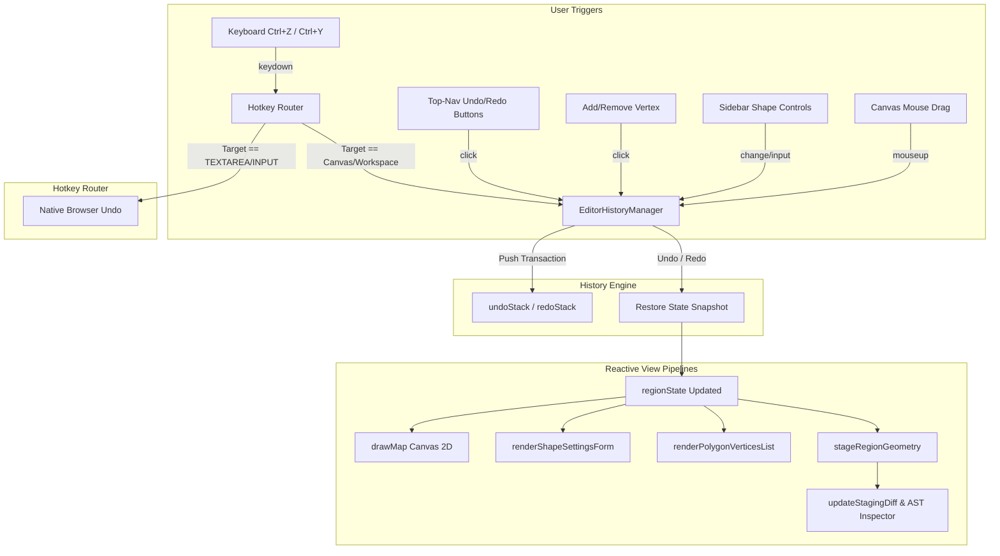

# Requirements

### Overview & Goals
The LeafRTP Web Editor (`docs/editor/index.html`) provides an interactive 2D cartography canvas and staging inspector (ADR-104, ADR-106) where server operators visually configure region boundaries, adjust donut radii, and drag polygon vertices. Currently, any accidental mouse drag, shape change, or vertex deletion cannot be undone; the only existing recovery action is `↺ Revert` (`resetStaging()`), which abruptly resets the entire region to a hardcoded default circle, discarding all in-progress work.

The goal of this task is to introduce a robust, non-intrusive **Undo/Redo History System** with standard keyboard shortcuts (`Ctrl+Z`, `Ctrl+Y`, `Ctrl+Shift+Z`) and top-bar toolbar buttons, protecting operators from accidental edits during region cartography and parameter staging.

---

### Evaluation: Can We Do That? Should We Plan It For Later?

#### 1. Can we do that?
**Yes, absolutely.**
- The web editor client already centralizes mutable geometry in `regionState` and `regionProfiles` inside `docs/editor/index.html`.
- Mutating `regionState` triggers established reactive pipelines: `drawMap()`, `syncPolygonAABB()`, `renderPolygonVerticesList()`, `renderShapeSettingsForm()`, `stageRegionGeometry()`, and `updateStagingDiff()`.
- A lightweight **Memento / State Snapshot Pattern** can capture state transitions at clean transaction boundaries (such as drag completion on `mouseup` and discrete parameter changes).
- Browser hotkeys (`Ctrl+Z`, `Ctrl+Y`, `Ctrl+Shift+Z`) can be captured globally with focus guards so native text editing in `<textarea id="cfg-editor">` and text input fields is never disrupted.
- Changes are fully testable in the existing Java test suite using GraalVM Polyglot (`EditorRegionHandlesTest.java` style) with zero platform or network risk.

#### 2. Should we plan it for a later time?
**Recommendation: Plan and deliver Phase 1 (Visual Region Editor & Staging Undo/Redo) now; defer Phase 2 (Unified Cross-File YAML AST & Collaborative CRDTs) to a later milestone.**

- **Why Phase 1 should be done now:**
  - **Critical Usability Gap:** The Visual Region Editor is tactile and drag-heavy. Moving a 20-vertex polygon vertex by accident or inadvertently altering a center coordinate currently forces operators to manually re-measure chunks or hit `↺ Revert`, which wipes the entire profile.
  - **Self-Contained & Low Risk:** The change is confined to `docs/editor/index.html` (and verified by unit tests). It does not alter the signed server channel protocol (ADR-106), does not touch server thread safety (S-005), and does not modify disk serialization formats.
  - **High Value / Low Effort:** A robust Memento manager for visual region editing requires ~150–250 lines of clean JavaScript and can be delivered in a focused 4-stage plan.
- **What should be deferred to later (Phase 2):**
  - **Cross-Panel Unified AST Undo:** Merging raw YAML textarea typing in `#cfg-editor` with canvas vertex dragging into a single unified undo stack requires complex operational transforms or virtual text document diffing. Browsers already handle `<textarea>` undo natively; trying to merge both now would introduce unnecessary complexity.
  - **Collaborative Conflict Resolution:** Multi-operator concurrent session editing over bytesocks WebSocket relay using CRDTs or operational transforms is future work (ADR-106 §5).

---

### Scope
- **In Scope (Phase 1):**
  - In-memory `EditorHistoryManager` maintaining bounded `undoStack` and `redoStack` in `docs/editor/index.html`.
  - Transaction boundary tracking for canvas interactions: mouse down/up drag gestures for vertices, move grips, and resize grips.
  - Transaction tracking for discrete actions: shape dropdown changes (`updateRegionShape`), shape parameter updates (`applyShapeSetting`), polygon vertex addition/deletion (`addPolygonVertex`, `removePolygonVertex`), and region profile creation/removal.
  - Global hotkey listener for `Ctrl+Z` / `Cmd+Z` (Undo) and `Ctrl+Y` / `Ctrl+Shift+Z` / `Cmd+Shift+Z` (Redo), with focus isolation for native text inputs and textarea.
  - Visual `↶ Undo` and `↷ Redo` buttons in the top navigation bar with dynamic enabled/disabled state and action tooltips.
  - Re-architecting `resetStaging()` so revert restores the session baseline (rather than hardcoded circle) and is itself recorded as an undoable action.
  - Automated GraalJS polyglot contract tests in `rtp-core`.
- **Out of Scope (Deferred to Phase 2):**
  - Intercepting and re-implementing raw text keystroke undo inside `<textarea id="cfg-editor">` (native browser undo handles text).
  - Multi-user collaborative undo/redo across remote WebSocket sessions.
  - Persistent undo history across browser page refreshes (session-scoped only).

---

### User Stories
- **US-1 (Canvas Drag Recovery):** As a server operator configuring a polygon region, I want to press `Ctrl+Z` after accidentally dragging a vertex to the wrong coordinate, so that the vertex snaps back to its previous position without restarting my setup.
- **US-2 (Shape Switch Reversal):** As an administrator testing different geometric algorithms, I want to undo a shape switch (e.g. from `POLYGON` to `CIRCLE`) so that my previously defined vertices and settings are immediately restored.
- **US-3 (Visual Toolbar Controls):** As an operator on a mobile or touch device, I want clickable `Undo` and `Redo` buttons in the top bar so that I can step through my staging history without a physical keyboard.
- **US-4 (Native Text Preservation):** As an operator typing custom YAML comments or adjusting values in the Config editor tab, I want `Ctrl+Z` to undo my text typing inside the textarea without accidentally reverting canvas geometry.

---

### Functional Requirements
- **FR-1:** The editor shall maintain separate `undoStack` and `redoStack` queues capped at a maximum of 50 states to prevent memory leaks.
- **FR-2:** Completing a canvas drag gesture (mouse button release after vertex, move grip, or scale grip translation) where geometry changed shall record exactly one history entry. Intermediate mouse movement frames shall not create separate history entries.
- **FR-3:** Triggering Undo shall restore the preceding state, redraw the canvas, re-render shape controls and vertex lists, patch the staged YAML configuration, and update the staging diff.
- **FR-4:** Triggering Redo shall re-apply the previously undone action and update all visual and staged models identically.
- **FR-5:** Performing any new mutating action while the `redoStack` is non-empty shall clear the `redoStack`.
- **FR-6:** The global hotkey handler shall intercept `Ctrl+Z`, `Cmd+Z`, `Ctrl+Y`, `Ctrl+Shift+Z`, and `Cmd+Shift+Z`. If the active focused element is `<textarea>` or an `<input type="text">`, the event shall not be intercepted, allowing native browser text undo/redo.
- **FR-7:** The top navigation bar shall expose `↶ Undo` and `↷ Redo` buttons whose disabled states update reactively based on stack availability.
- **FR-8:** Clicking `↺ Revert` shall restore the region's initial session snapshot and push the pre-revert state to the undo stack, ensuring revert is never irreversible.

---

### Non-Functional Requirements
- **NFR-1 (Performance):** State snapshot capture and restore operations shall complete in $< 2\text{ ms}$, maintaining $60\text{ FPS}$ interaction during canvas manipulation.
- **NFR-2 (Zero Dependency & Air-Gap Compliance):** All undo/redo logic shall be implemented in standard vanilla ES6 JavaScript inside `docs/editor/index.html` with zero external npm or CDN libraries, maintaining offline `file:///` capability (ADR-104 §4.4).
- **NFR-3 (Memory Safety):** Snapshots shall deep-clone plain data objects only (`shape`, `settings`, `vertices`) and drop references to DOM nodes or canvas contexts. Maximum memory overhead for 50 history entries shall remain $< 500\text{ KB}$.

# Technical Design

### Current Implementation
- **State Storage (`docs/editor/index.html` lines 1344–1347):**
  - `regionProfiles` holds loaded region definitions keyed by name.
  - `regionState` points to the active profile: `{ name, shape, settings: {}, vertices: [] }`.
  - Geometry is patched into `configs[regionFileName]` via `stageRegionGeometry(regionState)` (lines 6864–6874).
- **Canvas Interaction (lines 5977–6094):**
  - `canvas.addEventListener('mousedown')` initiates vertex drag (`draggingVertex = i`) or handle drag (`startRegionHandleDrag`).
  - `canvas.addEventListener('mousemove')` updates vertex positions or handle offsets at $60\text{ FPS}$.
  - `window.addEventListener('mouseup')` terminates drag (`draggingVertex = -1`, `endRegionHandleDrag()`) and triggers `updateStagingDiff()`.
- **Current Revert Action (lines 7113–7124):**
  - `resetStaging()` resets `regionState` to a hardcoded `CIRCLE` (`radius: '256c', centerRadius: '64c'`) rather than the session baseline, and offers no undo mechanism.
- **Existing Hotkeys (lines 8627–8662):**
  - Global `keydown` handler on `window` handles `Ctrl+K` for search modal, `Escape`, and arrow navigation.

---

### Key Decisions

1. **Memento (State Snapshot) Pattern over Command Inversion:**
   - *Chosen Approach:* Capture lightweight deep copies of `regionState` (`{ shape, settings: { ...settings }, vertices: vertices.map(v => [...v]) }`) before and after transactions.
   - *Rationale:* Shape transformations and polygon scaling involve non-linear floating-point math and chunk snapping. Inverting mathematical operations (e.g. inverse scale) risks rounding drift and vertex order corruption. Snapshotting plain JavaScript objects guarantees exact deterministic restoration with minimal memory overhead ($< 2\text{ KB}$ per entry).

2. **Gesture-Scoped Transaction Boundaries:**
   - *Chosen Approach:* Begin transaction recording at `mousedown` (or grip hit); apply live updates during `mousemove`; finalize and commit to `EditorHistoryManager` strictly on `mouseup` if the end state differs from the start state.
   - *Rationale:* Committing during mouse movement would produce hundreds of micro-states, requiring dozens of `Ctrl+Z` presses to undo a single drag gesture.

3. **Context-Aware Hotkey Routing with Native Input Passthrough:**
   - *Chosen Approach:* Check `document.activeElement` on `keydown`. If focused in `<textarea id="cfg-editor">` or a text `<input>`, skip custom undo/redo and let the browser execute native text undo.
   - *Rationale:* Users expect standard text undo while typing YAML in the code editor. Intercepting `Ctrl+Z` globally would break normal text typing workflows.

4. **Baseline-Aware, Reversible `Revert` Action:**
   - *Chosen Approach:* Store `initialRegionSnapshot` during payload ingest. When `resetStaging()` is invoked, restore `initialRegionSnapshot` and push the pre-revert state to `EditorHistoryManager`.
   - *Rationale:* Prevents destructive state loss when clicking Revert, allowing operators to safely undo accidental resets.

---

### Architecture Diagram



---

### Data Models / Contracts

```javascript
/**
 * Represents a single atomic user action recorded in the history stack.
 */
class HistoryEntry {
  /**
   * @param {string} desc Human-readable action description for tooltips (e.g. "Drag Vertex")
   * @param {string} regionName Name of the region profile affected
   * @param {Object} before Snapshot of { shape, settings, vertices } before action
   * @param {Object} after Snapshot of { shape, settings, vertices } after action
   */
  constructor(desc, regionName, before, after) {
    this.desc = desc;
    this.regionName = regionName;
    this.before = before;
    this.after = after;
    this.timestamp = Date.now();
  }
}

/**
 * Singleton managing undo and redo history for visual editor state.
 */
var EditorHistoryManager = (() => {
  const MAX_STACK = 50;
  const undoStack = [];
  const redoStack = [];
  let pendingGestureStart = null;

  function cloneGeometry(state) {
    if (!state) return null;
    return {
      shape: state.shape || '',
      settings: Object.assign({}, state.settings || {}),
      vertices: Array.isArray(state.vertices) ? state.vertices.map(v => [v[0], v[1]]) : []
    };
  }

  function beginGesture(desc, state) {
    pendingGestureStart = { desc, regionName: state.name, before: cloneGeometry(state) };
  }

  function commitGesture(state) {
    if (!pendingGestureStart) return;
    const { desc, regionName, before } = pendingGestureStart;
    pendingGestureStart = null;
    const after = cloneGeometry(state);
    if (JSON.stringify(before) === JSON.stringify(after)) return;
    push(new HistoryEntry(desc, regionName, before, after));
  }

  function push(entry) {
    undoStack.push(entry);
    if (undoStack.length > MAX_STACK) undoStack.shift();
    redoStack.length = 0; // Clear redo on new action
    updateToolbarUI();
  }

  function undo() {
    if (undoStack.length === 0) return false;
    const entry = undoStack.pop();
    redoStack.push(entry);
    applySnapshot(entry.regionName, entry.before);
    updateToolbarUI();
    return true;
  }

  function redo() {
    if (redoStack.length === 0) return false;
    const entry = redoStack.pop();
    undoStack.push(entry);
    applySnapshot(entry.regionName, entry.after);
    updateToolbarUI();
    return true;
  }

  function applySnapshot(regionName, snapshot) {
    const profile = regionProfiles[regionName];
    if (!profile) return;
    profile.shape = snapshot.shape;
    profile.settings = Object.assign({}, snapshot.settings);
    profile.vertices = snapshot.vertices.map(v => [v[0], v[1]]);
    if (regionState.name === regionName) {
      syncShapeSpecificControls(regionState);
      renderShapeSettingsForm(regionState);
      renderPolygonVerticesList();
      syncPolygonAABB();
      drawMap();
      stageRegionGeometry(regionState);
      updateStagingDiff();
    }
  }

  return { beginGesture, commitGesture, push, undo, redo, canUndo: () => undoStack.length > 0, canRedo: () => redoStack.length > 0 };
})();
```

---

### File Structure
- `docs/editor/index.html` (modified):
  - Add `EditorHistoryManager` module definition.
  - Update top-nav markup with Undo/Redo toolbar buttons.
  - Wrap canvas mousedown/mouseup and grip drag handlers with `beginGesture` / `commitGesture`.
  - Wrap shape select, polygon vertex add/delete, and parameter changes with `push`.
  - Extend global `keydown` event listener to handle `Ctrl+Z`, `Ctrl+Y`, `Ctrl+Shift+Z`.
- `rtp-core/src/test/java/io/github/dailystruggle/rtp/common/commands/editor/EditorUndoRedoPageTest.java` (added):
  - Unit contract tests running in GraalVM Polyglot `Context`, validating snapshot consistency, drag boundary grouping, and stack eviction.

---

### Risks & Mitigations
- **Risk 1: Keystroke Collisions with Native Text Editing:**
  - *Mitigation:* Explicit check on `document.activeElement`. If the focus is inside `<textarea>` or an `<input type="text">`, hotkeys are not prevented and the custom undo stack is bypassed.
- **Risk 2: High-Frequency Drag Event Thrashing:**
  - *Mitigation:* `mousemove` updates only live coordinates and canvas rendering. State snapshots are taken strictly at `mousedown` and evaluated on `mouseup`. If start and end snapshots match, no entry is created.
- **Risk 3: Server Back-Propagation Overwrites:**
  - *Mitigation:* When server pushes live curve/geometry updates over the signed channel (ADR-106 §5), the incoming update is treated as a remote server commit. If the active profile is altered by the server, `EditorHistoryManager` can record an external checkpoint or safely reset the redo branch.

# Testing

### Validation Approach
Verification follows the repository's established multi-tier strategy (Rule ADR-104 / `TESTING_GUIDE.md`). Because `docs/editor/index.html` is executed both locally via `file:///` and hosted on the documentation site, testing comprises:
1. **GraalVM Polyglot Unit Contract Tests (`rtp-core`):** Automated headless JavaScript contract tests executed through GraalJS, identical to `EditorRegionHandlesTest.java` and `EditorShapeSwitchPageTest.java`.
2. **Browser End-to-End Smoke Verification:** Opening `docs/editor/index.html` directly in a browser to verify hotkey capture, toolbar button state transitions, and canvas reactivity.

---

### Key Scenarios
1. **Vertex Drag Undo/Redo:**
   - Grab vertex $P_2$ of a polygon at $(100, 200)$, drag through multiple intermediate points, and release at $(300, 400)$.
   - Verify: exactly one history entry is created.
   - Press `Ctrl+Z`: vertex returns to $(100, 200)$, canvas redraws, staging diff updates.
   - Press `Ctrl+Y`: vertex moves to $(300, 400)$.

2. **Handle Scale & Move Drag Undo/Redo:**
   - Drag radial handle for a `CIRCLE` shape from radius $256\text{c}$ to $512\text{c}$ and release.
   - Verify: `undoStack.length == 1`.
   - Press `Ctrl+Z`: radius reverts to $256\text{c}$, shape settings form input updates to `256c`, HUD updates.

3. **Shape Switch Undo/Redo:**
   - Switch active region shape from `RECTANGLE` to `CIRCLE`.
   - Press `Ctrl+Z`: shape selector returns to `RECTANGLE`, rectangle inputs (`width`, `height`) reappear, canvas restores rectangle outline.

4. **Polygon Point Addition/Deletion:**
   - Click `+ Add Vertex` to add $P_5$, then delete $P_2$.
   - Press `Ctrl+Z`: $P_2$ is restored.
   - Press `Ctrl+Z` again: $P_5$ is removed.

5. **Revert Button Reversibility:**
   - Make several edits, then click `↺ Revert`.
   - Verify: region returns to initial baseline snapshot.
   - Press `Ctrl+Z`: all pre-revert edits are completely restored.

---

### Edge Cases
- **Zero-Delta Drag:** Clicking a vertex or handle without moving it (mousedown followed immediately by mouseup at identical coordinates) must NOT push an entry onto the undo stack.
- **Native Textarea Isolation:** Focus `<textarea id="cfg-editor">`, type text, and press `Ctrl+Z`. Verify that text typing is undone natively by the browser and the canvas region geometry is NOT altered.
- **Redo Invalidation:** Make 3 edits, press `Ctrl+Z` twice, then perform a new drag. Verify that `redoStack` is emptied and new history branches forward correctly.
- **Stack Bound Clamping:** Perform 60 consecutive edits. Verify that `undoStack.length` never exceeds 50 and oldest entries are evicted without error.

---

### Test Changes
- **New Test Class:** `rtp-core/src/test/java/io/github/dailystruggle/rtp/common/commands/editor/EditorUndoRedoPageTest.java`
  - Extracts `EditorHistoryManager` and associated helper functions from `docs/editor/index.html`.
  - Runs headless contract verification with DOM stubs in GraalVM JavaScript context.
- **Execution Command:**
  `.\gradlew.bat :rtp-core:test --tests "*EditorUndoRedoPageTest*"`

# Delivery Steps

### ✓ Step 1: Core Undo/Redo Engine & State Memento Manager in docs/editor/index.html
The web editor contains an in-memory Memento transaction manager with push, undo, redo, and state restoration capabilities.

- Implement `EditorHistoryManager` in `docs/editor/index.html` with bounded `undoStack` and `redoStack` (configurable depth, default 50 actions).
- Define snapshot serialization and deep-cloning for `regionState` (`name`, `shape`, `settings`, `vertices`).
- Implement `applyHistorySnapshot(snapshot)` restoring the visual editor state and invoking `syncShapeSpecificControls()`, `renderShapeSettingsForm()`, `renderPolygonVerticesList()`, `drawMap()`, `stageRegionGeometry()`, and `updateStagingDiff()`.
- Replace the hardcoded `resetStaging()` implementation with a baseline-aware revert that restores the initial session geometry while pushing an undoable snapshot onto the stack.

### ✓ Step 2: Transaction Boundary Hooks for Canvas Interactions and Sidebar Controls
User canvas drags, grip resizes, polygon point mutations, and sidebar parameter changes record discrete undoable transactions.

- Instrument canvas interaction in `canvas.addEventListener('mousedown')` and `window.addEventListener('mouseup')` / `endRegionHandleDrag`: capture a pre-drag snapshot at gesture start and commit a single atomic transaction on mouseup if geometry changed.
- Instrument polygon vertex mutations in `addPolygonVertex()`, `removePolygonVertex()`, and debounced vertex coordinate inputs in `renderPolygonVerticesList()`.
- Instrument sidebar shape controls: wrap `updateRegionShape()`, `applyShapeSetting()`, and `handleRegionSelectChange()` to push state changes to `EditorHistoryManager`.
- Ensure high-frequency continuous mouse movements (60 FPS `mousemove`) update the live canvas without polluting or flooding the history stack.

### ✓ Step 3: Keyboard Shortcuts and Toolbar UI Controls
Operators can trigger undo and redo via standard keyboard hotkeys and visual toolbar buttons with real-time state reflection.

- Add a global `keydown` shortcut router in `docs/editor/index.html` for `Ctrl+Z` / `Cmd+Z` (Undo) and `Ctrl+Y` / `Ctrl+Shift+Z` / `Cmd+Shift+Z` (Redo).
- Implement an active element focus guard to bypass hotkey interception when the user is focused inside text inputs or `<textarea id="cfg-editor">`, preserving native browser text editing undo.
- Add `↶ Undo` and `↷ Redo` buttons with shortcut badges to the top navigation header (`#top-nav .nav-actions`).
- Bind button enabled/disabled states and tooltip descriptors dynamically to `undoStack.length` and `redoStack.length`.

### ✓ Step 4: GraalJS Polyglot Contract & Regression Test Suite
Automated contract and regression tests in rtp-core verify undo/redo stack invariants, drag transaction coalescing, and hotkey rules.

- Create `rtp-core/src/test/java/io/github/dailystruggle/rtp/common/commands/editor/EditorUndoRedoPageTest.java` using GraalVM Polyglot `Context` following the contract test pattern in `EditorRegionHandlesTest.java`.
- Test transaction boundary coalescing: assert that dragging a vertex across multiple intermediate points results in exactly one undo step.
- Test shape switching undo/redo: assert that changing from `CIRCLE` to `POLYGON` and undoing restores the original settings and vertex geometry.
- Test polygon vertex modification: assert that adding and removing vertices correctly reverses point arrays and bounding calculations.
- Test stack limits and branch invalidation: assert that new edits clear the redo stack and history depth is capped at 50 entries.