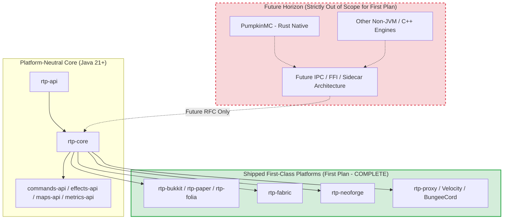

# Requirements

### Overview & Goals
The multi-platform expansion plan (`docs/dev/MULTI_PLATFORM_PLAN.md`) was initiated to bring first-class support for modern Minecraft mod loaders—specifically Fabric and NeoForge—to RTP, alongside its established Bukkit, Paper, and Folia adapters.

All five core phases defined in `MULTI_PLATFORM_PLAN.md` are functionally and structurally complete:
- **Phase 0:** Scope unlock (ADR-022, ADR-033, REQUIREMENTS.md).
- **Phase 1:** Infrastructure & Loom/ModDevGradle build system setup with single/unified multi-loader packaging.
- **Phase 2:** Fabric feature parity (Steps A through K: chunk loading, schedulers, databases, event bridges, Anvil pre-filtering, permissions, Brigadier commands, menu renderers, and network mode hooks).
- **Phase 3:** Fabric documentation and beta release.
- **Phase 4:** NeoForge adapter (Phases N0 through N3, Steps NA through NK: full functional parity on 1.21.x and 26.1.x, public beta release shipped).

This plan outlines the formal audit, reconciliation, and closeout of `MULTI_PLATFORM_PLAN.md`. Crucially, to prevent goalpost-moving, it explicitly establishes that non-Java / native Minecraft server runtimes (such as PumpkinMC in Rust) are formally out of scope for this first plan and belong to a prospective future horizon.

### Scope

#### In Scope
- Auditing and closing all residual checkbox items in `docs/dev/MULTI_PLATFORM_PLAN.md`.
- Adding complete requirement traceability rows for `rtp-fabric` and `rtp-neoforge` in `docs/dev/TRACEABILITY.md`.
- Updating `docs/dev/REQUIREMENTS.md` section 0 to mark Fabric and NeoForge as fully shipped and remove obsolete deferral language.
- Explicitly documenting non-Java servers (e.g., PumpkinMC) in `docs/dev/REQUIREMENTS.md` and `docs/dev/MULTI_PLATFORM_PLAN.md` as out of scope for the current architecture and designated for future independent exploration.
- Updating `docs/dev/INDEX.md` and `docs/dev/ROADMAP.md` to reflect the completed status of the multi-platform expansion.

#### Out of Scope
- Implementing non-Java server adapters (PumpkinMC, Feather, etc.) or native FFI/WASM bindings.
- Modifying any Java source code or runtime platform logic (the platform adapters are already built and tested).
- Backporting to legacy Minecraft versions or Java versions older than Java 21 (governed by ADR-021).

### User Stories
- **As an RTP Maintainer**, I want the first multi-platform plan (`MULTI_PLATFORM_PLAN.md`) formally reconciled and closed out so that active development focus can shift to subsequent roadmap initiatives without lingering ambiguity.
- **As an Open-Source Contributor**, I want clear documentation regarding platform boundaries so I know that non-Java servers like PumpkinMC represent a future architectural inquiry rather than an unfulfilled requirement of the current plugin codebase.

### Functional Requirements
- **FR-01 (Traceability Parity):** All requirements defined in `platforms/rtp-fabric/REQUIREMENTS.md` and `platforms/rtp-neoforge/REQUIREMENTS.md` shall be enumerated in `docs/dev/TRACEABILITY.md` with links to implementing classes and test suites.
- **FR-02 (Residual Checkbox Closure):** All non-blocking or deferred items in `MULTI_PLATFORM_PLAN.md` (Architectury re-evaluation, legacy Forge evaluation, Anvil probe adapter hoisting) shall have their final resolution status documented.
- **FR-03 (Goalpost Invariant):** `docs/dev/REQUIREMENTS.md` and `docs/dev/MULTI_PLATFORM_PLAN.md` shall explicitly state that non-Java servers (e.g., PumpkinMC) are out of scope for the current plan, preserving the bounded scope of the Fabric and NeoForge release.
- **FR-04 (Status Transition):** `docs/dev/MULTI_PLATFORM_PLAN.md` shall be marked `Status: Completed / Archived`.

### Non-Functional Requirements
- **NFR-01 (Markdown Hygiene):** All documentation edits must strictly comply with project UTF-8 formatting rules (no BOM, no CRLF, zero mojibake markers such as corrupted em dashes or checkmarks).
- **NFR-02 (ADR Alignment):** Documented decisions must align with ADR-021 (Legacy MC/Java out of scope), ADR-022 / rtp-fabric-ADR-002 (Fabric in scope), and ADR-033 / rtp-neoforge-ADR-001 (NeoForge in scope).

# Technical Design

### Current Implementation
The repository contains complete, production-ready platform implementations:
- `platforms/rtp-fabric/` hosts `rtp-fabric-common`, `rtp-fabric-common-unobf`, and 7 versioned carriers (`v1_20_R1`, `v1_21_R1`, `v1_21_R5`, `v1_21_R11`, `v26_1_R1`, `v26_2_R1`, `v26_3_R1`).
- `platforms/rtp-neoforge/` hosts `rtp-neoforge-common`, `rtp-neoforge-v1_21_R1`, and `rtp-neoforge-v26_1_R1`.
- Both platform modules pass all unit and contract tests cleanly (`:rtp-fabric:rtp-fabric-common:test` and `:rtp-neoforge:rtp-neoforge-common:test` green).
- `rtp-plugin` produces a unified distribution jar supporting Bukkit, Paper, Folia, Fabric, and NeoForge loaders.

However, `MULTI_PLATFORM_PLAN.md` still lists its header status as active, contains a handful of unchecked follow-up boxes (e.g. TRACEABILITY rows and Architectury evaluation), and `docs/dev/REQUIREMENTS.md` still contains legacy language stating that NeoForge is deferred.

### Key Decisions

#### Decision 1: Declare First Multi-Platform Plan Formally Complete
- *Approach:* Audit and close all residual checklist items in `docs/dev/MULTI_PLATFORM_PLAN.md` and transition the document status to Completed / Archived.
- *Rationale:* All architectural phases (Phases 0–4) have been implemented, tested, and released. The remaining open checkmarks are either documentation syncs (which this plan resolves) or non-platform core maintenance tasks.

#### Decision 2: Strictly Preserve Scope Boundaries Regarding Non-Java Servers
- *Approach:* Explicitly designate non-Java / native servers (such as PumpkinMC in Rust) as out of scope for the current architecture, framing them as a potential future horizon (separate RFC / future plan).
- *Rationale:* RTP is fundamentally a Java 21+ JVM application. Supporting non-Java servers requires a completely different architectural paradigm (e.g., FFI/sidecar architecture, C-ABI bindings, or network mode protocol routing). Expanding the current plan would violate the user's explicit directive not to move the goalposts on this initial milestone.

#### Decision 3: Reconcile Residual Evaluation Items
- *Approach:* Formally document the resolution of open evaluation items:
  - *Architectury evaluation:* Rejected; maintaining sibling platform adapter trees (`rtp-fabric` and `rtp-neoforge`) via `rtp-core` and SPI abstractions proved clean and avoids the complexity and coupling of the Architectury toolchain.
  - *Legacy Forge evaluation:* Formally closed as out of scope per ADR-021 (Forge <=1.20.1 is sunsetting; modern modpacks target NeoForge).
  - *AnvilColumnProbeAdapter hoisting & Lazy claim poisoning:* Classified as general `rtp-anvil` / `rtp-core` pipeline technical debt, documented without blocking platform completion.

### Proposed Changes

#### 1. `docs/dev/MULTI_PLATFORM_PLAN.md`
- Update header to `Status: COMPLETED (2026-10-07)`.
- Mark the remaining checklist items:
  - Step H traceability rows: checked.
  - Step K follow-up verification: checked/noted.
  - Architectury evaluation: marked resolved (rejected in favor of sibling modules).
  - Legacy Forge evaluation: marked closed (out of scope per ADR-021/033).
- Add a new section: `## Future Horizons — Non-Java Servers (e.g. PumpkinMC)`:
  - Explains the boundary: RTP v3 multi-platform support covers JVM-based mod loaders (Fabric, NeoForge) alongside Bukkit/Paper/Folia.
  - Non-Java servers (like PumpkinMC written in Rust) require foreign-function interfaces (FFI), native daemon sidecars, or proxy-only network-mode integration.
  - These are explicitly excluded from this first multi-platform plan to maintain strict goalpost stability and will be addressed in a future dedicated plan.

#### 2. `docs/dev/REQUIREMENTS.md`
- In `0. Scope -> In Scope`: remove the outdated sentence `"NeoForge support is deferred until the Fabric adapter stabilizes..."` and update to state that Bukkit, Paper, Folia, Fabric, and NeoForge are all fully implemented, first-class supported platforms.
- In `0. Scope -> Out of Scope -> Unsupported platforms`: add an explicit bullet point stating that non-Java servers (including PumpkinMC, Feather, C/C++ native engines) are out of scope for the current JVM codebase.

#### 3. `docs/dev/TRACEABILITY.md`
- Expand the `## rtp-fabric Requirements` section with complete mappings for `REQ-FABRIC-F-001..010` and `REQ-FABRIC-ARCH-001..010`.
- Expand the `## rtp-neoforge Requirements` section with complete mappings for `REQ-NEOFORGE-F-001..011` and `REQ-NEOFORGE-ARCH-001..013`.

#### 4. `docs/dev/INDEX.md` and `docs/dev/ROADMAP.md`
- Update references in `docs/dev/INDEX.md` to indicate that `MULTI_PLATFORM_PLAN.md` is complete.
- Update `docs/dev/ROADMAP.md` Tier 1.D and Tier 2 to show Fabric and NeoForge as fully delivered.

### File Structure
- `docs/dev/MULTI_PLATFORM_PLAN.md` (modified)
- `docs/dev/REQUIREMENTS.md` (modified)
- `docs/dev/TRACEABILITY.md` (modified)
- `docs/dev/INDEX.md` (modified)
- `docs/dev/ROADMAP.md` (modified)

### Architecture Diagram

### Risks & Mitigations
- **Risk:** Marking `MULTI_PLATFORM_PLAN.md` complete might obscure open core maintenance items (e.g. `AnvilColumnProbeAdapter` hoisting or lazy claim poisoning).
  - *Mitigation:* Explicitly document these items as general core / API technical debt or track them in `docs/dev/POTENTIAL_BUGS.md`, ensuring they are not lost while freeing the multi-platform milestone from artificial blockers.
- **Risk:** Future inquiries regarding PumpkinMC or other native Minecraft servers might assume lack of interest rather than architectural scoping.
  - *Mitigation:* Clearly articulate the technical rationale in `MULTI_PLATFORM_PLAN.md` and `REQUIREMENTS.md` (JVM vs native runtime, need for FFI or network-mode protocol), positioning native server support as a respected future milestone.

# Delivery Steps

### ✓ Step 1: Reconcile residual checklist items and requirements traceability
All Fabric and NeoForge requirements are fully traced in `docs/dev/TRACEABILITY.md` and open follow-up checkboxes in `docs/dev/MULTI_PLATFORM_PLAN.md` are reconciled.

- Add traceable requirement rows to `docs/dev/TRACEABILITY.md` for `platforms/rtp-fabric/REQUIREMENTS.md` (`REQ-FABRIC-F-001..010`, `REQ-FABRIC-ARCH-001..010`) linking to implementing classes and test suites.
- Add traceable requirement rows to `docs/dev/TRACEABILITY.md` for `platforms/rtp-neoforge/REQUIREMENTS.md` (`REQ-NEOFORGE-F-001..011`, `REQ-NEOFORGE-ARCH-001..013`).
- In `docs/dev/MULTI_PLATFORM_PLAN.md`, tick the traceability row checkbox (`line 92`) and the S-005 verification / Maps audit follow-up items (`lines 116-118`).
- Resolve the open evaluation checkboxes for Architectury (`lines 131, 516`) and Legacy Forge (`line 130`) by documenting their formal resolution (rejected in favor of sibling modules per ADR-033 and out-of-scope per ADR-021).
- Classify generic cross-platform pipeline items (e.g. `Lazy claim-space poisoning` at `line 514` and `AnvilColumnProbeAdapter` hoisting at `line 63`) as ongoing core maintenance rather than platform-parity gates.

### ✓ Step 2: Codify non-Java and native server scope boundary
`docs/dev/REQUIREMENTS.md` and `docs/dev/MULTI_PLATFORM_PLAN.md` clearly document the non-Java server boundary, keeping PumpkinMC strictly out of scope for the current plan.

- Update `docs/dev/REQUIREMENTS.md` section 0 (*In Scope*): remove stale phrasing stating NeoForge is deferred; assert Spigot, Paper, Folia, Fabric, and NeoForge as fully shipped first-class platforms.
- Update `docs/dev/REQUIREMENTS.md` section 0 (*Out of Scope*): under *Unsupported platforms*, explicitly state that non-Java / native Minecraft servers (including Rust-based implementations such as PumpkinMC, C/C++ servers, and other non-JVM runtimes) are out of scope for the native plugin/mod codebase.
- Add an explicit *Future Horizon (Non-Java / Native Servers)* section to `docs/dev/MULTI_PLATFORM_PLAN.md` detailing the architectural delta (e.g., FFI/sidecar/network mode bridge) and designating it for a future, independent roadmap rather than extending the current plan.

### ✓ Step 3: Finalize plan closeout across documentation and roadmaps
`MULTI_PLATFORM_PLAN.md` is formally marked complete and all repo roadmaps and index routers reflect full platform delivery.

- Update `docs/dev/MULTI_PLATFORM_PLAN.md` header status from "In Progress" to "Completed / Archived (2026-10-07)", recording the full delivery of Phases 0 through 4 (Fabric and NeoForge).
- Update `docs/dev/INDEX.md` line 31 and line 83 descriptions for `MULTI_PLATFORM_PLAN.md` from "Active Fabric frontier status" to "Multi-platform expansion plan (Fabric & NeoForge; Completed)".
- Update `docs/dev/ROADMAP.md` Tier 1.D and relevant platform references to confirm all multi-platform deliverables are complete and closed.
- Verify markdown encoding hygiene (UTF-8, no BOM, zero mojibake) across all modified documentation.