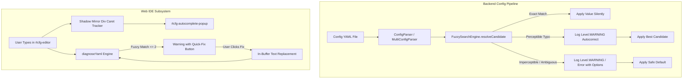

# Requirements

### Overview & Goals

This proposal introduces typo-tolerant, best-score candidate resolution across LeafRTP configuration ingestion and transforms the web editor into a responsive, VS Code-like Web IDE for YAML configurations.

Configuration errors in Minecraft plugins typically stem from small typographical slips (e.g., `circl` instead of `CIRCLE`, `linar` instead of `LINEAR`, or `dimond` instead of `DIAMOND`). Currently, these errors cause either silent fallbacks to unrelated defaults, silent property drops, or plugin initialization failures. By introducing a tri-state resolution model—**Exact (silent)**, **Perceptible Typo (warn & autocorrect)**, and **Imperceptible (error & fallback)**—operators receive clear diagnostics and graceful corrections. In parallel, equipping the web editor (`docs/editor/index.html`) with inline tab-completion, shadow caret tracking, and one-click quick fixes prevents syntax and schema errors before configurations are deployed.

---

### Performance & Utility Verdict: Command Tab-Completion

Per project instructions, we conducted a dedicated architectural and performance investigation into in-game command tab-completion (`commands-api`, `BrigadierCommandAdapter`, and `TreeCommand`):

1. **Performance Cost Cannot Be Justified / Is Not Provably Trivial:**
   - In modern Minecraft (1.13+), command tab-completion packets (`ServerboundCommandSuggestionPacket`) are transmitted from connected clients to the server on **every keystroke** in the chat bar.
   - On production servers with 50–200 concurrent players, dozens of tab-completion packets are processed per second.
   - Standard prefix matching (`s.startsWith(token)`) is an $O(1)$/$O(K)$ pointer scan executing in $< 10\,\text{ns}$ with zero object allocations.
   - In contrast, fuzzy matching requires computing Levenshtein dynamic programming matrices ($O(M \times N)$). Across large candidate sets—such as Bukkit's $\approx 1{,}000$ materials, dynamic player name lists, world lists, and biomes—fuzzy scoring on every keystroke incurs substantial CPU overhead and heavy GC allocation pressure on server worker threads and the main thread (Spigot/Bukkit).
   - This contrasts sharply with config loading (which runs once at startup or reload) and the web editor (which runs in the operator's browser on client hardware).

2. **Utility & User Experience Is Low or Counter-Productive:**
   - Players use in-game tab completion for **autocompletion**, typing 1–2 characters and pressing `<TAB>` (e.g., `/rtp shape=c<TAB>` to get `CIRCLE`). Prefix matching already handles this with 100% precision.
   - Players do not intentionally type a 5-character typo (e.g. `circl`) and press `<TAB>` expecting spell correction.
   - Activating fuzzy matching on short, 1-character or 2-character prefixes produces high false-positive noise, flooding the client's compact chat completion dropdown and displacing intended prefix matches.
   - Furthermore, client-side Brigadier suggestion engines on modern clients enforce client-side filtering; returning non-prefix suggestions from the server can conflict with client rendering and disrupt vanilla muscle memory.

**Verdict:** In accordance with the user's directive (*"unless we can justify the performance cost or the performance cost is provably trivial, leave command tabcompletion alone for now"*), **in-game command tab-completion is intentionally excluded from this scope**.

---

### Scope

#### In Scope
- **Backend Configuration Parsing (`rtp-core`):**
  - Generalize `FuzzySearchEngine` with a reusable candidate resolution utility supporting exact matching, bounded Levenshtein scoring, and unambiguity margin guards.
  - Wire fuzzy resolution with warning diagnostics into `RegionConfigLoader` for shape names (`Shape<?>`) and vertical adjustor names (`VerticalAdjustor<?>`).
  - Wire fuzzy resolution with warning diagnostics into `FactoryValue.setData` for enum properties, replacing silent exception discarding.
  - Wire fuzzy resolution into `ActionConfigLoader` for confinement boundaries (`ConfinementBoundary`) and parameter types (`ParameterType`).
- **Platform Material Resolution (`rtp-bukkit`, `rtp-folia`, `LeafRTPGuiAddon`):**
  - Fuzzy-match unrecognized material names in `BukkitRTPWorld`, `FoliaRTPWorld`, and `BukkitCustomItemResolver` before falling back to default items.
- **Web Editor as a Config Web IDE (`docs/editor/index.html`):**
  - Inline YAML tab-completion / autocomplete widget (`#cfg-autocomplete-popup`) positioned via a shadow mirror div (`#cfg-textarea-mirror`) at the exact caret position.
  - Context-aware completion suggestions: YAML keys from schema, enum options from `@options`, registered shape/vert names, booleans, and unit chips.
  - Keyboard navigation: `Tab`/`Enter` to commit, `ArrowUp`/`ArrowDown` to navigate, `Escape` to dismiss.
  - Fuzzy schema diagnostics in `diagnoseYaml`: Warn with "Did you mean X?" and render one-click quick-fix buttons for perceptible typos ($\le 2$ edit distance).

#### Out of Scope
- Command tab-completion modifications in `commands-api` or `BrigadierCommandAdapter` (left alone per the performance/utility verdict).
- External JavaScript editor libraries (Monaco, CodeMirror) — the implementation must remain zero-dependency and air-gap compatible per ADR-104.
- Modifying safety-critical block hazard filters in `safety.yml` (S-001 must remain strictly fail-closed).

---

### User Stories

- **As a server administrator,** I want LeafRTP to recognize minor typos in configuration files (such as `circl` or `linar`) and autocorrect them with an informative warning, so that my server does not silently default to an unintended shape or fail to boot.
- **As a server administrator,** I want invalid or completely unrecognized configuration values to log a descriptive error with a list of valid choices, so that I can quickly pinpoint and fix syntax mistakes.
- **As a configuration author using the Web Editor,** I want an inline autocomplete dropdown that suggests valid keys, enum values, and shape types as I type or press Tab, so that I don't have to consult external documentation.
- **As a configuration author using the Web Editor,** I want schema diagnostics to suggest quick fixes for misspelled values and apply them with a single click, so that editing configurations is fast and error-free.

---

### Functional Requirements

1. **FR-001 (Tri-State Candidate Resolution):** For any configured enum, shape, or material name, the engine shall categorize inputs into:
   - *Exact Match:* Identical or normalized match. Silent, zero logging.
   - *Perceptible Typo:* Edit distance $\le 2$ (length $\ge 5$) or $\le 1$ (length 3–4), with an unambiguity lead of $\ge 20$ score points. Logs a `Level.WARNING` notice explaining the correction and uses the candidate.
   - *Imperceptible Input:* Edit distance exceeds threshold or input is ambiguous. Logs a `Level.WARNING`/`Level.SEVERE` message listing valid candidates and triggers the safe fallback.
2. **FR-002 (Shape & Vert Loading):** `RegionConfigLoader` shall resolve shape names against registered shapes in `RTP.factoryMap.get(shape)` and vertical adjustors against `RTP.factoryMap.get(vert)` using FR-001.
3. **FR-003 (Factory Value Property Matching):** `FactoryValue.setData` shall match property names case-insensitively and fuzzy-match misspelled keys against `enumLookup`, logging warnings instead of silently dropping data.
4. **FR-004 (Material Resolution):** Platform adapters and GUI item resolvers shall fuzzy-resolve unrecognized material names against known platform materials before applying default fallbacks.
5. **FR-005 (Safety Prohibitions S-001/S-003):** Block safety lists in `safety.yml` and claim provider names shall remain fail-closed and strictly excluded from soft autocorrection.
6. **FR-006 (Web IDE Caret Tracking):** The web editor shall accurately track the $(x, y)$ coordinate of the caret in `<textarea id="cfg-editor">` using a zero-dependency shadow mirror element.
7. **FR-007 (Web IDE Autocomplete Widget):** When typing or pressing `Tab` / `Ctrl+Space`, the editor shall display a floating suggestion popup filtered by prefix and Levenshtein distance ($\le 2$).
8. **FR-008 (Web IDE Quick-Fix Actions):** `diagnoseYaml` shall flag perceptible typos as warnings with suggested candidates, rendering an interactive `[Quick Fix]` action in both the line gutter and the diagnostic card.

---

### Non-Functional Requirements

- **Zero Runtime Hot-Path Overhead:** Config candidate resolution shall execute only during plugin initialization and configuration reloads (`/rtp reload`), never during location generation or teleportation.
- **Zero-Dependency Web Editor:** The autocomplete widget and diagnostics must be implemented in native HTML5, CSS3, and ES6 JavaScript, preserving ADR-104's zero-dependency, single-file bundle architecture.
- **Log Hygiene:** Autocorrect warnings must clearly identify the file, key, provided value, and chosen replacement to eliminate ambiguity during server audits.

# Technical Design

### Current Implementation

#### Backend Config Ingestion
- `io.github.dailystruggle.rtp.common.selection.region.RegionConfigLoader`:
  - `deserializeShape` uses `factory.get(shapeName)`. When null, it logs a blunt warning and falls back to `CIRCLE`, discarding operator intent (e.g., `SQARE` reverts to `CIRCLE`).
  - `deserializeVert` similarly defaults to `JUMP` when `factory.get(vertName)` fails.
- `io.github.dailystruggle.rtp.common.factory.FactoryValue`:
  - `setData(Map<String, Object>)` invokes `Enum.valueOf(myClass, keyStr)` inside a `try-catch` block where `IllegalArgumentException` is caught and silently ignored (`catch (IllegalArgumentException ignored) {}`).
- `io.github.dailystruggle.rtp.common.action.ActionConfigLoader`:
  - `parseConfinement` uses a rigid `switch (bStr)` on `ConfinementBoundary`. Unknown values log a warning and fall back to `SUBSPACE`.
  - `ParameterType.parse` throws `IllegalArgumentException` on any typo (e.g. `playr`).
- `platforms/rtp-bukkit/.../BukkitRTPWorld.java` & `FoliaRTPWorld.java`:
  - `SafetyKeys.platformMaterial` uses `Material.valueOf(...)` inside a `try-catch` that silently falls back to `Material.GLASS`.
- `addons/LeafRTPGuiAddon/.../BukkitCustomItemResolver.java`:
  - Uses `Material.matchMaterial(vanillaName)` which fails on any typo and defaults to `Material.COMPASS`.

#### Web Editor
- `docs/editor/index.html`:
  - Features `#cfg-editor` (`<textarea>`), `#cfg-gutter`, staged diff calculation, and `diagnoseYaml(file, text)`.
  - `computeLevenshtein(a, b)` already exists at line 8570 for documentation search.
  - However, no inline autocomplete popup or caret position tracking exists, and `diagnoseYaml` flags any non-matching shape or enum value as a fatal `error` with no quick-fix option.

---

### Key Decisions

1. **Exclude In-Game Command Tab-Completion:**
   - *Decision:* Keep command tab-completion in `commands-api` strictly prefix-based.
   - *Rationale:* Packet-per-keystroke tab completion across large candidate sets introduces server CPU spikes and GC allocation pressure, while fuzzy matching degrades vanilla client muscle memory and conflicts with Brigadier client-side filtering.
2. **Tri-State Candidate Resolution Model:**
   - *Decision:* Classify lookups into Exact (silent), Perceptible (warn & autocorrect), and Imperceptible (error & fallback).
   - *Rationale:* Provides maximum operator convenience without hiding severe mistakes or silent data corruption.
3. **Unambiguity Lead Margin Guard ($\Delta \ge 20$):**
   - *Decision:* A fuzzy candidate must lead the runner-up candidate by at least 20 score points.
   - *Rationale:* Prevents false-positive corrections on short, collision-prone words (e.g. distinguishing `CAT` from `BAT`).
4. **Mirror-Div Caret Position Tracking for Native Textarea:**
   - *Decision:* Replicate textarea styling in a hidden `#cfg-textarea-mirror` `<div>` to measure caret pixel coordinates.
   - *Rationale:* Avoids introducing heavy external dependencies like Monaco or CodeMirror, maintaining compliance with ADR-104 (ephemeral, zero-dependency, air-gap friendly single-file web editor).
5. **Interactive Quick-Fix Diagnostics in Web IDE:**
   - *Decision:* Augment `diagnoseYaml` with a `fix` payload and render a one-click button in the gutter and inspection pane.
   - *Rationale:* Transforms passive validation into active IDE assistance.

---

### Architecture Diagram



---

### Data Models / Contracts

#### Backend Resolution Contract (`rtp-core`)
```java
package io.github.dailystruggle.rtp.common.search;

public final class FuzzySearchEngine {
    public enum LookupStatus {
        EXACT,
        PERCEPTIBLE_TYPO,
        IMPERCEPTIBLE
    }

    public record FuzzyLookupResult<T>(
        LookupStatus status,
        @Nullable T match,
        @NotNull String matchedKey,
        @NotNull String rawInput,
        int editDistance,
        @NotNull List<String> availableCandidates
    ) {}

    public static <T> FuzzyLookupResult<T> resolveCandidate(
        @NotNull String rawInput,
        @NotNull Map<String, T> candidateMap,
        int maxDist
    ) {
        // 1. Exact match (case-insensitive & normalized) -> EXACT
        // 2. Bounded Levenshtein calculation -> score and rank
        // 3. Unambiguity check: topScore - runnerUpScore >= 20
        // 4. Return PERCEPTIBLE_TYPO or IMPERCEPTIBLE
    }
}
```

#### Web IDE Diagnostic & Quick-Fix Contract (`docs/editor/index.html`)
```javascript
/**
 * @typedef {Object} DiagnosticFix
 * @property {string} label - e.g. "Replace with 'CIRCLE'"
 * @property {number} line - line number (1-based)
 * @property {string} original - original misspelled token
 * @property {string} replacement - corrected candidate
 */

/**
 * @typedef {Object} SchemaIssue
 * @property {number} line
 * @property {'error'|'warning'} severity
 * @property {string} msg
 * @property {DiagnosticFix} [fix]
 */
```

---

### Components

- **`FuzzySearchEngine` (`rtp-core`):** Shared candidate scoring and resolution engine.
- **`RegionConfigLoader` (`rtp-core`):** Shape and vertical adjustor deserialization with autocorrect logging.
- **`FactoryValue` (`rtp-core`):** Enum property mapping with case-insensitive and fuzzy resolution.
- **`ActionConfigLoader` (`rtp-core`):** Confinement boundary and parameter type resolution.
- **`BukkitRTPWorld` & `FoliaRTPWorld` (`platforms`):** Material resolution for emergency platforms.
- **`BukkitCustomItemResolver` (`addons/LeafRTPGuiAddon`):** GUI material resolution.
- **Web Editor Textarea & Mirror Tracker (`docs/editor/index.html`):** DOM elements `#cfg-editor` and `#cfg-textarea-mirror` managing cursor tracking and autocomplete display.
- **Web Editor Context Engine (`docs/editor/index.html`):** Inspects AST indentation and schema metadata to serve context-appropriate suggestions.
- **Web Editor Diagnostic Engine (`docs/editor/index.html`):** Executes `diagnoseYaml`, attaches quick-fix actions, and handles text replacement.

---

### Risks & Mitigations

- **Risk: Ambiguous autocorrects altering server behavior unexpectedly.**
  - *Mitigation:* Require the top candidate to lead runner-ups by $\Delta \ge 20$. If ambiguous, reject and fall back to safe default.
- **Risk: Autocorrect compromising safety filters (S-001).**
  - *Mitigation:* Explicitly restrict fuzzy autocorrect to non-hazardous aesthetic settings (shapes, adjustors, icons). Blacklists and claim providers remain strictly fail-closed.
- **Risk: Textarea scrolling desynchronizing autocomplete popup position.**
  - *Mitigation:* Caret coordinate calculation offsets for `cfgEditor.scrollLeft` and `cfgEditor.scrollTop`, clamping the popup within visible viewport boundaries.

# Testing

### Validation Approach

Verification is structured around targeted unit tests for `rtp-core` and platform adapters, combined with local browser validation for the Web Editor.

---

### Key Scenarios

#### 1. Backend Core Candidate Resolution
- **Exact Match:** Configure `shape: circle` -> Resolves to `CIRCLE` prototype without any log output.
- **Perceptible Typo (Shape):** Configure `shape: circl` -> Resolves to `CIRCLE`, logs `[RTP] Region '<name>' shape 'circl' was not recognized, but closely matches 'CIRCLE'. Autocorrecting to 'CIRCLE'.`
- **Perceptible Typo (Adjustor):** Configure `vert: linar` -> Resolves to `LINEAR`, logs autocorrect notice.
- **Ambiguous Input:** Configure input equally close to two distinct candidates -> Treats as imperceptible, logs error with candidate list, and falls back to default.
- **Imperceptible Garbage:** Configure `shape: xyz12345` -> Logs invalid shape warning listing valid shapes, falls back to `CIRCLE`.
- **FactoryValue Enum Keys:** Configure `radiu: 500` -> Autocorrects to `radius`, logs warning, and sets property value.

#### 2. Platform Material Typo Resolution
- **Perceptible Material Typo:** Configure `platformMaterial: GLAS` -> Autocorrects to `Material.GLASS` with a warning log.
- **GUI Custom Item Material:** Configure icon `COMPAS` -> Resolves to `Material.COMPASS` with a warning log.

#### 3. Web IDE Autocomplete & Caret Tracking
- **Key Completion:** Position caret on a new indented line under `shape:` -> Suggestions popup displays valid shape parameters (`radius`, `centerRadius`, etc.).
- **Value Completion:** Position caret after `name: cir` under `shape:` -> Autocomplete popup displays `CIRCLE` as top match.
- **Keyboard Navigation:** Press `ArrowDown` to highlight candidate, press `Tab` -> Misspelled token is replaced with `CIRCLE`, caret advances past the inserted word.
- **Popup Dismissal:** Press `Escape` or click outside -> Popup hides immediately.

#### 4. Web IDE Fuzzy Diagnostics & Quick Fix
- **Fuzzy Diagnostic Warning:** Type `shape: { name: circl }` -> Diagnostics display warning: `Unrecognized shape 'circl'. Did you mean 'CIRCLE'?` with a `[Quick Fix]` action.
- **Quick-Fix Application:** Click `[Quick Fix]` button -> Editor text updates to `CIRCLE`, diagnostic clears, and diff view reflects the change.
- **Imperceptible Error:** Type `shape: { name: foobarqux }` -> Diagnostics display error: `Unknown shape 'foobarqux' (registered: CIRCLE, SQUARE, ...)`.

---

### Edge Cases
- Empty or whitespace-only inputs.
- Delimiter-heavy keys (e.g. `min-radius` vs `min_radius` vs `minRadius`).
- Short 3-character words where edit distance 1 represents a 33% variation.
- High-concurrency config reload scenarios (thread safety of cached candidate sets).
- Caret positioning at the bottom-right viewport boundary in the web editor (popup must flip upward if viewport height is insufficient).

---

### Test Changes
- `rtp-core/src/test/java/.../search/FuzzySearchEngineCandidateTest.java` (New unit tests for candidate resolution and unambiguity margins).
- `rtp-core/src/test/java/.../selection/region/RegionConfigLoaderFuzzyTest.java` (New tests verifying shape and vert autocorrect/fallback).
- `rtp-core/src/test/java/.../factory/FactoryValueFuzzyTest.java` (New tests asserting property key typo autocorrection).

# Delivery Steps

### ✓ Step 1: Core Candidate Resolution Infrastructure & Config Loaders
Implement reusable candidate resolution utilities in `rtp-core` and wire fuzzy typo-tolerance into core configuration loaders.

- Add `LookupStatus` (`EXACT`, `PERCEPTIBLE`, `IMPERCEPTIBLE`) and `FuzzyLookupResult<T>` records to `io.github.dailystruggle.rtp.common.search.FuzzySearchEngine`.
- Implement `resolveCandidate(String input, Map<String, T> candidates, int maxDist)` in `FuzzySearchEngine` using bounded Levenshtein distance, normalization, and an unambiguity score margin guard ($\Delta \ge 20$).
- Update `RegionConfigLoader.deserializeShape` and `deserializeVert` to resolve unregistered names against the active `Factory` registries, logging `Level.WARNING` autocorrect notices for perceptible typos and clear invalid-input warnings for imperceptible inputs.
- Update `FactoryValue.setData(Map<String, Object>)` to lookup keys case-insensitively via `enumLookup` and fuzzy-resolve misspelled property names with warning logs instead of silently swallowing `IllegalArgumentException`.
- Update `ActionConfigLoader` to fuzzy-resolve `ConfinementBoundary` values and `ParameterType` declarations with warning diagnostics.
- Ensure strict compliance with S-001/S-003 safety prohibitions: block safety/hazard filters in `safety.yml` remain strictly fail-closed without soft autocorrection.
- Add unit tests in `rtp-core` (`FuzzyLookupTest`, `RegionConfigLoaderFuzzyTest`, `FactoryValueFuzzyTest`) asserting exact matches, autocorrected typos, ambiguous tie rejections, and imperceptible fallbacks.

### ✓ Step 2: Platform Material Typo Resolution
Wire fuzzy material candidate resolution into platform world adapters and GUI item resolvers.

- Add a cached `Material` candidate resolver to platform adapters (`rtp-bukkit-common` and `rtp-folia-common`), normalizing material names and indexing `Material.values()`.
- Update `BukkitRTPWorld` and `FoliaRTPWorld` emergency platform block material resolution (`SafetyKeys.platformMaterial`) to attempt fuzzy matching against known materials with a warning log before falling back to `Material.GLASS`.
- Update `BukkitCustomItemResolver.resolve` in `LeafRTPGuiAddon` (`rtp-gui-bukkit`) to fuzzy-match unrecognized vanilla material names with a warning log before falling back to default navigation items (`Material.COMPASS`).
- Add unit tests validating that common typos (e.g., `GLAS` -> `GLASS`, `COMPAS` -> `COMPASS`, `DIAMOND_SWORDD` -> `DIAMOND_SWORD`) resolve correctly with logged warnings, while random gibberish triggers the safe fallback.

### ✓ Step 3: Web IDE Autocomplete & Caret Tracking
Implement zero-dependency inline tab-completion, shadow caret tracking, and keyboard navigation in the web configuration editor.

- Add `#cfg-autocomplete-popup` and styling to `docs/editor/index.html` adhering to the editor's Catppuccin color scheme, supporting scrollable suggestion items, icons, and active selection highlights.
- Implement `#cfg-textarea-mirror` to calculate the exact pixel $(x, y)$ coordinates of the caret within `<textarea id="cfg-editor">` without external editor dependencies.
- Build the YAML context detector: inspect line indentation, active token, parent key hierarchy, and schema metadata to determine whether the user is completing a configuration key, an enum value (`@options`), a registered shape/adjustor name, a boolean, or a unit chip.
- Implement keyboard navigation event handlers on `#cfg-editor`: `Tab`/`Enter` to commit completion, `ArrowUp`/`ArrowDown` to navigate popup options, and `Escape` to dismiss.
- Add candidate filtering and ranking: exact prefix matches appear first, followed by fuzzy matches computed via `computeLevenshtein(query, candidate) <= 2`.
- Verify autocomplete behavior in standalone browser environments without network dependencies.

### ✓ Step 4: Web IDE Fuzzy Schema Diagnostics & Quick-Fix Actions
Enhance web editor schema diagnostics with fuzzy typo detection, hover diagnostics, and one-click quick-fix replacements.

- Update `diagnoseYaml(file, text)` in `docs/editor/index.html` to compute Levenshtein distance when encountering unrecognized shape names, vertical adjustor names, or `@options` enum values.
- Partition diagnostics into two tiers: perceptible typos (distance $\le 2$) emit a `warning` with "Did you mean '<candidate>'?", while imperceptible inputs (distance $> 2$) retain an `error` status.
- Attach quick-fix actions to perceptible typo diagnostics: render a `[Quick Fix: Replace with <candidate>]` button in the diagnostic inspection card and line gutter tooltip.
- Implement in-buffer replacement logic: clicking a quick-fix button replaces the exact range of the misspelled token in `cfgEditor.value`, triggers buffer re-parsing, updates the diff inspector, and clears the resolved diagnostic.
- Verify fuzzy diagnostics and quick-fix replacements across core configuration files (`config.yml`, `regions/`, `definitions/`).