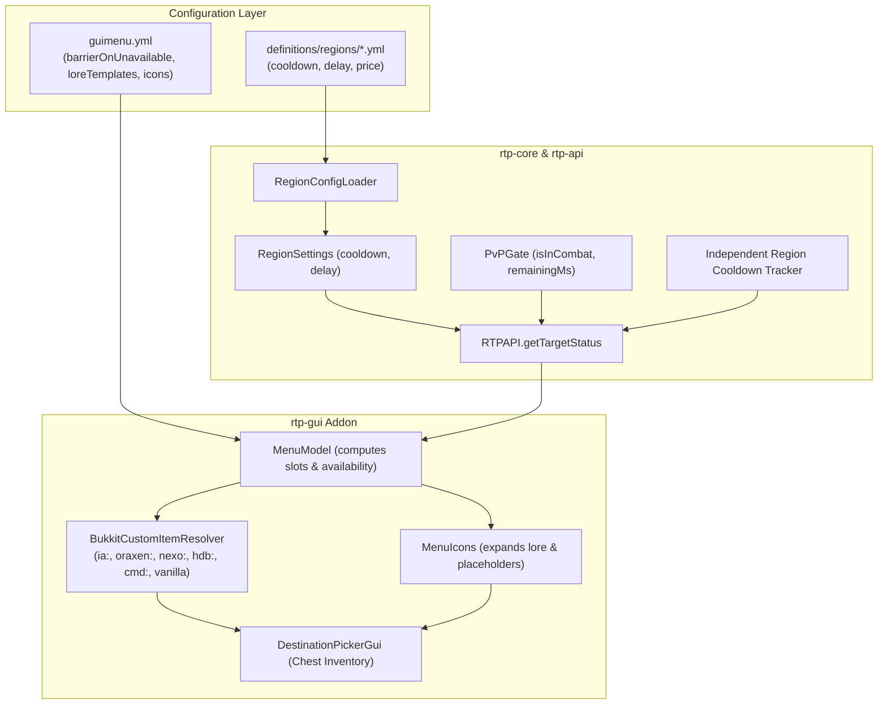

# Requirements

### Overview & Goals
The objective is to modernize the user experience of `LeafRTPGuiAddon` and introduce granular teleport pacing in `rtp-core`:
1. Enable servers to use custom items from **ItemsAdder**, **Oraxen**, **Nexo**, **HeadDatabase**, **Player Heads / Base64**, and **CustomModelData** as menu icons.
2. Provide immediate "at-a-glance" readability in the `/rtp` GUI by rendering blocked destinations as `BARRIER` blocks whenever a player is on cooldown, tagged in combat, lacking funds, or missing permission.
3. Replace hardcoded menu lore with configurable hover text templates supporting rich placeholders (`{status}`, `{cooldown}`, `{delay}`, `{cost}`, `{target}`, `{world}`).
4. Introduce optional per-region `cooldown` and `delay` settings in `rtp-core` with independent per-region cooldown tracking per player.

### Scope
#### In Scope
- **Custom Item Syntax**: Prefix routing in `guimenu.yml` for `itemsadder:`, `ia:`, `oraxen:`, `nexo:`, `hdb:`, `head:`, `base64:`, and `MATERIAL:CMD`.
- **Reflection / Soft-Depend Integration**: Decoupled, zero-shaded-dependency integration with third-party item plugins following ADR-026.
- **Blocked Visual Feedback**: Toggleable `barrierOnUnavailable` setting in `guimenu.yml` that swaps destination icons to `BARRIER` when not ready.
- **Combat State Exposure**: Adding `Availability.IN_COMBAT` to `RtpTargetStatus` by querying `PvPGate` and computing remaining combat tag time.
- **Dynamic Lore Templates**: Configurable lore lines with placeholder replacement and human-formatted duration strings (e.g., `1m 45s`, `30s`).
- **Region Cooldowns & Delays**: Adding optional `cooldown` and `delay` to `RegionKeys`, `RegionSettings`, and `RegionConfigLoader` with unit support (`5m`, `3s`).
- **Independent Region Cooldown Tracking**: Per-player per-region last teleport timestamp tracking in `RTP` and `TeleportData`.
- **Precedence Hierarchy**: `rtp.nocooldown`/`rtp.nodelay` bypass -> permission overrides -> region configuration -> global `config.yml` defaults.

#### Out of Scope
- Adding compile-time shaded dependencies to `build.gradle` (all third-party item APIs are accessed reflectively or via compileOnly soft-depends).
- Modifying the operator book menu (`/rtp admin`), which operates via chat and book components rather than inventory item stacks.

### User Stories
- **As a server administrator**, I want to configure ItemsAdder, Oraxen, or CustomModelData items in `guimenu.yml` so that my `/rtp` menu matches my server's custom theme and resource pack.
- **As a player**, I want blocked destinations to appear as barrier blocks with hover tooltips showing remaining cooldown or combat time so that I immediately see what I can and cannot click.
- **As a server owner**, I want resource-rich worlds or Nether regions to have longer cooldowns and warmups than the overworld, without locking players out of all teleports simultaneously.

### Functional Requirements
- `guimenu.yml` icon strings shall support prefixes: `ia:<id>`, `itemsadder:<id>`, `oraxen:<id>`, `nexo:<id>`, `hdb:<id>`, `head:<player>`, `base64:<hash>`, `MATERIAL:<cmd>` / `MATERIAL#<cmd>`, and vanilla `MATERIAL`.
- When `barrierOnUnavailable` is `true` (default), any target whose availability is not `READY` shall display as `BARRIER` (or `iconUnavailable`).
- When a destination is hovered, the tooltip shall display configurable lore lines for its specific availability state (`loreReady`, `loreCooldown`, `loreCombat`, `loreNoFunds`, `loreNoPermission`).
- Duration placeholders (`{cooldown}`, `{delay}`) shall format into concise, readable units (`1m 30s` or `45s`).
- If `PvPGate` reports a player in combat, `RTPAPI.getTargetStatus` shall return `Availability.IN_COMBAT` and include the remaining combat tag duration in milliseconds.
- Region YAML files (`definitions/regions/<name>.yml`) shall accept optional `cooldown` and `delay` values with unit suffixes (e.g., `10m`, `300s`, `5s`).
- Teleporting to Region A shall only trigger Region A's cooldown for that player; Region B shall remain usable if its own cooldown has elapsed.

# Technical Design

### Current Implementation
- `DestinationPickerGui.java` in `rtp-gui-bukkit` resolves items using `Material.matchMaterial(name.trim().toUpperCase())`, supporting only vanilla Bukkit materials.
- `MenuIcons.java` builds hardcoded lore in Java (`Status: ...`, `Cooldown: ...s`, `Cost: ...`) without configurable templates or rich placeholder substitution.
- `RtpTargetStatus.java` tracks `READY`, `ON_COOLDOWN`, `NO_PERMISSION`, `NO_FUNDS`, `DISABLED`, and `UNKNOWN`. It does not check `PvPGate.isInCombat` and does not carry warmup delay information.
- `RegionSettings.java` and `RegionConfigLoader.java` only manage spatial bounds, shapes, vertical adjustors, pricing, and cache caps. Cooldown and delay are strictly global (`ConfigKeys.teleportCooldown`, `ConfigKeys.teleportDelay`).
- Cooldown tracking in `RTP.java` is global per player via `RTP.getEffectiveLastTeleportTime(UUID)`.

### Key Decisions
- **Decision 1: Prefix-Routed Soft-Depend Item Resolver**
  - *Approach*: Implement `BukkitCustomItemResolver` using reflection and `Bukkit.getPluginManager().isPluginEnabled(...)` to inspect and build items for ItemsAdder (`CustomStack`), Oraxen (`OraxenItems`), Nexo (`NexoItems`), HeadDatabase (`HeadDatabaseAPI`), Base64/Player heads (`SkullMeta`), and CustomModelData (`ItemMeta#setCustomModelData`).
  - *Rationale*: Maintains zero shaded dependencies (ADR-026) and guarantees that missing plugins degrade gracefully to vanilla fallbacks without throwing `ClassNotFoundException`.

- **Decision 2: Barrier Block Swap for Blocked Targets**
  - *Approach*: When `barrierOnUnavailable: true` (default), `GuiMenuConfig.iconName(target, status)` returns `iconUnavailable` (`BARRIER`) whenever `status.availability() != Availability.READY`.
  - *Rationale*: Provides immediate, effortless "at-a-glance" visual parsing for players, clearly distinguishing between available and locked options.

- **Decision 3: Independent Per-Region Cooldown Tracking**
  - *Approach*: Track a map of `Map<String, Long>` (region name to last teleport epoch timestamp) per player UUID in `RTP`, updated upon successful teleport completion in `TeleportData.onComplete`.
  - *Rationale*: Allows different worlds and regions to have completely isolated cooldown timers (e.g., Nether on a 15m cooldown while Overworld is 1m) without cross-region lockout.

- **Decision 4: Combat State Integration in Target Status**
  - *Approach*: Add `IN_COMBAT` to `RtpTargetStatus.Availability`, query `PvPGate.isInCombat(uuid)` in `RTPAPI.getTargetStatus`, and compute remaining combat tag duration.
  - *Rationale*: Ensures the menu reflects real-time combat status, preventing players from clicking seemingly ready buttons only to be blocked by the command gate.

### Architecture Diagram


### Data Models & Contracts
#### `RtpTargetStatus` Enhancements
```java
public enum Availability {
  READY,
  ON_COOLDOWN,
  IN_COMBAT,      // newly added
  NO_PERMISSION,
  NO_FUNDS,
  DISABLED,
  UNKNOWN
}

// Additional accessors:
public long delayMillis(); // warmup delay configured for this target
public long combatRemainingMillis(); // remaining combat tag duration
```

#### `RegionSettings` and `RegionKeys` Enhancements
```java
// RegionKeys enum additions:
cooldown,
delay

// RegionSettings record additions:
Long cooldownMillis, // null or -1L indicates inherit global config
Long delayMillis     // null or -1L indicates inherit global config
```

#### Custom Item Resolver Contract (`BukkitCustomItemResolver`)
```java
public final class BukkitCustomItemResolver {
  public static ItemStack resolve(String itemSpec, Material fallback);
  public static boolean isCustomItem(String itemSpec);
}
```
Syntax specifications:
- `ia:<namespace>:<id>` or `itemsadder:<namespace>:<id>`
- `oraxen:<id>`
- `nexo:<id>`
- `hdb:<id>`
- `head:<playerName>`
- `base64:<base64EncodedTexture>`
- `<MATERIAL>:<cmdInt>` or `<MATERIAL>#<cmdInt>`
- `<MATERIAL>` (vanilla fallback)

#### `guimenu.yml` Lore Template Keys
```yaml
barrierOnUnavailable: true
iconInCombat: "BARRIER"

loreTemplates:
  ready:
    - "&7Status: &aREADY"
    - "&7Cost: &6{cost}"
    - "&7Warmup: &e{delay}"
    - ""
    - "&aClick to teleport!"
  cooldown:
    - "&7Status: &eON COOLDOWN"
    - "&cCooldown remaining: &e{cooldown}"
    - ""
    - "&cCannot teleport right now."
  combat:
    - "&7Status: &cIN COMBAT"
    - "&cCombat tag remaining: &e{cooldown}"
    - ""
    - "&cCannot teleport while in combat."
  noFunds:
    - "&7Status: &eINSUFFICIENT FUNDS"
    - "&7Required: &6{cost}"
    - ""
    - "&cYou cannot afford this teleport."
  noPermission:
    - "&7Status: &cLOCKED"
    - ""
    - "&cYou lack permission for this region."
```

### File Structure
- **Modified Core & API Files**:
  - `rtp-api/src/main/java/io/github/dailystruggle/rtp/api/RtpTargetStatus.java`
  - `rtp-core/src/main/java/io/github/dailystruggle/rtp/common/configuration/enums/RegionKeys.java`
  - `rtp-core/src/main/java/io/github/dailystruggle/rtp/common/selection/region/RegionSettings.java`
  - `rtp-core/src/main/java/io/github/dailystruggle/rtp/common/selection/region/RegionConfigLoader.java`
  - `rtp-core/src/main/java/io/github/dailystruggle/rtp/common/selection/region/Region.java`
  - `rtp-core/src/main/java/io/github/dailystruggle/rtp/common/commands/RTPCmd.java`
  - `rtp-core/src/main/java/io/github/dailystruggle/rtp/common/RTP.java`
- **Modified GUI Addon Files**:
  - `addons/LeafRTPGuiAddon/rtp-gui-common/src/main/java/io/github/dailystruggle/rtp/guiaddon/common/GuiMenuKeys.java`
  - `addons/LeafRTPGuiAddon/rtp-gui-common/src/main/java/io/github/dailystruggle/rtp/guiaddon/common/GuiMenuConfig.java`
  - `addons/LeafRTPGuiAddon/rtp-gui-common/src/main/java/io/github/dailystruggle/rtp/guiaddon/common/MenuIcons.java`
  - `addons/LeafRTPGuiAddon/rtp-gui-common/src/main/java/io/github/dailystruggle/rtp/guiaddon/common/MenuModel.java`
  - `addons/LeafRTPGuiAddon/rtp-gui-bukkit/src/main/java/io/github/dailystruggle/rtp/guiaddon/bukkit/DestinationPickerGui.java`
  - `addons/LeafRTPGuiAddon/rtp-gui-common/src/main/resources/addons/guimenu.yml`
- **Added Files**:
  - `addons/LeafRTPGuiAddon/rtp-gui-bukkit/src/main/java/io/github/dailystruggle/rtp/guiaddon/bukkit/item/BukkitCustomItemResolver.java`
  - Corresponding test classes across `rtp-core`, `rtp-api`, and `LeafRTPGuiAddon`.

# Testing

### Validation Approach
Verification relies on unit and component tests across `rtp-api`, `rtp-core`, and `LeafRTPGuiAddon` modules using JUnit 5, Mockito, and mock sender/player abstractions. Tests are executable directly via `./gradlew test`.

### Key Scenarios
- **Custom Item Resolver**:
  - Verify that `ia:<item>` resolves to the mock ItemsAdder custom item when ItemsAdder is simulated as present.
  - Verify that `oraxen:<item>` and `nexo:<item>` resolve correctly when those plugins are present.
  - Verify that `DIAMOND_SWORD:1005` correctly parses the material and applies `CustomModelData = 1005` to `ItemMeta`.
  - Verify that absent third-party plugins fall back to the vanilla material or default item without throwing exceptions.
- **Barrier Block Swapping**:
  - Verify that `GuiMenuConfig.iconName()` returns `BARRIER` when availability is `ON_COOLDOWN`, `IN_COMBAT`, `NO_FUNDS`, or `NO_PERMISSION` and `barrierOnUnavailable` is `true`.
  - Verify that when `barrierOnUnavailable` is `false`, the original configured target icon is preserved.
- **Combat State Target Status**:
  - Verify that when `PvPGate.isInCombat(uuid)` is `true`, `RTPAPI.getTargetStatus` returns `Availability.IN_COMBAT` and populates the remaining combat tag milliseconds.
- **Configurable Lore & Placeholders**:
  - Verify that `{cooldown}` formats correctly as `45s`, `1m 30s`, or `12h`.
  - Verify that `{delay}` expands to the configured warmup delay.
  - Verify that `{cost}` correctly expands to formatted currency or "Free".
- **Independent Region Cooldowns**:
  - Configure Region A with `cooldown: 5m` and Region B with `cooldown: 1m`.
  - Teleport the player to Region A; assert Region A status is `ON_COOLDOWN` with ~5 minutes remaining.
  - Assert Region B status remains `READY`.
  - Verify that `rtp.nocooldown` bypasses both regional and global cooldowns.

### Edge Cases
- Region configured with `@config` reference token for `cooldown` or `delay` properly inherits from the default configuration block.
- Teleportation to a region without an explicit `cooldown` key cleanly falls back to the global `teleportCooldown` in `config.yml`.
- Malformed custom item strings (e.g., empty IDs, negative CustomModelData values, invalid base64 textures) fail safely to standard fallbacks.
- Combat tag expiring while the menu is open (menu click re-verifies status via `PvPGate` at execution time to uphold S-004).

# Delivery Steps

### * Step 1: Implement Region Cooldown & Delay Configuration with Independent Tracking
Regions support optional per-region cooldown and warmup delay settings with independent cooldown timers per player.

- Add `cooldown` and `delay` keys to `io.github.dailystruggle.rtp.common.configuration.enums.RegionKeys`.
- Extend `io.github.dailystruggle.rtp.common.selection.region.RegionSettings` and `RegionConfigLoader` to parse human-readable durations (e.g. `cooldown: 5m`, `delay: 3s`) using `ConfigParser.parseDurationMillis` with `@config` inheritance support.
- Implement independent per-region cooldown tracking in `io.github.dailystruggle.rtp.common.RTP` and `TeleportData`, recording per-region timestamps in a player map (`ConcurrentHashMap<UUID, Map<String, Long>>`).
- Update `RTPCmd` and `TeleportPipelineTask` to resolve cooldown and warmup delay through the precedence hierarchy: permission bypass (`rtp.nocooldown`, `rtp.nodelay`) -> permission override (`rtp.cooldown.<sec>`, `rtp.delay.<sec>`) -> region setting -> global config default.
- Add unit tests in `rtp-core` validating region configuration parsing, precedence order, and independent cooldown enforcement.

###   Step 2: Integrate Combat Availability and Delay into RtpTargetStatus
`RtpTargetStatus` reflects active PvP combat state and exposes destination warmup delay for menu consumers.

- Add `Availability.IN_COMBAT` to `io.github.dailystruggle.rtp.api.RtpTargetStatus.Availability`.
- Update `RtpTargetStatus` with accessors for destination warmup delay (`delayMillis()`) and remaining combat tag duration.
- Update `RTPAPI.getTargetStatus` in `RTP.java` to query `PvPGate.isInCombat(uuid)` and calculate remaining combat tag milliseconds, marking the status as `IN_COMBAT` when the gate denies teleportation.
- Update `RTPAPI.getTargetStatus` to evaluate region-specific cooldowns and attach the resolved region's warmup delay.
- Add unit tests in `rtp-core` and `rtp-api` covering combat status reporting, region cooldown calculations, and delay exposure.

###   Step 3: Build Prefix-Routed Custom Item Resolver for Bukkit GUI
The Bukkit GUI addon resolves items from ItemsAdder, Oraxen, Nexo, HeadDatabase, player skins, and CustomModelData without hard dependencies.

- Implement `BukkitCustomItemResolver` in `io.github.dailystruggle.rtp.guiaddon.bukkit.item.BukkitCustomItemResolver`.
- Support prefix routing for `itemsadder:<id>`, `ia:<id>`, `oraxen:<id>`, `nexo:<id>`, `hdb:<id>`, `head:<name>`, `base64:<hash>`, and `MATERIAL:<cmd>` / `MATERIAL#<cmd>` using reflection and soft-depend checks (`Bukkit.getPluginManager().isPluginEnabled`).
- Provide graceful degradation: when a custom item plugin is missing or an ID is invalid, log a diagnostic once and fall back cleanly to vanilla `Material.matchMaterial` or `Material.COMPASS`.
- Update `DestinationPickerGui.java` to route all icon creation (destinations, filler, dashboard, action selector, operator hub) through `BukkitCustomItemResolver`.
- Add unit tests verifying prefix routing, CustomModelData parsing, and fallback behavior.

###   Step 4: Implement Barrier Block Swapping and Configurable Lore Templates in GUI Addon
Blocked destinations display as barrier blocks at a glance, and hover lore renders configurable templates with dynamic placeholders.

- Add `barrierOnUnavailable: true` and configurable lore template keys (`loreReady`, `loreCooldown`, `loreCombat`, `loreNoFunds`, `loreNoPermission`) to `guimenu.yml` and `GuiMenuKeys`.
- Update `GuiMenuConfig.java` to return `iconUnavailable` (`BARRIER`) for any non-ready destination when `barrierOnUnavailable` is enabled.
- Refactor `MenuIcons.java` to support placeholder expansion: `{status}`, `{cooldown}`, `{delay}`, `{cost}`, `{target}`, `{world}`, and `{region}`, formatting millisecond durations into readable strings (e.g. `1m 30s` or `45s`).
- Update `DestinationPickerGui` and `MenuModel` to bind the dynamic lore and barrier representation to inventory slots.
- Add unit tests in `rtp-gui-common` and `rtp-gui-bukkit` validating barrier block swapping, placeholder formatting, and configurable lore templates.