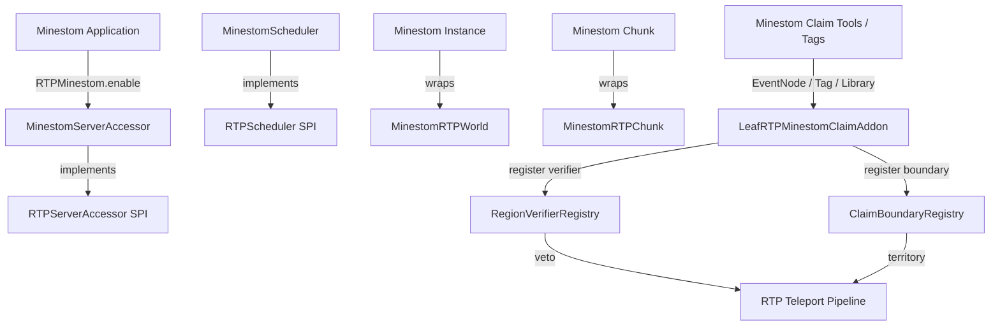

# Requirements

### Overview & Goals
The goal of this initiative is to expand LeafRTP to support **Minestom** as a first-class server platform (`rtp-minestom`) and establish a native ecosystem tool integration layer mirroring Bukkit's claim plugin support (`LeafRTPClaimAddon`).

Minestom is a lightweight, pure-Java, asynchronous Minecraft server library (Java 21+). Unlike native servers such as PumpkinMC, Minestom requires no WebAssembly sandboxing, incurs no FFI performance penalties, and requires no Bukkit compatibility layers (e.g., PatchBukkit). RTP's modular SPI architecture allows Minestom to be supported purely by implementing platform adapters for existing contracts.

This roadmap is tracked under Linear issue **RTP-33** for future execution.

### Scope
- **In Scope:**
  - Adding `PlatformFamily.MINESTOM` to `rtp-api`.
  - Creating `platforms/rtp-minestom` providing concrete bindings for `RTPServerAccessor`, `RTPScheduler`, `RTPWorld`, `RTPChunk`, and `RTPPlayer`.
  - Library-first bootstrap API (`RTPMinestom.enable(...)`) for custom Minestom standalone applications.
  - Command registration via Minestom `CommandManager` or Brigadier adapter.
  - Ecosystem tool and claim integration layer (`LeafRTPMinestomClaimAddon` / `MinestomToolIntegrations`) hooking into `RegionVerifierRegistry` and `ClaimBoundaryRegistry`.
  - Minestom native `EventNode` and instance `Tag` veto hooks for server-specific spatial zones.
- **Out of Scope (for this initiative):**
  - Legacy Minestom versions prior to modern Java 21 snapshots.
  - Emulating Bukkit plugins inside Minestom.
  - Non-JVM native servers (e.g., Rust-based PumpkinMC).

### User Stories
- **As a Minestom server developer**, I want to include RTP as a dependency in my Minestom application so that players can use `/rtp` with intelligent spiral distribution and safety checks.
- **As a Minestom network operator**, I want custom spawn zones, territory claims, and instances to be protected from random teleportation without writing complex custom patches.
- **As an ecosystem tool author**, I want to register region verifiers and claim boundaries in Minestom via standard `RTPHooks` interfaces.

### Functional Requirements
- **FR-01 (Runtime Bootstrap):** Minestom servers must be able to boot RTP via `RTPMinestom.enable(MinecraftServer server, Path configDirectory)`.
- **FR-02 (World & Chunk Pipeline):** Minestom `Instance` and `Chunk` instances must be adapted to `RTPWorld` and `RTPChunk`, supporting asynchronous column probing and surface height search.
- **FR-03 (Asynchronous Scheduling):** All task scheduling must route through Minestom's `SchedulerManager` via `RTPScheduler` without creating raw unmanaged threads.
- **FR-04 (Claim & Tool Integrations):** Third-party or in-house claim systems must be able to veto candidate destinations via `RTPAPI.hooks().verifiers().register(...)` and provide bounding boxes via `ClaimBoundaryRegistry`.
- **FR-05 (Instance Tag Protection):** Minestom instances tagged with protected spatial metadata or handled by registered `EventNode` filters must veto candidate teleport locations automatically.

### Non-Functional Requirements
- **NFR-01 (Zero Main-Thread Chunk I/O):** Chunk column checks and terrain generation queries must execute asynchronously without blocking Minestom instance tick threads (S-005).
- **NFR-02 (Zero Third-Party Runtime Bloat):** Use RTP's built-in `yaml-api` and decoupled storage without pulling heavy unneeded dependencies.
- **NFR-03 (Java 21+ Baseline):** Target Java 21+ in lockstep with RTP's platform standards.

# Technical Design

### Current Implementation
RTP's platform abstraction decouples core algorithms from server implementations:
- **`rtp-api`:** Defines SPI contracts (`RTPServerAccessor`, `RTPScheduler`, `RTPWorld`, `RTPChunk`, `RTPPlayer`, `PlatformFamily`).
- **`rtp-core`:** Houses all spatial math (Archimedean spiral, Hilbert curves), queue management, caching, and persistence.
- **Platform Adapters:** Existing adapters include `rtp-bukkit` (Spigot, Paper, Folia), `rtp-fabric`, and `rtp-neoforge`.
- **Hooks & Claim Integrations:** `RTPAPI.hooks().verifiers()` (`RegionVerifierRegistry`) and `RTPAPI.hooks().claimBoundaries()` (`ClaimBoundaryRegistry`) allow modular protection checks. In Bukkit this is delivered via `LeafRTPClaimAddon`, and in Fabric/NeoForge via `ModClaimIntegrations`.

### Key Decisions
1. **Target Minestom Directly Without Bukkit Layers:** Minestom's clean API allows direct implementation of `RTPServerAccessor` and `RTPWorld` without the overhead or impedance mismatch of Bukkit bridges.
2. **Library-First Bootstrap Model:** Modern Minestom applications typically run as standalone Java apps with a custom `main()` method. RTP will provide a primary `RTPMinestom.enable(...)` library bootstrap API, alongside an optional extension shim for extension-runner environments.
3. **Dual-Tier Tool and Claim Integration:**
   - *Tier 1 (Known Libraries):* Checkers for established Minestom protection libraries (e.g., plot systems or ports of claim tools) registering to `RTPHooks`.
   - *Tier 2 (Native Minestom Primitives):* Direct support for Minestom `Tag` metadata on `Instance` and `EventNode` predicates, allowing custom game modes to veto coordinates out of the box.

### Architecture Diagram

### Proposed Changes
- **`rtp-api`:** Add `PlatformFamily.MINESTOM` to `io.github.dailystruggle.rtp.api.server.PlatformFamily`.
- **`platforms/rtp-minestom`:**
  - `MinestomServerAccessor`: Implements `RTPServerAccessor`.
  - `MinestomScheduler`: Implements `RTPScheduler` backed by Minestom's scheduler manager.
  - `MinestomRTPWorld`: Adapts `Instance` to `RTPWorld`.
  - `MinestomRTPChunk`: Adapts `Chunk` to `RTPChunk`.
  - `MinestomRTPPlayer`: Adapts `Player` to `RTPPlayer`.
  - `MinestomCommandBridge`: Adapts `commands-api` tree to Minestom commands.
- **Claim & Tool Layer:**
  - `LeafRTPMinestomClaimAddon`: Discovers installed claim tools and wires verifiers.
  - `MinestomTagProtectionChecker`: Evaluates candidate coordinates against instance tags or bounding boxes.

### File Structure
- `api/rtp-api/src/main/java/io/github/dailystruggle/rtp/api/server/PlatformFamily.java` (modified)
- `platforms/rtp-minestom/build.gradle` (new)
- `platforms/rtp-minestom/src/main/java/io/github/dailystruggle/rtp/minestom/RTPMinestom.java` (new)
- `platforms/rtp-minestom/src/main/java/io/github/dailystruggle/rtp/minestom/server/MinestomServerAccessor.java` (new)
- `platforms/rtp-minestom/src/main/java/io/github/dailystruggle/rtp/minestom/scheduling/MinestomScheduler.java` (new)
- `platforms/rtp-minestom/src/main/java/io/github/dailystruggle/rtp/minestom/world/MinestomRTPWorld.java` (new)
- `platforms/rtp-minestom/src/main/java/io/github/dailystruggle/rtp/minestom/world/MinestomRTPChunk.java` (new)
- `platforms/rtp-minestom/src/main/java/io/github/dailystruggle/rtp/minestom/entity/MinestomRTPPlayer.java` (new)
- `platforms/rtp-minestom/src/main/java/io/github/dailystruggle/rtp/minestom/claims/MinestomToolIntegrations.java` (new)
- `addons/LeafRTPMinestomClaimAddon/` (new, optional modular addon)

### Risks & Mitigations
- **Risk:** Minestom snapshot API drift across versions.
  - *Mitigation:* Pin Minestom dependency version in Gradle and encapsulate version-specific calls in dedicated wrapper methods.
- **Risk:** Synchronous chunk generation blocking instance ticks (S-005).
  - *Mitigation:* Ensure `MinestomRTPWorld.getChunkAt` uses Minestom's asynchronous chunk loading (`Instance#loadChunk`) and `CompletableFuture` pipelines.

# Testing

### Validation Approach
Verification will follow RTP's standard multi-tiered testing model:
- **Unit Testing:** Use mocked or lightweight in-memory Minestom `InstanceContainer` and `Chunk` instances to verify world wrapping, coordinate translations, and safety checks without starting network listeners.
- **Scheduler Verification:** Verify `MinestomScheduler` correctly cancels tasks, executes delayed tasks, and routes async work without deadlock.
- **Claim / Tool Verification:** Test `RegionVerifierRegistry` and `ClaimBoundaryRegistry` with mock claim providers and verify candidate locations are vetoed properly.

### Key Scenarios
1. **Lifecycle Boot:** Booting RTP via `RTPMinestom.enable(...)` registers commands, loads YAML configs, and initializes `RTPServerAccessor` with `PlatformFamily.MINESTOM`.
2. **Safe Destination Teleport:** Player executes `/rtp`, candidate location is searched on an async thread, block safety is verified on the Minestom chunk, and player position is updated.
3. **Claim Veto:** When candidate coordinates fall inside a registered Minestom protected region or tagged instance area, the verifier returns `false`, causing the pipeline to reject the candidate and select the next spiral step.

### Edge Cases
- **Unloaded Instance:** Teleporting to an instance that is shutting down or has no loaded chunks safely aborts without throwing unhandled exceptions.
- **Pre-Initialization Call:** Addons querying `RTPAPI` before `RTPMinestom.enable` throws `IllegalStateException` (REQ-RTP-S-006).
- **Veto Throwing Exception:** A custom Minestom claim verifier that throws an unhandled runtime exception is caught, logged at WARNING, and treated as vetoed (`false`) per REQ-RTP-S-004.

# Delivery Steps

###   Step 1: API contracts and PlatformFamily.MINESTOM
rtp-api exposes PlatformFamily.MINESTOM and passes all fail-closed contract validations.

- Add `MINESTOM` to `io.github.dailystruggle.rtp.api.server.PlatformFamily`.
- Update `RTPServerAccessor.getPlatformFamily()` default heuristics to detect Minestom if platform name starts with `minestom`.
- Add unit tests verifying `PlatformFamily.MINESTOM` behaves properly across default accessor methods and compatibility checks (`isCompatible`, `isPlatformFamily`).
- Maintain strict fail-closed semantics (REQ-RTP-S-006) when accessing uninitialized state.

###   Step 2: Core Minestom Platform Adapter (rtp-minestom)
rtp-minestom compiles against Minestom and boots the core teleport engine in a standalone Minestom environment.

- Create the `platforms/rtp-minestom` submodule in `settings.gradle` and configure dependencies on `net.minestom:minestom-snapshots`, `rtp-api`, and `rtp-core`.
- Implement `RTPMinestom.enable(MinecraftServer, Path)` bootstrap lifecycle.
- Implement `MinestomServerAccessor` implementing `RTPServerAccessor` (players, instances, console command sender, broadcast messages).
- Implement `MinestomScheduler` implementing `RTPScheduler` (12 methods) delegating to Minestom's `MinecraftServer.getSchedulerManager()` and asynchronous executors.
- Implement `MinestomRTPWorld` and `MinestomRTPChunk` wrapping Minestom `Instance` and `Chunk`, with asynchronous chunk column probing (S-005).
- Wire RTP commands into Minestom's `CommandManager` using the `commands-api` tree.

###   Step 3: Minestom Ecosystem Claim and Tool Integration Layer
Minestom-native protection tools and custom spatial tag/event vetoes integrate directly into RTP's hook pipeline.

- Create `LeafRTPMinestomClaimAddon` (or in-adapter `MinestomToolIntegrations`) discovering Minestom claim libraries and registering verifiers via `RTPAPI.hooks().verifiers()`.
- Implement a Minestom `EventNode` listener and instance `Tag` checker that allows server owners to veto teleport destinations using Minestom's native spatial tags without extra plugins.
- Wire `ClaimBoundaryRegistry` for Minestom-based territory lookup providers.
- Provide soft-depend hooks for Minestom permission providers (e.g. `LuckPerms-Minestom`) and `RTPEconomy`.

###   Step 4: Test Harness, Verification, and Documentation
Minestom adapter and claim integrations pass automated unit tests and operator documentation is complete.

- Author unit and integration tests using Minestom test fixtures (`MinestomServerAccessorTest`, `MinestomSchedulerTest`, `MinestomTeleportSafetyTest`).
- Verify no blocking chunk I/O occurs on instance tick threads (S-005 verification).
- Author Minestom configuration and deployment guide in `docs/admin/platforms/minestom.md`.
- Update `docs/dev/MULTI_PLATFORM_PLAN.md` and `docs/dev/EXTERNAL_HOOKS.md` to catalog Minestom and its tool integrations.