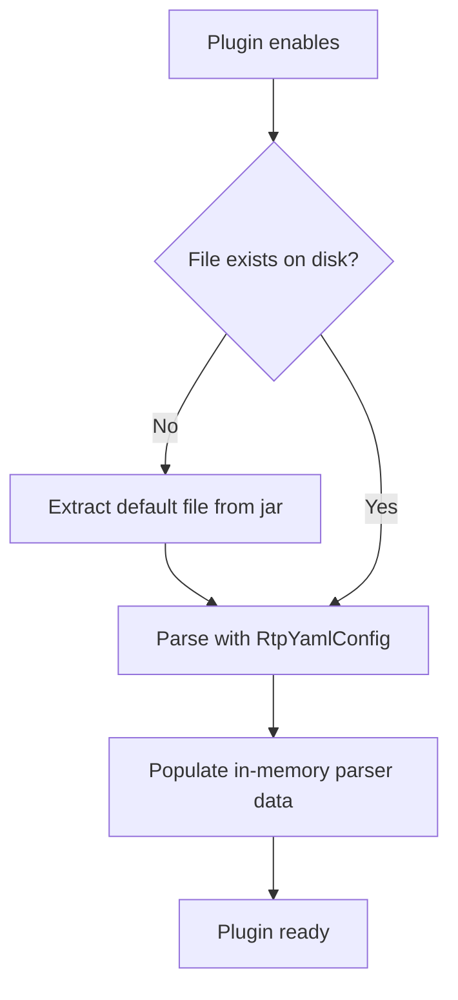
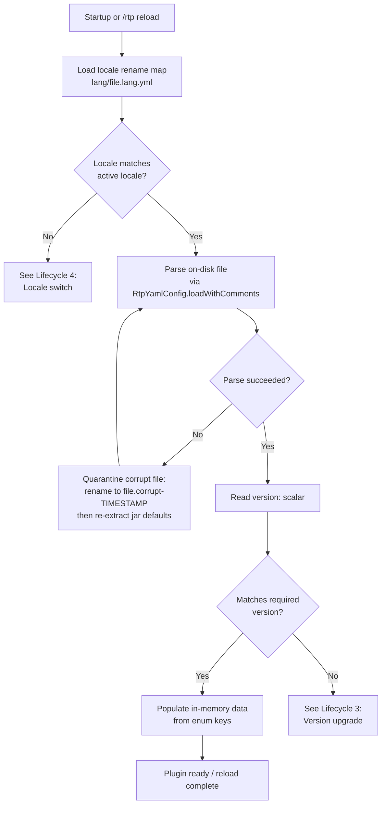
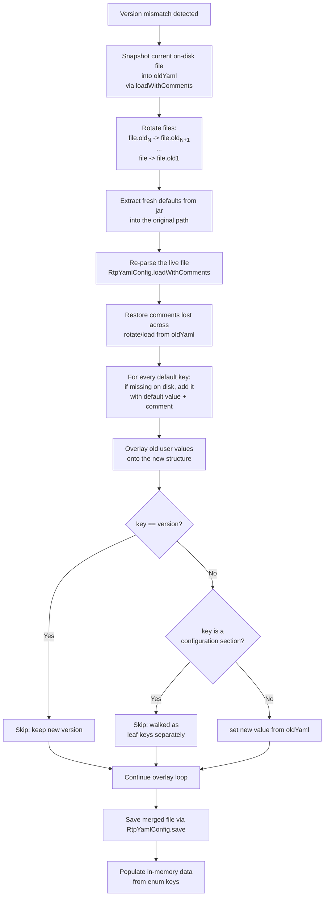
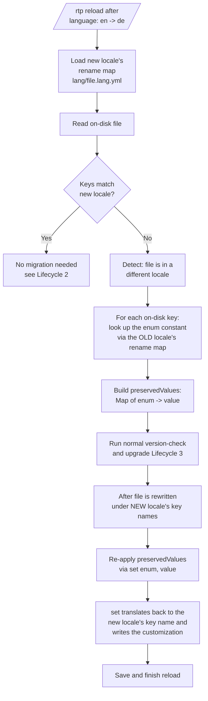
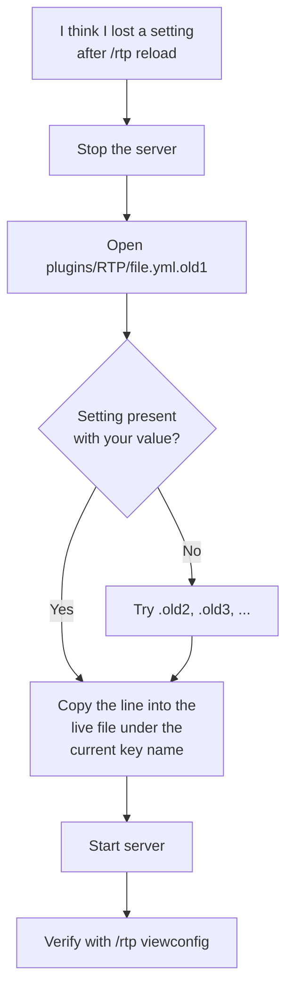

# Config Lifecycle (Load, Reload, Version Upgrade)

This document describes how RTP loads its YAML configuration files, what happens on `/rtp reload`, and how the plugin upgrades on-disk configs across versions without losing your customizations.

It is intended for server operators who want to understand:

- Where on-disk values come from (jar defaults vs. your edits).
- What the `.oldN` files that appear next to your configs are.
- Why a version bump never wipes your settings.
- How locale switches preserve your edits across renamed keys.

For the **key reference** (what each setting does), see [CONFIGURATION.md](CONFIGURATION.md) and [CORE_CONFIG.md](CORE_CONFIG.md). For **upgrade procedure** (which command to run, when), see [MIGRATION.md](../MIGRATION.md). This document only covers the **mechanics** of how the on-disk files are managed.

---

## TL;DR

1. On startup or `/rtp reload`, each YAML file under `plugins/RTP/` is parsed by RTP's custom YAML implementation (`RtpYamlConfig`).
2. If the on-disk `version:` field does not match the plugin's required version, the file is **upgraded in place**:
   - Your current file is **read into memory first**.
   - Your current file is **rotated** to `<name>.oldN` (numbered backups).
   - **Fresh defaults** are extracted from the plugin jar.
   - **Your old values are overlaid** onto the fresh defaults, then the file is saved.
3. The `version:` field itself is always taken from the new defaults (so the upgrade does not loop).
4. If the plugin detects you switched languages (e.g., `language: en` -> `language: de`), the previous file's values are **translated back to enum constants** and re-applied under the new locale's key names. Your customizations survive the locale switch.

You should never lose customizations across a version bump or a locale switch. If you do, that is a defect — please file an issue with the contents of your `.old1` file attached.

---

## Files involved

For each managed file (e.g. `config.yml`, `safety.yml`, `economy.yml`, `performance.yml`, `worlds/<world>.yml`, `regions/<region>.yml`):

| Path | Role |
|---|---|
| `plugins/RTP/<file>.yml` | The **live** file. Editable by you. This is what RTP reads at runtime. |
| `plugins/RTP/<file>.yml.old1` | The most recent **pre-upgrade snapshot**. Created automatically when RTP rewrites the live file. |
| `plugins/RTP/<file>.yml.old2`, `.old3`, ... | Older pre-upgrade snapshots. Each upgrade shifts existing `.oldN` files up by one. |
| `plugins/RTP/lang/<locale>/<file>.yml` | Locale-translated defaults shipped inside the jar. Extracted to disk only when needed. |
| `plugins/RTP/lang/<file>.lang.yml` | Key rename map: original baseline key -> translated key for the active locale. |

**The `.oldN` files are not garbage.** They are your safety net. If an upgrade goes wrong, you can compare the live file to `.old1` to see exactly what changed and merge by hand.

You may delete `.oldN` files manually once you are satisfied the upgrade is clean. RTP never reads them at runtime.

---

## Lifecycle 1: First startup (no on-disk file yet)

On first startup, every managed file is extracted verbatim from the jar (the active locale's variant if applicable), parsed, and held in memory. No upgrade logic runs because there is nothing on disk yet.

---

## Lifecycle 2: Normal startup or `/rtp reload` (versions match)

The happy path: parse, check version, copy enum-keyed values into memory. No file rewrite happens. Comments you added to the YAML are preserved on disk because the file is never rewritten.

If the file is corrupt (malformed YAML), RTP quarantines it (renames it to `<file>.yml.corrupt-<timestamp>`) and re-extracts jar defaults so the plugin self-heals on the next load rather than silently running with empty data. The quarantined file is left alone so you can recover edits from it.

---

## Lifecycle 3: Version upgrade (on-disk version != required version)

This is the case the issue's question targets: **what happens when the plugin bumps a file's required version and you have customizations in the old file?**

**Key guarantee:** the snapshot in step B happens **before** any file is rotated or overwritten. The old values live entirely in memory while the new defaults are being written, then they are overlaid back on top. The on-disk `.old1` is also kept as a manual fallback.

**What gets preserved automatically:**

- Every scalar value you customized (numbers, strings, booleans).
- Every list you customized (`airBlocks`, `unsafeBlocks`, `biomes`, `consoleCommands`, ...).
- Comments — your hand-added comments are restored from the in-memory snapshot, and any new default keys arrive with their jar-shipped comments.

**What does NOT get preserved:**

- The `version:` scalar itself — it is intentionally taken from the new defaults so the file matches the upgraded plugin and the upgrade does not loop next reload.
- Keys you added that are not recognized by RTP — they are silently dropped on the next upgrade because RTP only re-emits keys that exist in the new defaults' enum schema. If you need custom keys, use the documented extension points instead of injecting them into RTP's managed files.

**What if a key was removed in the new version?**

The overlay loop iterates `oldYaml.getKeys(true)` (all leaf keys present in your old file) and re-applies them via `set(...)`. A key that exists in your old file but not in the new defaults will be re-introduced into the new file. This is the "persist user customizations" bias: when in doubt, RTP keeps your value rather than silently retiring it. To actively retire a key, RTP needs an explicit removal step in the upgrade code; that is a code-level decision, not a config-level one.

---

## Lifecycle 4: Locale switch (you changed `language:` in `config.yml`)

YAML keys themselves may be translated for non-English locales (e.g. `teleportDelay` -> `verzogerung_teleport` in a hypothetical German locale). Switching locales is therefore not just a translation of *values* — it is a rename of *keys*. RTP handles this without you having to hand-edit each file.

The in-memory representation is always enum-keyed (locale-independent); locale only affects what the YAML key looks like on disk. Switching locale rewrites the file under new key names but your numeric/string/boolean values come along for the ride.

If you customized a value under the old locale's key name, after `/rtp reload` with a new `language:` you will find your customization under the new locale's key name in the same file. Nothing is lost.

---

## When customizations could legitimately fail to carry over

These are not bugs but they are worth knowing:

1. **You hand-renamed a key.** If you renamed a baseline key in your live file to something neither the old nor new locale recognizes, RTP cannot map it back to an enum constant. The value will be dropped on the next upgrade. Always edit values, not key names.
2. **You changed a value's type.** If a key expects an integer and you set a string, RTP logs a warning and either coerces or falls back to default. The `.old1` file still has your original.
3. **The new version intentionally retires a key.** When a release note in [CHANGELOG.md](https://github.com/dailystruggle/RTP/blob/V3/CHANGELOG.md) lists a key as removed, the overlay will re-introduce it on the immediate next upgrade only if RTP did not add an explicit removal step. Either way, the key will no longer have any effect because the enum constant is gone. Remove it from your live file at your leisure.
4. **You edited a `.lang.yml` rename map by hand.** Do not do this. The rename maps are generated by the project's translation pipeline, and hand edits will be overwritten the next time it runs.

---

## Disaster recovery: restoring a customization that went missing

`.oldN` files are plain YAML. You can read them with any editor. The newest snapshot is always `.old1`.

If a key was renamed across versions, the safest reference is the **new** file's defaults plus the value you find in `.oldN`. The plugin's [CHANGELOG.md](https://github.com/dailystruggle/RTP/blob/V3/CHANGELOG.md) lists any key renames per release.

---

## Verifying the upgrade worked

After a version bump, the following are healthy signs:

- `plugins/RTP/<file>.yml.old1` exists and contains your pre-upgrade content.
- `plugins/RTP/<file>.yml` exists with the new `version:` scalar and all your custom values still present (under the active locale's key names).
- No `WARNING` entries in the server log mentioning `quarantining and re-extracting defaults` for the file in question.

If any of those are wrong, attach the `.old1` file and the relevant server log section to a [GitHub issue](https://github.com/DailyStruggle/RTP/issues).

---

## See also

- [CONFIGURATION.md](CONFIGURATION.md) — key-by-key reference for every managed file.
- [CORE_CONFIG.md](CORE_CONFIG.md) — detailed reference for `config.yml`.
- [MIGRATION.md](../MIGRATION.md) — version-specific upgrade notes.
