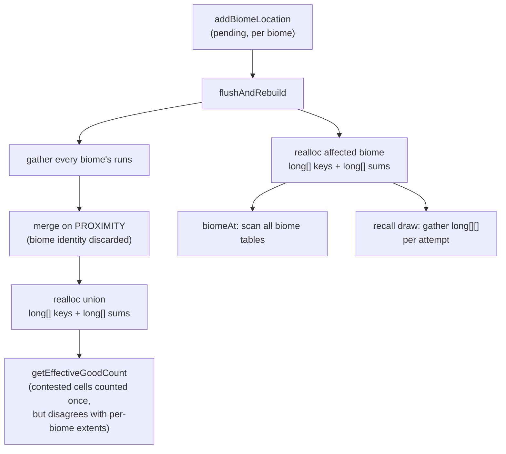
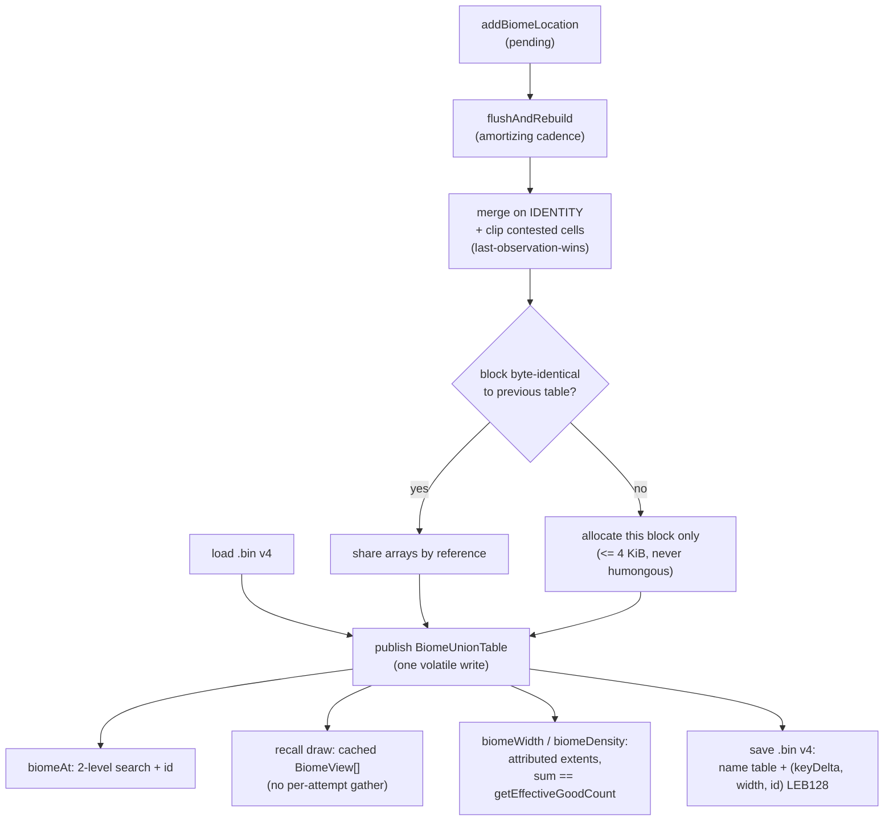

# ADR-081 — Unified Blocked Biome Run Table in `MemoryShape` (identity merging, last-observation-wins clipping, `.bin` v4)

**Status:** Accepted
**Date:** 2026-09-05

## Context

`MemoryShape` records observed biome coverage as sorted runs over the shape's 1D key domain (ADR-001), sourced from the Anvil `.mca` palette (ADR-016) and persisted in the shape catalog's `.bin` (ADR-034). The recall draw that ADR-062 defines reads those runs to pick a candidate inside a requested biome.

Four properties of the original structure forced a rework:

1. **Every run was stored twice.** Once in the owning biome's `long[]` key/prefix-sum pair, and again in a coalesced union pair - 32 B per run resident, plus roughly 200 B of map entry and array headers per biome. This is the cost the operator sees grow, and biome run count tracks **area**, not biome boundary length (measured growth exponent 1.99-2.02: the ring order maps a patch spanning many rings to one run *per ring*). Bytes-per-run is therefore a constant factor on a quadratic term, so it matters more as a world is scanned wider, not less.
2. **The union merged on proximity, not identity.** Any two runs within `spatialResolution` were coalesced regardless of biome, so a forest run and an ocean run could become one run. The union consequently could not answer "which biome is here" at all, and a point lookup had to scan every biome's own table - `O(biomes x log runs)`.
3. **A cell could be claimed by two biomes**, so per-biome extents and the union disagreed about total recorded coverage.
4. **Every rebuild reallocated everything.** Applying a handful of pending observations reallocated the affected biome's arrays and both union arrays in full, making rebuild cost proportional to the *existing* table rather than to the pending work, and pushing any `long[]` past 131,072 entries into a G1 humongous allocation on each pass.

## Decision

The biome table has exactly **one** form, in memory and on disk: a single immutable, blocked union of runs, each run carrying one biome id.

1. **Unified table.** One ascending run stream for all biomes with a parallel `short` biome id and an append-only id/name table. Per-biome queries are `BiomeView`s - `int[]` run indices plus that biome's cumulative widths - built on first request and cached for the immutable table's lifetime.
2. **Identity merging.** Runs coalesce only when the biome id matches (still bridging a `spatialResolution` gap). Differing-biome runs never merge.
3. **Last-observation-wins by clipping.** An incoming run overlapping an already-placed run of a different biome is clipped to start past that run's end, and dropped if fully covered. The union is therefore a **partition** of recorded space: every cell belongs to exactly one run of exactly one biome. "Last observation" is defined by merge order (key-ascending) with a deterministic name-sorted tie-break for equal keys.
4. **Blocked `int` offsets over `long` block bases.** Absolute key and prefix-sum bases are stored once per block; each run stores `int` offsets from its block's bases. A block closes on a run count limit **or** whenever the next key or sum offset would exceed `Integer.MAX_VALUE`, so overflow is structurally impossible at any world border size or `spatialResolution`.
5. **Per-block copy-on-write.** A closing block byte-identical to the corresponding block of the previously published table reuses that block's arrays by reference. Only touched blocks allocate.
6. **`.bin` version 4** stores the on-disk image of the union: a name table plus one ascending stream of `(key delta, width, biome id)`, each LEB128. Version <= 3 files are *ingested*, not migrated - their per-biome sections are staged, sorted key-ascending, and passed through the same identity-merge-with-clipping helper the rebuild uses.
7. **Attributed, not un-clipped, per-biome extents.** `biomeWidth` / `biomeWidthBefore` / `biomeDensity` report the extent attributed to a biome by the partition, so per-biome widths sum to `getEffectiveGoodCount()` and agree with `biomeAt`.

### How it used to work

```
per-biome tables (one pair per biome, exact-fit, reallocated whole on rebuild)

  "forest"  keys [ 100  260  900 ]        sums [ 16  32  48 ]     long, 16 B/run
  "ocean"   keys [ 262  910 ]             sums [ 16  32 ]         long, 16 B/run
  "desert"  keys [ 104 ]                  sums [ 16 ]             long, 16 B/run

coalesced union (second copy of every run, no biome id)

  keys [ 100 ......... 260 ......... 900 ]
  sums [  48           112          176  ]
         ^ forest+desert merged      ^ forest+ocean merged
           on PROXIMITY, biome lost    on PROXIMITY, biome lost

  point lookup: scan every biome's own table            O(biomes x log runs)
  rebuild:      realloc affected biome pair + both union arrays   O(recorded runs)
  resident:     16 B/run own + 16 B/run union = 32 B/run + ~200 B/biome
```



### How it ought to work

```
one blocked union - the only stored form

  names:        [ 0:"forest"  1:"ocean"  2:"desert" ]     append-only

  blockStart:   [ 0                       2 ]
  blockBaseKey: [ 100                     900 ]            long, once per block
  blockBaseSum: [ 0                       48 ]             long, once per block

  keyOffset:    [   0    4   ][   0   10  ]                int,   4 B/run
  sumOffset:    [   0   16   ][   0   16  ]                int,   4 B/run
  biomeId:      [   0    2   ][   0    1  ]                short, 2 B/run
                  ^forest ^desert  ^forest ^ocean          -> 10 B/run

  key(i) = blockBaseKey[b(i)] + keyOffset[i]
  sum(i) = blockBaseSum[b(i)] + sumOffset[i]

  BiomeView("forest") = runIndices [ 0, 2 ] + cumulative widths   12 B/run,
                                                                  queried biomes only

  point lookup: search blockBaseKey, search in block, read biomeId   O(log runs)
                                                     biome-count independent
```



## Alternatives Considered

| Alternative | Why Rejected |
|-------------|--------------|
| Keep per-biome tables, only deduplicate the union | Leaves 16 B/run of duplicate storage and keeps `biomeAt` biome-count dependent; the union still cannot name a biome. |
| Tag union runs with a biome id but stop merging across ids without clipping | `getEffectiveGoodCount()` is accumulated from the union, so a cell claimed by two biomes would count twice and inflate the selector's good/bad ratio. |
| Leave the union un-clipped (allow overlapping runs) | Overlapping runs break the floor-by-key search: it lands on a short run starting later and misses the longer run that covers the location, so `biomeAt` returns null on exactly the contested cells. Clipping is what makes the partition and the lookup correct. |
| Keep an id *set* per run for contested cells | Destroys the flat-array layout and the whole resident saving, to represent an artifact of coarse `spatialResolution` aggregation rather than real terrain. |
| Flat `int[]` keys, region-relative | With chunk scaling and a vanilla border the key domain is still ~3.5e12 cells at `spatialResolution` 1, needing `res >= 41 chunks` to be safe. Close enough to a real setting to ship a wrapping bug, and it fails by wrapping rather than throwing. |
| Fixed-size blocks indexed by `i >> 10` | Early closes on offset overflow make blocks variable-length; a shift-indexed layout either forbids early closes (reintroducing overflow) or mis-indexes. Explicit `blockStart[]` with a floor search is required. |
| Six independent volatile columns instead of one immutable holder | A reader could mix generations - a prefix sum from generation N+1 against a key from generation N. One holder swapped by a single volatile write keeps readers lock-free with no epoch tracking. |
| Ping-pong / capacity-doubling published buffers | Writing into a spare buffer mutates an array a lock-free reader may still hold. Per-block copy-on-write gets the same amortization without ever writing a published array. Grow-only reuse is applied only to never-published merge scratch. |
| Fixed-width `int` key field on disk | Delta magnitude tracks run *spacing*, which does not grow with world radius, while absolute keys track a domain that grows quadratically. A varint both saves more typically and needs no ceiling. |
| Migrate v<=3 files in a dedicated conversion pass | The old per-biome sections are already sorted runs with width deltas - exactly the builder's input. Ingesting through the *same* merge helper is what keeps a load and a rebuild of the same observations in agreement. |
| Spatial tree (quadtree / R-tree) for biome recall | Loses the `O(log n)` width-proportional weighted draw that prefix sums over a monotone 1D index give, and loses ADR-001's radius-append property. |

## Consequences

- **Positive:** resident cost per union run falls to 10 B from 32 B held in two copies, and per-biome view arrays are paid only for biomes actually queried. Rebuild allocation at 65,536 recorded runs fell 3.01 MB -> 183 kB per rebuild, with allocation growth over a 128x table 12.83x -> 3.61x. The recall draw no longer gathers per attempt (at 8 biomes x 8192 runs: 131,632 -> 132 ns and 638 kB -> 4 B per attempt). `biomeAt` is `O(log runs)` and biome-count independent. No column can be a G1 humongous allocation. On-disk biome section shrinks to roughly 3 B/run from 16 B/run.
- **Negative / Trade-offs:** contested cells resolve to a single biome, which is user-visible in `/rtp map` rendering for cells with conflicting observations, and is documented as a `spatialResolution` aggregation artifact. Per-biome extents changed definition from un-clipped to attributed. "Last observation" means merge order, not observation time. The name table retains biomes no longer present, because ids must be append-only or per-block copy-on-write shares nothing. A run maps to its block by search rather than by shift. Rebuild *time* remains proportional to recorded runs: the merge still walks every run even though it publishes shared blocks, so making the merge itself incremental is outstanding.

## References

- `rtp-core/src/main/java/io/github/dailystruggle/rtp/common/selection/region/selectors/memory/shapes/MemoryShape.java` (`BiomeUnionTable`, `BiomeView`, `flushAndRebuild`, `save`/`load`)
- `rtp-core/src/main/java/io/github/dailystruggle/rtp/common/selection/region/PregenTask.java` (`refreshBiomeDrawTables`, `drawWeightedBiome`)
- Tests: `MemoryShapeTest` (identity merging, overlap clipping, block spans and huge gaps, per-block reuse by array identity), `MemoryShapeLoadedUnionTest` (v4 round-trip, v3 ingest), `BiomeTableLayoutComparisonTest`, `BiomeRecallDrawCostTest`, `MemoryShapeRebuildCostTest`
- [ADR-001](ADR-001-archimedean-spiral-1d-mapping.md) 1D mapping and radius-append invariant; [ADR-016](ADR-016-anvil-subsystem.md) Anvil observation source; [ADR-034](ADR-034-memory-shape-catalog.md) shape catalog and persistence; [ADR-062](ADR-062-biome-probability-weighting.md) recall draw semantics
- [`docs/dev/LESSONS_LEARNED.md`](../dev/LESSONS_LEARNED.md) 2026-09-05 entry - the traps encountered implementing this
- `scripts/analyze_memoryshape_bin.py` - run-count area-scaling measurement
