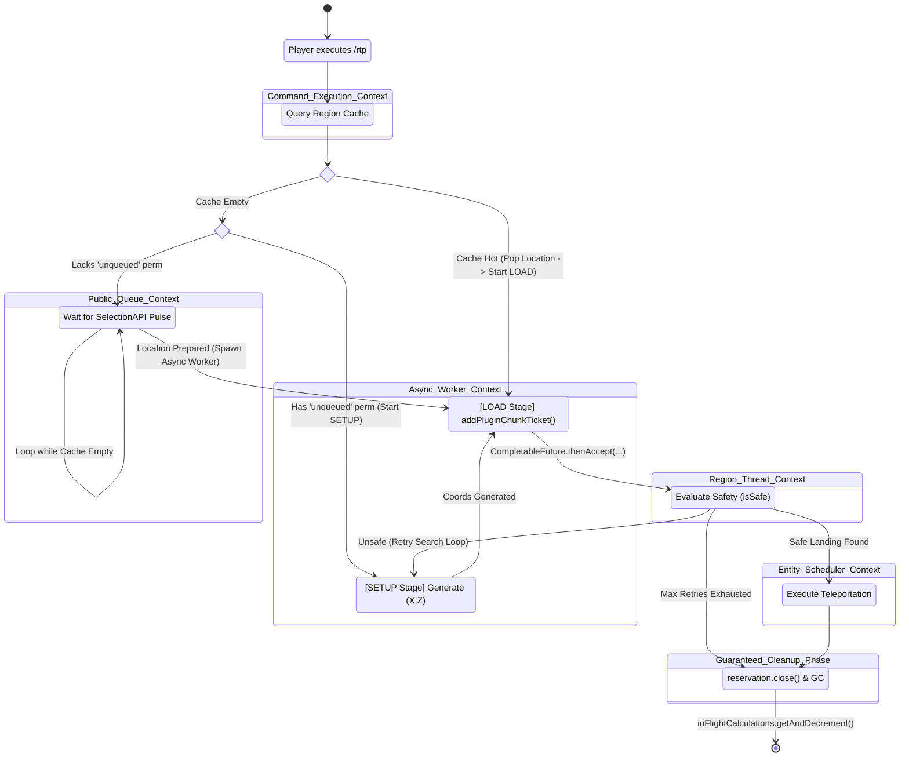

```mermaid
stateDiagram-v2
    CmdTrigger : Player executes /rtp
    [*] --> CmdTrigger

    state cache_check <<choice>>
    state perm_check <<choice>>

%% 1. Define State Containers (No quotes or aliases)
    state Command_Execution_Context {
        QueryCache : Query Region Cache
    }

    state Public_Queue_Context {
        QueueWait : Wait for SelectionAPI Pulse
    }

    state Async_Worker_Context {
        GenRandom : [SETUP Stage] Generate (X,Z)
        ReqTicket : [LOAD Stage] addPluginChunkTicket()
    }

    state Region_Thread_Context {
        EvalBlocks : Evaluate Safety (isSafe)
    }

    state Entity_Scheduler_Context {
        MovePlayer : Execute Teleportation
    }

    state Guaranteed_Cleanup_Phase {
        Teardown : reservation.close() & GC
    }

%% 2. Map Transitions
    CmdTrigger --> QueryCache
    QueryCache --> cache_check

%% Hot Cache Path
    cache_check --> ReqTicket : Cache Hot (Pop Location -> Start LOAD)

%% Cold Cache Logic
    cache_check --> perm_check : Cache Empty

%% Public Queue Loop
    perm_check --> QueueWait : Lacks 'unqueued' perm
    QueueWait --> QueueWait : Loop while Cache Empty
    QueueWait --> ReqTicket : Location Prepared (Spawn Async Worker)

%% Unqueued Path
    perm_check --> GenRandom : Has 'unqueued' perm (Start SETUP)

%% Generation & Ticket Pipeline
    GenRandom --> ReqTicket : Coords Generated
    ReqTicket --> EvalBlocks : CompletableFuture.thenAccept(...)

%% Evaluation Branches
    EvalBlocks --> MovePlayer : Safe Landing Found
    EvalBlocks --> GenRandom : Unsafe (Retry Search Loop)
    EvalBlocks --> Teardown : Max Retries Exhausted

%% Finalization
    MovePlayer --> Teardown
    Teardown --> [*] : inFlightCalculations.getAndDecrement()
```