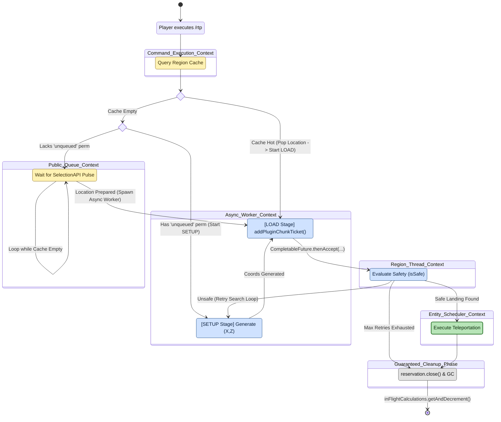

# Teleport execution pipeline

**Scope of this diagram.** This chart covers the end-to-end lifecycle of a *single* `/rtp` teleport once `SelectionAPI.getRegion` has already resolved a region (diagram 08) — from the cache-vs-queue-vs-unqueued branch, through the async `SETUP` → `LOAD` stages, region-thread safety eval, entity-scheduler teleport, and guaranteed cleanup. This is the **outer loop** that orchestrates all other pipelines. Related-but-separate behavior paths are intentionally **out of scope** here and documented elsewhere:
- **How a candidate `(x, y, z)` is accepted or rejected inside one attempt** — see diagram 09 (location selection per attempt); `EvalBlocks` in this chart is a single node that expands into that entire flowchart.
- **How the cache was filled** — see diagram 02 (budgeted cache generator); `QueueWait` simply pops a result prepared by that loop.
- **How chunk tickets are actually issued and released** — see diagram 03 (chunk ticket lifecycle); `ReqTicket` and `Teardown` are abstractions over it.
- **Region / world resolution** — see diagram 08 (`/rtp` command region selection); this chart starts after a region has been chosen.
- **Failure attribution and user-facing messages** — see `CODE_TOUR.md` §7 and S-004 / S-007.

> Companion walkthrough: [`CODE_TOUR.md` §2 — Teleport pipeline (end-to-end)](../dev/CODE_TOUR.md).

