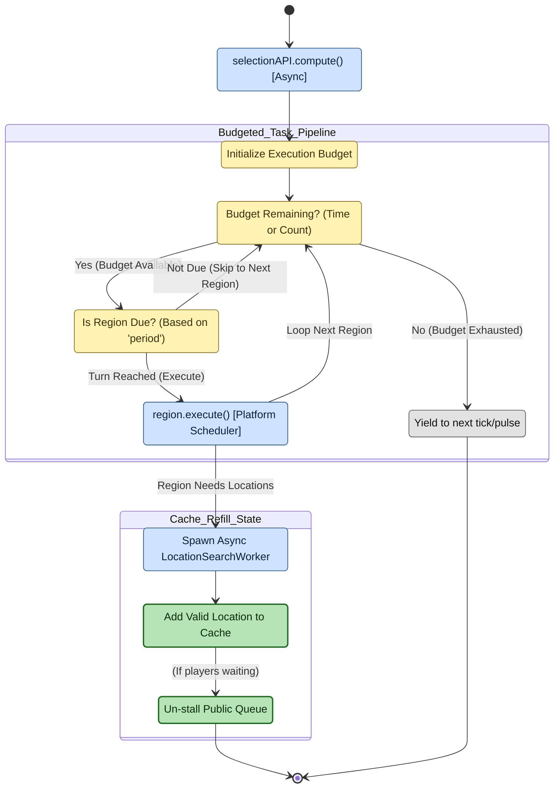

# Budgeted cache generator (queue refill)

**Scope of this diagram.** This chart covers the *background* loop that keeps each region's location cache warm: the periodic `SelectionAPI.compute()` pulse, the region-by-region budget enforcement (`queueLen` / maxBiasedAttempts), the hand-off to `LocationGenerator`, and the insertion of successful results into the cache that diagram 01 pops from. Related-but-separate behavior paths are intentionally **out of scope** here:
- **What happens inside one candidate attempt** — see diagram 08 (location selection per attempt); `GenerateLocation` in this chart expands into that flowchart.
- **How a waiting `/rtp` consumes the cache** — see diagram 01 (`QueryCache` / `QueueWait`).
- **Chunk ticket book-keeping** — see diagram 03; every generated candidate reserves a ticket via `ChunkReservation`.

> Companion walkthrough: [`CODE_TOUR.md` section 3 — Budgeted cache generator](../dev/CODE_TOUR.md).

