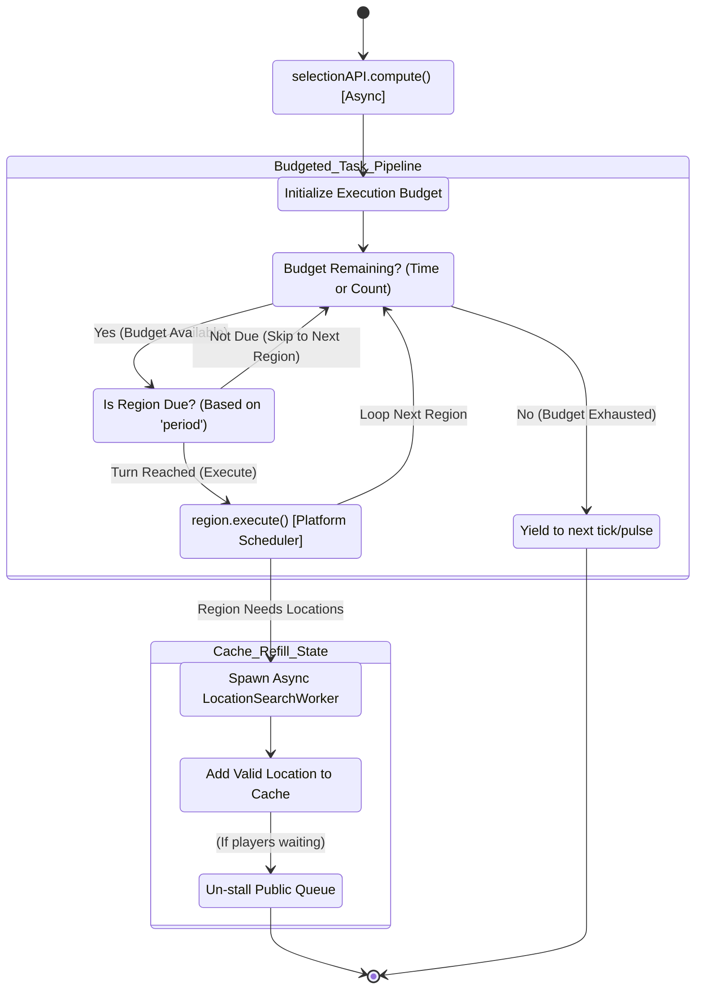

```mermaid
stateDiagram-v2
    PulseTrigger : selectionAPI.compute() [Async]
    [*] --> PulseTrigger

%% 1. Define State Containers (Strict Parser Syntax)
    state Budgeted_Task_Pipeline {
        InitBudget : Initialize Execution Budget
        CheckBudget : Budget Remaining? (Time or Count)
        CheckPeriod : Is Region Due? (Based on 'period')
        ExecuteRegion : region.execute() [Platform Scheduler]
        YieldTask : Yield to next tick/pulse
    }

    state Cache_Refill_State {
        SpawnWorker : Spawn Async LocationSearchWorker
        PushQueue : Add Valid Location to Cache
        WakePlayer : Un-stall Public Queue
    }

%% 2. Map Transitions
    PulseTrigger --> InitBudget

%% Budget Loop
    InitBudget --> CheckBudget
    CheckBudget --> CheckPeriod : Yes (Budget Available)

%% Period Rotation Gating
    CheckPeriod --> ExecuteRegion : Turn Reached (Execute)
    CheckPeriod --> CheckBudget : Not Due (Skip to Next Region)

    ExecuteRegion --> CheckBudget : Loop Next Region
    CheckBudget --> YieldTask : No (Budget Exhausted)

%% Fulfillment Branch
    ExecuteRegion --> SpawnWorker : Region Needs Locations
    SpawnWorker --> PushQueue
    PushQueue --> WakePlayer : (If players waiting)

%% Terminations
    WakePlayer --> [*]
    YieldTask --> [*]
```