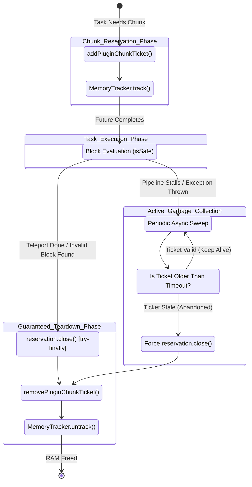

```mermaid
stateDiagram-v2
    [*] --> ReqTicket : Task Needs Chunk

    %% 1. Chunk Loading Context
    state Chunk_Reservation_Phase {
        ReqTicket : addPluginChunkTicket()
        TrackRes : MemoryTracker.track()
    }

    %% 2. Execution Context
    state Task_Execution_Phase {
        EvalBlocks : Block Evaluation (isSafe)
    }

    %% 3. Safety Net Context (Background GC)
    state Active_Garbage_Collection {
        SweepTask : Periodic Async Sweep
        CheckStale : Is Ticket Older Than Timeout?
        ForceClose : Force reservation.close()
    }

    %% 4. Teardown Context
    state Guaranteed_Teardown_Phase {
        CloseRes : reservation.close() [try-finally]
        DropTicket : removePluginChunkTicket()
        UntrackRes : MemoryTracker.untrack()
    }

    %% Transitions
    ReqTicket --> TrackRes
    TrackRes --> EvalBlocks : Future Completes

    %% Success / Expected Failure Path
    EvalBlocks --> CloseRes : Teleport Done / Invalid Block Found

    %% Memory Leak / Stall Path
    EvalBlocks --> SweepTask : Pipeline Stalls / Exception Thrown
    
    %% GC Loop
    SweepTask --> CheckStale
    CheckStale --> SweepTask : Ticket Valid (Keep Alive)
    CheckStale --> ForceClose : Ticket Stale (Abandoned)

    %% Teardown Funnel
    CloseRes --> DropTicket
    ForceClose --> DropTicket
    DropTicket --> UntrackRes

    UntrackRes --> [*] : RAM Freed
```