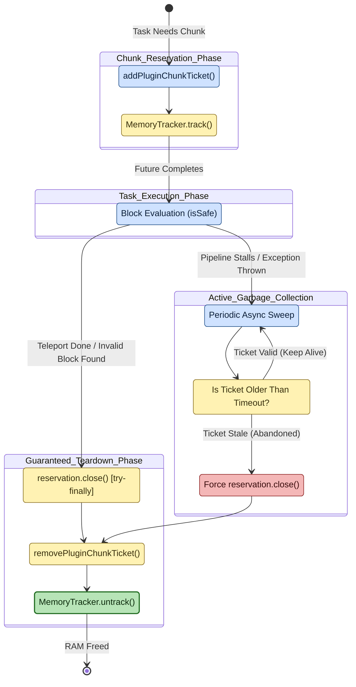

# Chunk ticket lifecycle

**Scope of this diagram.** This chart covers the lifecycle of a *single* chunk ticket (`ChunkReservation`) — from allocation on behalf of a pending task, through `MemoryTracker` registration, through release on every exit path (normal, exception, disconnect, plugin disable). This is the **invariant core** that S-002 (no permanently force-loaded chunks) and S-005 (no sync chunk loads) both depend on. Related-but-separate behavior paths are intentionally **out of scope** here:
- **Who allocates the ticket and why** — see diagram 01 (teleport pipeline `ReqTicket` stage), diagram 02 (cache generator `GenerateLocation`), diagram 05 (scan crawler), and diagram 08 (per-attempt chunk resolution). All of them funnel through the state machine shown here.
- **Platform-specific async chunk-load primitive** — Spigot `PaperLib.getChunkAtAsync`, Folia `RegionizedWorld.getChunkAtAsync`, Fabric `ServerWorld.getChunkFuture` — see `rtp-spigot` / `rtp-paper` / `rtp-folia` / `rtp-fabric` world adapters.
- **Anvil pre-filter** (which *avoids* needing a ticket at all) — see `CODE_TOUR.md` §7 nuance on S-005 and ADR-016.

> Companion walkthrough: [`CODE_TOUR.md` §4 — Chunk ticket lifecycle](../dev/CODE_TOUR.md).

