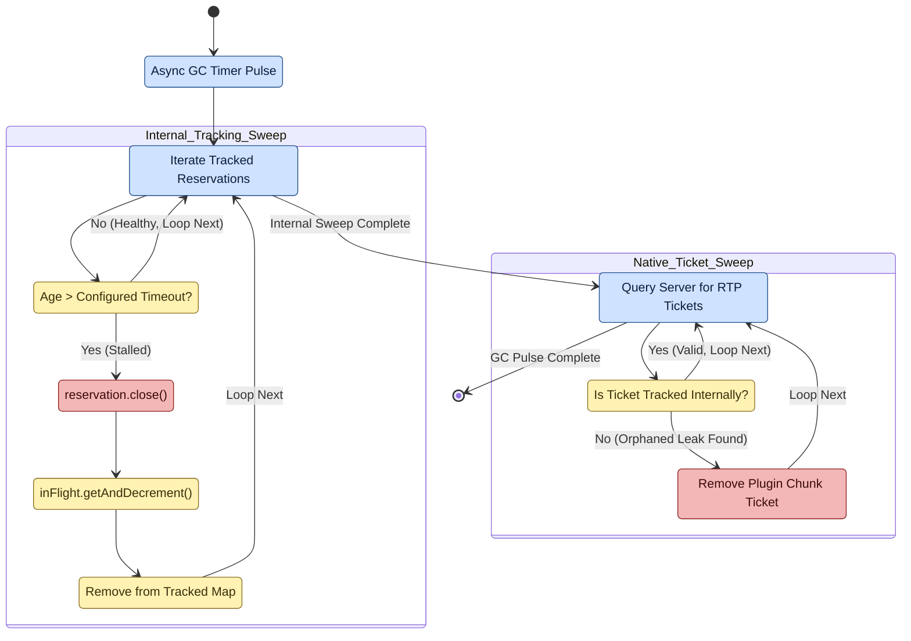

# Active GC sweep

**Scope of this diagram.** This chart covers the periodic background sweep that audits `MemoryTracker`'s registered allocations — cancelling stale `TeleportPipelineTask` instances, releasing abandoned `ChunkReservation` tickets, and logging leaks. This is the **safety net** that catches any allocation which escaped a normal cleanup path in diagrams 01, 02, 03, or 05. Related-but-separate behavior paths are intentionally **out of scope** here:
- **Normal cleanup** — every pipeline in diagrams 01/02/05 releases its own tickets/tasks on success and on expected failure; GC only runs for *abandoned* allocations (player disconnect mid-LOAD, exception below `thenAccept`, plugin reload races).
- **Chunk ticket semantics** — see diagram 03 for what `reservation.close()` actually does.
- **ChunkUnloadProcessor** (non-Folia per-tick unload pacing) — a different timer, separate concern; see `CODE_TOUR.md` §10 and diagram 07.

> Companion walkthrough: [`CODE_TOUR.md` §5 — Active GC sweep](../dev/CODE_TOUR.md).

