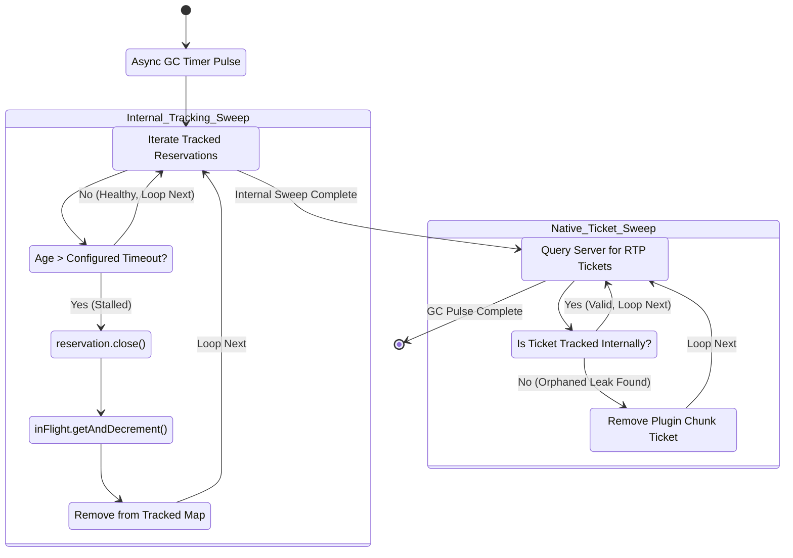

```mermaid
stateDiagram-v2
    TimerTrigger : Async GC Timer Pulse
    [*] --> TimerTrigger

%% 1. Define State Containers (Strict Parser Syntax)
    state Internal_Tracking_Sweep {
        FetchMap : Iterate Tracked Reservations
        CheckTimeout : Age > Configured Timeout?
        ForceClose : reservation.close()
        DecCounter : inFlight.getAndDecrement()
        Untrack : Remove from Tracked Map
    }

    state Native_Ticket_Sweep {
        FetchServer : Query Server for RTP Tickets
        CheckTracked : Is Ticket Tracked Internally?
        DropOrphan : Remove Plugin Chunk Ticket
    }

%% 2. Internal Sweep Logic
    TimerTrigger --> FetchMap
    FetchMap --> CheckTimeout

%% Internal Branches
    CheckTimeout --> ForceClose : Yes (Stalled)
    ForceClose --> DecCounter
    DecCounter --> Untrack
    Untrack --> FetchMap : Loop Next

    CheckTimeout --> FetchMap : No (Healthy, Loop Next)

%% 3. Transition to Native Sweep
    FetchMap --> FetchServer : Internal Sweep Complete

%% 4. Native Sweep Logic
    FetchServer --> CheckTracked

%% Native Branches
    CheckTracked --> DropOrphan : No (Orphaned Leak Found)
    DropOrphan --> FetchServer : Loop Next

    CheckTracked --> FetchServer : Yes (Valid, Loop Next)

%% Termination
    FetchServer --> [*] : GC Pulse Complete
```