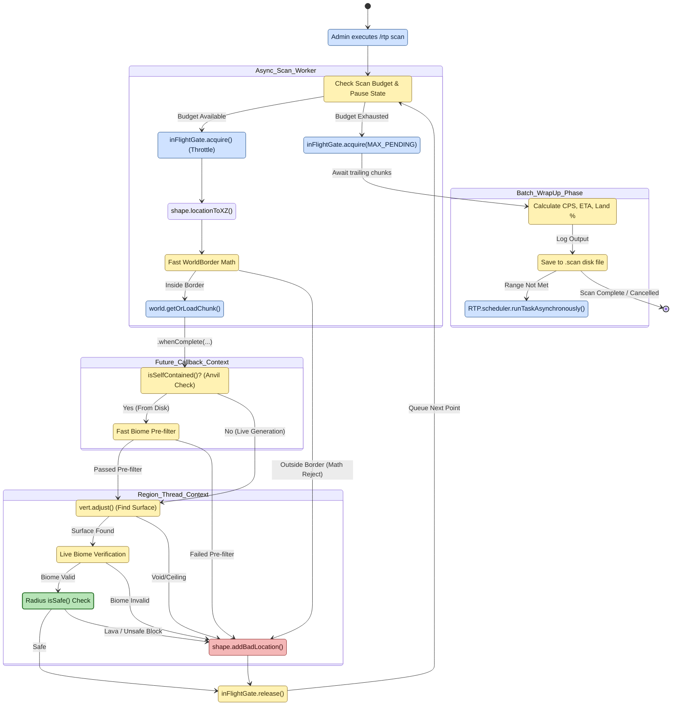

# `/rtp scan` task crawler

**Scope of this diagram.** This chart covers the admin-triggered bulk pre-warm loop — `/rtp scan <region> <count>` — that crawls a region's spiral index in bounded ticks, pushes accepted locations into the same per-region cache that diagram 02 fills, and reports progress. Related-but-separate behavior paths are intentionally **out of scope** here:
- **What makes a single candidate acceptable** — see diagram 09 (per-attempt pipeline); scan just invokes it in a loop.
- **How `/rtp` consumes those pre-warmed locations** — see diagram 01 (cache-hot branch).
- **Background refill without admin intervention** — see diagram 02; the two crawlers both write to the same cache but scan is one-shot, budget-bounded by count rather than `queueLen`.
- **Command parsing / permissions for `/rtp scan`** — see `commands-api` and `BukkitBaseRTPCmd`; this chart starts after the command has been dispatched.

> Companion walkthrough: [`CODE_TOUR.md` §6 — Scan task crawler](../dev/CODE_TOUR.md).

