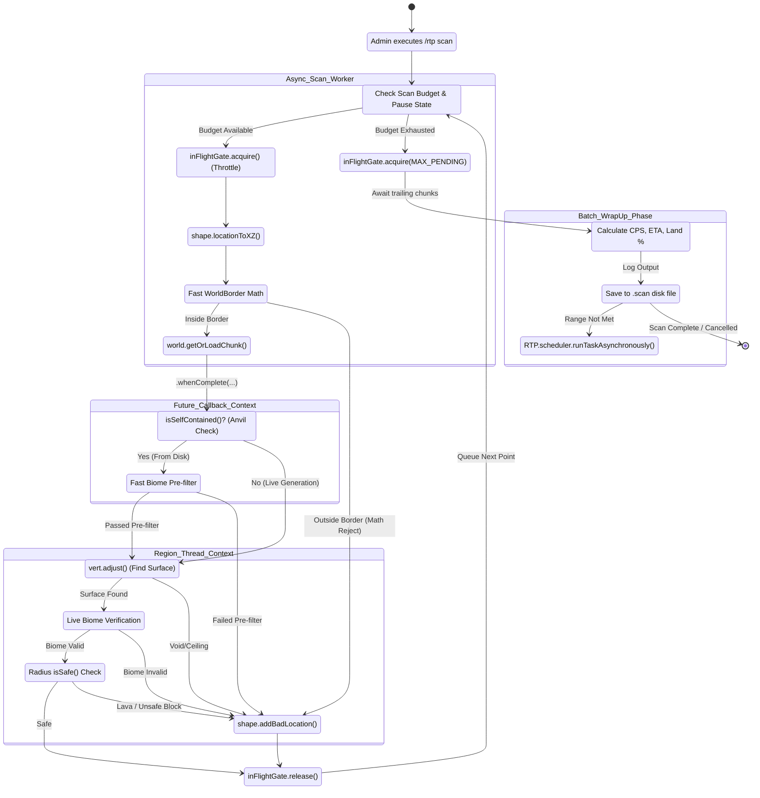

```mermaid
stateDiagram-v2
    CmdTrigger : Admin executes /rtp scan
    [*] --> CmdTrigger

%% 1. Define State Containers (Strict Parser Syntax)
    state Async_Scan_Worker {
        CheckLimit : Check Scan Budget & Pause State
        AcquireGate : inFlightGate.acquire() (Throttle)
        GenCoords : shape.locationToXZ()
        BorderCheck : Fast WorldBorder Math
        ReqChunk : world.getOrLoadChunk()
        DrainGate : inFlightGate.acquire(MAX_PENDING)
    }

    state Future_Callback_Context {
        CheckContained : isSelfContained()? (Anvil Check)
        AnvilBiome : Fast Biome Pre-filter
    }

    state Region_Thread_Context {
        VertAdjust : vert.adjust() (Find Surface)
        PhysBiome : Live Biome Verification
        SafeCheck : Radius isSafe() Check
        MarkBad : shape.addBadLocation()
    }

    state Batch_WrapUp_Phase {
        CalcStats : Calculate CPS, ETA, Land %
        SaveState : Save to .scan disk file
        YieldTask : RTP.scheduler.runTaskAsynchronously()
    }

%% 2. The Throttled Worker Loop
    CmdTrigger --> CheckLimit
    CheckLimit --> AcquireGate : Budget Available
    CheckLimit --> DrainGate : Budget Exhausted

    AcquireGate --> GenCoords
    GenCoords --> BorderCheck
    BorderCheck --> ReqChunk : Inside Border
    BorderCheck --> MarkBad : Outside Border (Math Reject)

%% 3. Chunk Loading & Callback
    ReqChunk --> CheckContained : .whenComplete(...)
    CheckContained --> AnvilBiome : Yes (From Disk)
    CheckContained --> VertAdjust : No (Live Generation)

    AnvilBiome --> VertAdjust : Passed Pre-filter
    AnvilBiome --> MarkBad : Failed Pre-filter

%% 4. Region Thread Block Evaluation
    VertAdjust --> PhysBiome : Surface Found
    VertAdjust --> MarkBad : Void/Ceiling

    PhysBiome --> SafeCheck : Biome Valid
    PhysBiome --> MarkBad : Biome Invalid

    SafeCheck --> ReleaseGate : Safe
    SafeCheck --> MarkBad : Lava / Unsafe Block

    MarkBad --> ReleaseGate

    ReleaseGate : inFlightGate.release()
    ReleaseGate --> CheckLimit : Queue Next Point

%% 5. Wrap-Up & Checkpointing
    DrainGate --> CalcStats : Await trailing chunks
    CalcStats --> SaveState : Log Output
    SaveState --> YieldTask : Range Not Met
    SaveState --> [*] : Scan Complete / Cancelled
```