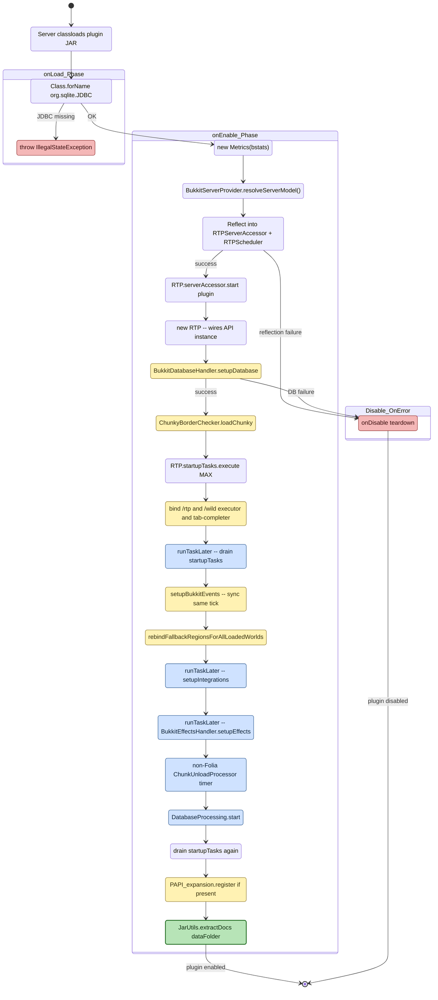

# Plugin setup lifecycle

**Scope of this diagram.** This chart covers the one-shot Bukkit-family plugin lifecycle — `onLoad` (JDBC probe / fail-fast) → `onEnable` (strictly ordered: metrics, server-model resolution, reflective accessor wiring, DB setup, Chunky probe, startup-task drains, command binding, event registration, fallback-region rebind, integrations, effects, non-Folia `ChunkUnloadProcessor`, DB processing loop, PAPI, doc extraction) → `onDisable` bail-out on any failure. This is the **setup-time counterpart** to every runtime loop in diagrams 01–05 and 08–09. Related-but-separate behavior paths are intentionally **out of scope** here:
- **Fabric entry point** — Fabric uses a different bootstrap (`ModInitializer`), out of scope per `REQUIREMENTS.md section 0`.
- **Runtime teleport / cache / GC / scan loops** — see diagrams 01, 02, 04, 05; this chart ends once those loops are running.
- **Config reload** — a separate code path (`/rtp reload`) that re-runs a subset of `onEnable` steps.
- **Per-command dispatch** — see diagrams 08 (region selection) and 09 (location selection); this chart stops at `BindCmds`.

> Companion walkthrough: [`CODE_TOUR.md` section 10 — Plugin setup lifecycle](../dev/CODE_TOUR.md).

Notes on ordering (do not reorder without reading):

- **`setupBukkitEvents` runs synchronously** inside `onEnable`, not via `runTaskLater`. A previous bug (see `OnWorldLoadUnload` Javadoc) missed `WorldLoadEvent`s fired on tick 1 by generators like Multiverse when the listener registration was deferred.
- **`rebindFallbackRegionsForAllLoadedWorlds`** is the safety net for worlds loaded *before* the listener was installed.
- **Integrations and effects** are deferred one tick so that other plugins have finished their own `onEnable`.
- **`startupTasks` is drained three times** (eagerly, then on tick 1, then again at end of `onEnable`) because integrations and event handlers can push new startup tasks during setup.
- **On Folia, no `ChunkUnloadProcessor`** — Folia handles chunk lifetime per region. The `isFolia()` guard is the only behavior split in this diagram.
- **`onDisable` is invoked on any fatal init failure.** It cancels all RTP-owned Bukkit tasks, kills the per-subsystem processors (`AsyncTeleportProcessing`, `SyncTeleportProcessing`, `ScanTaskProcessing`, `DatabaseProcessing`), and calls `RTP.stop()`.
