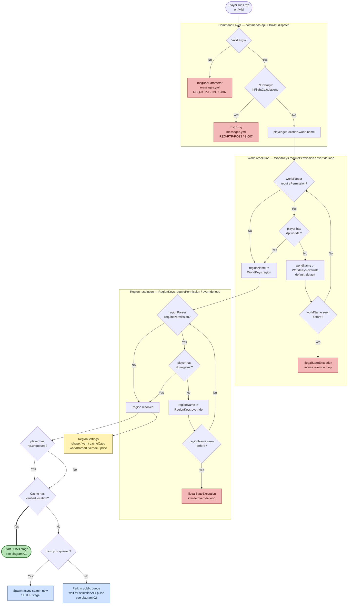

# `/rtp` command — world/region selection

**Scope of this diagram.** This chart covers *only* the `/rtp` (and alias `/wild`) command path from dispatch through `SelectionAPI.getRegion(player)` to the point where the teleport pipeline (diagram 01) or the public queue (diagram 02) takes over. Related-but-separate behavior paths are intentionally **out of scope** here and documented elsewhere:

- **onEvent auto-teleport** (join / respawn / …) — different entry point (`OnPlayerJoin`, `OnPlayerRespawn`, etc.) gated by `rtp.onevent.<event>` and `onEventParsing`.
- **`SelectionAPI.tempRegion(...)`** — addon/command extensibility that bypasses the world/region override loops by overriding `RegionKeys` directly against a base region.
- **`/rtp scan`** — a separate long-lived worker with its own throttle; see diagram 05.
- **Pipeline stages after `Start LOAD`** — see diagram 01.
- **Cache replenishment** driving the "Cache has verified location?" decision — see diagram 02.

How to read this chart:

- **The decision tree is almost entirely data-driven.** Nothing in `rtp-core` hardcodes "if world == X, use shape Y". Behavior is the product of `world.yml`, `region.yml`, `messages.yml`, plus per-player permission nodes.
- **Two nested override loops** — world-level (`WorldKeys.override`) and region-level (`RegionKeys.override`) — protect against infinite loops via a `Set<String> attempted` guard, throwing `IllegalStateException` on cycle detection. This is the only place in the normal flow that throws rather than attributes a failure, because it is a configuration bug, not a teleport failure.
- **Permission nodes involved** (non-exhaustive):
  - `rtp.worlds.<worldName>` — gates access to a world; failure falls through the world `override`.
  - `rtp.regions.<regionName>` — gates access to a region; failure falls through the region `override`.
  - `rtp.unqueued` — bypasses the public queue and forces an ad-hoc async search. Dangerous on large servers; see [ADR-001](../adr/ADR-001-archimedean-spiral-1d-mapping.md) on why the search is still bounded.
  - `rtp.effect.<stage>.*` — decorates pipeline stages with sounds/particles/etc. (see [`docs/admin/EVENTS_AND_EFFECTS.md`](../admin/EVENTS_AND_EFFECTS.md)).
  - `rtp.onevent.<event>` — opts the player into auto-teleport on lifecycle events (join / respawn / …). Requires `onEventParsing: true`.
- **`RegionSettings`** (`shape`, `vert`, `cacheCap`, `activeChunkCap`, `price`, `spatialResolution`, `worldBorderOverride`) is the *only* source of truth for per-region behavior. To change a region's shape or cache size, edit `region.yml`; never fork code per region.
- **Busy / invalid messages are configurable** (S-007, REQ-RTP-F-013). All user-visible strings come from `messages.yml`; never hardcode them in a command or adapter.
- **`tempRegion(...)`** (SelectionAPI) lets an addon or command spawn a one-shot region by overriding specific keys against a named base region (default: `default`). It is the supported extensibility point for custom per-call behavior — prefer it over constructing `Region` directly.
