# Location selection — per-attempt pipeline

**Scope of this diagram.** This chart covers the behavior *inside* a single attempt of `LocationGenerator` — i.e., how one candidate `(x, y, z)` is proposed, chunk-loaded, and accepted or rejected. This is the **decision core** that drives everything downstream: every cached location (diagram 02), every `/rtp` teleport that reaches `Start LOAD` (diagram 01), and every `/rtp scan` hit (diagram 05) comes out of this loop. Related-but-separate behavior paths are intentionally **out of scope** here:

- **Who invoked us** — `/rtp` command selection (diagram 08), cache replenishment (diagram 02), `/rtp scan` (diagram 05), onEvent auto-teleport — all funnel into `ILocationGenerator.getLocation` but differ only in who owns the returned `GenerationResult`.
- **Outer attempt-loop re-entry plumbing** — `PregenTask.run()` / `rescheduleNextAttempt()` / `continueInline(...)` is the state-machine harness (ADR-015 Option B) that re-invokes `runAttempt` without blocking. See `PregenTask.java` header.
- **Chunk ticket lifecycle** (`ChunkReservation`, `MemoryTracker`) — see diagram 03.
- **Stale-chunk guard** on live-backed chunks — see [ADR-015](../adr/ADR-015-stale-chunk-guard-countbound-pipes.md).
- **Anvil probe ordering** — see [ADR-016](../adr/ADR-016-anvil-subsystem.md) §11 and §13.1.

```mermaid
%% Color legend: green=accepting success; red=hard terminal / fail-fast sink; blue=async or thread-hop work; yellow=config / bookkeeping / data-driven choice.
flowchart TD
    Start([PregenTask.runAttempt<br/>attempt i / maxAttempts]):::async --> CapCheck{i &gt; maxAttempts<br/>or biomeChecks &gt;= maxBiomeChecks?}
    CapCheck -- Yes --> Exhausted[completeExhausted<br/>result = GenerationResult null, i, null]:::fail
    CapCheck -- No  --> ShapePick

%% 1. Shape + optional biomeRecall
    subgraph ShapeStage [Shape selection — MemoryShape.rand or biomeRecall]
        ShapePick{shape is<br/>MemoryShape?}
        ShapePick -- No  --> ShapeSelect[shape.select<br/>returns chunk cx, cz]
        ShapePick -- Yes --> Recall{biomeRecall<br/>and not defaultBiomes?}
        Recall -- No  --> MemRand[memoryShape.rand]:::data
        Recall -- Yes --> RecallHas{any biome keys<br/>in memory?}
        RecallHas -- Yes --> RecallPick[weighted pick<br/>by prefix sums]:::data
        RecallHas -- No  --> RecallForced{biomeRecallForced?}
        RecallForced -- Yes --> ForcedFail[result = empty GenerationResult<br/>log invalid state]:::fail
        RecallForced -- No  --> MemRand
        MemRand --> XZDecode[locationToXZ]
        RecallPick --> XZDecode
    end
    ShapeSelect --> BorderCheck
    XZDecode --> BorderCheck

%% 2. WorldBorder probe
    BorderCheck{inside<br/>WorldBorder?}
    BorderCheck -- No --> BorderFail[worldBorderFails++<br/>maxAttempts++]:::data
    BorderFail --> BorderCap{&gt; 1000 fails?}
    BorderCap -- Yes --> BorderAbort[result = empty<br/>log region outside border]:::fail
    BorderCap -- No  --> Reschedule[rescheduleNextAttempt<br/>outer loop re-enters]:::async
    BorderCheck -- Yes --> RequestChunk

%% 3. Probe-first chunk resolution (ADR-016 §13.1)
    subgraph ChunkStage [Chunk resolution — cached then anvil then live]
        RequestChunk[world.getOrLoadChunk cx, cz]:::async --> ChunkOK{resolved<br/>non-null?}
        ChunkOK -- No  --> NullChunk[FailTypes.nullChunk<br/>reason=ticketFailed or<br/>chunkLoadTimeout or<br/>asyncLoadNull]:::fail
        ChunkOK -- Yes --> SelfCheck{chunk.isSelfContained?<br/>anvil = yes / live = no}
        SelfCheck -- Yes --> Evaluate[proceedWithEvaluation<br/>stays on async thread]:::async
        SelfCheck -- No  --> LiveHop[dispatchLiveEvaluation<br/>hop to region-owning thread<br/>allocate ChunkReservation<br/>see diagram 03]:::async
        LiveHop --> StaleGuard{stale-chunk<br/>guard passes?<br/>ADR-015}
        StaleGuard -- No --> StaleRetry[staleRetries++<br/>re-request or attribute<br/>staleChunkBeforeVert]:::fail
        StaleGuard -- Yes --> Evaluate
    end
    NullChunk --> Reschedule

%% 4. Vert adjust + biome filter
    Evaluate --> VertAdjust[vert.adjust chunk<br/>returns x,y,z or null]
    VertAdjust --> VertOK{non-null?}
    VertOK -- No --> VertFail[FailTypes.vert<br/>MemoryShape.addBadLocation]:::fail
    VertFail --> Reschedule
    VertOK -- Yes --> BiomeFilter{biome in<br/>biomeNames<br/>== biomeWhitelist?}
    BiomeFilter -- No --> BiomeFail[FailTypes.biome<br/>biomeChecks++<br/>maxAttempts++]:::fail
    BiomeFail --> BiomeCap{biomeChecks &gt;=<br/>maxBiomeChecks?}
    BiomeCap -- Yes --> Exhausted
    BiomeCap -- No  --> Reschedule
    BiomeFilter -- Yes --> LoadNeighbors

%% 5. Neighbour grid + safety y-scan
    subgraph SafetyStage [Safety check — 2r+1 squared neighbour grid]
        LoadNeighbors[getChunkAt for each<br/>neighbour in 2r+1 grid<br/>allOf with 5s timeout]:::async
        LoadNeighbors --> NeighborsOK{all non-null<br/>within 5s?}
        NeighborsOK -- No --> NeighborFail[FailTypes.nullChunk<br/>reason=neighborNull]:::fail
        NeighborsOK -- Yes --> YScan[y-scan x,y,z in<br/>+/- safetyRadius]
        YScan --> Safe{all blocks<br/>safe vs unsafeBlocks?}
        Safe -- No --> SafetyFail[FailTypes.safety<br/>MemoryShape.addBadLocation]:::fail
        Safe -- Yes --> Verifiers
    end
    NeighborFail --> Reschedule
    SafetyFail --> Reschedule

%% 6. External verifiers + success
    Verifiers[GlobalRegionVerifiers<br/>async chain<br/>claim plugins, custom]:::async
    Verifiers --> VerOK{all pass?}
    VerOK -- No --> VerFail[FailTypes.safetyExternal<br/>MemoryShape.addBadLocation]:::fail
    VerFail --> Reschedule
    VerOK == Yes ==> Success([completeSuccess<br/>MemoryShape.addBiomeLocation<br/>preload view-distance ChunkSet<br/>result = GenerationResult coords, i, chunks]):::success

    Reschedule -.outer loop.-> Start

    classDef success fill:#b7e4b7,stroke:#1f6b1f,stroke-width:2px,color:#0b2a0b;
    classDef fail    fill:#f2b8b8,stroke:#8a1f1f,stroke-width:1px,color:#2a0b0b;
    classDef async   fill:#c9dcf5,stroke:#28518a,stroke-width:1px,color:#0b1f3a;
    classDef data    fill:#f2e6a8,stroke:#8a6b1f,stroke-width:1px,color:#2a220b;
```

How to read this chart:

- **The single success condition is `Success` (green, thick edge).** There is exactly one accepting state in the whole per-attempt pipeline: `VerOK == Yes ==> Success`, styled green and reached via a thick `==>` edge, rendered as a stadium `([...])` node. Every other terminal — `Exhausted`, `BorderAbort`, `ForcedFail`, and every `*Fail` node — is a non-success outcome that either ends the outer loop or re-enters via `Reschedule`. When tracing a "teleport never completes" bug, the question is always "why did control never reach `Success`?"

- **Every rejection path ends the same way** — attribute a `FailTypes` bucket, optionally `addBadLocation` on a `MemoryShape` so the spiral won't re-propose it, release the `ChunkReservation` if one was allocated (diagram 03), and call `rescheduleNextAttempt`. This uniformity is why S-004 (no silently discarded failures) can be audited from a single place.
- **`FailTypes` is the public failure vocabulary.** The buckets (`biome`, `worldBorder`, `vert`, `safety`, `safetyExternal`, `nullChunk`, `timeout`, `misc`) are the only labels any admin ever sees in `rtp verbose` output; the sub-reason strings (`neighborNull`, `ticketFailed`, `chunkLoadTimeout`, `asyncLoadNull`, `staleChunkBeforeVert`, `OUTSIDE_BORDER`, `biome=<NAME>`) are diagnostics layered on top. A regression guard (`ReqRtpS004NullChunkAttributionTest`) locks the `nullChunk` attribution — do not refactor without reading it.
- **Shape is the algorithmic heart** — `MemoryShape.rand()` is the bounded Archimedean spiral 1D mapping (ADR-001). `biomeRecall` swaps the uniform pick for a prefix-sum weighted pick over previously accepted-by-biome entries — it dramatically speeds up rare-biome targeting at the cost of clustering (`biomeRecallForced: false` falls back to uniform when memory is empty).
- **Self-contained vs live-backed chunks branch the threading model.** Anvil-backed chunks (`isSelfContained() == true`, see ADR-016) are thread-safe for reads and stay on the async worker; live server chunks must hop to the region-owning thread via `dispatchLiveEvaluation`, which also allocates the `ChunkReservation` (see diagram 03 for ticket lifecycle) and arms the ADR-015 stale-chunk guard. Getting this branch wrong is the single most common S-005 violation when porting to a new platform.
- **`maxAttempts` is soft.** Every biome reject and every worldborder reject *increments* `maxAttempts` (up to the biome-checks cap), so the loop has a budget proportional to legitimate misses. This is deliberate: `vert` and `safety` failures cost a hard attempt, but biome misses are cheap and effectively free against the cap until `maxBiomeChecks` is hit.
- **Success preloads a view-distance `ChunkSet`.** `completeSuccess` does not just return coordinates — it allocates (asynchronously) the chunks the player will see on arrival (`max(safetyRadius, viewDistanceSelect)` radius) and transfers ownership of that `ChunkSet` via `GenerationResult` so the caller can hand it to the LOAD stage (diagram 01) without a second round-trip.
- **Config keys that change behavior here**: `RegionSettings.shape`, `vert`, `cacheCap`, `spatialResolution`, `unsafeBlocks`, `safetyRadius`, `biomeWhitelist`, `biomeRecall`, `biomeRecallForced`, `maxAttempts`, `maxBiomeChecks`, `worldBorderOverride`, plus `performance.viewDistanceSelect`. Everything else is code-level and should not be edited per region.

Related code:

- `rtp-core`: `PregenTask`, `QueueTask`, `PregenState`, `LocationGenerator`, `GlobalRegionVerifiers`, `selectors/memory/shapes/MemoryShape`, `selectors/verticalAdjustors/*`.
- `rtp-api`: `ILocationGenerator`, `GenerationContext`, `GenerationResult`, `RTPChunk`, `RTPWorld`.
- ADRs: [ADR-001](../adr/ADR-001-archimedean-spiral-1d-mapping.md) (spiral), [ADR-015](../adr/ADR-015-stale-chunk-guard-countbound-pipes.md) (stale guard + Option B), [ADR-016](../adr/ADR-016-anvil-subsystem.md) (Anvil probe-first).
- Requirements: `REQ-RTP-S-004` (no silent failures), `REQ-RTP-S-005` (no sync chunk I/O on main thread) — see [`TRACEABILITY.md`](../dev/TRACEABILITY.md).
