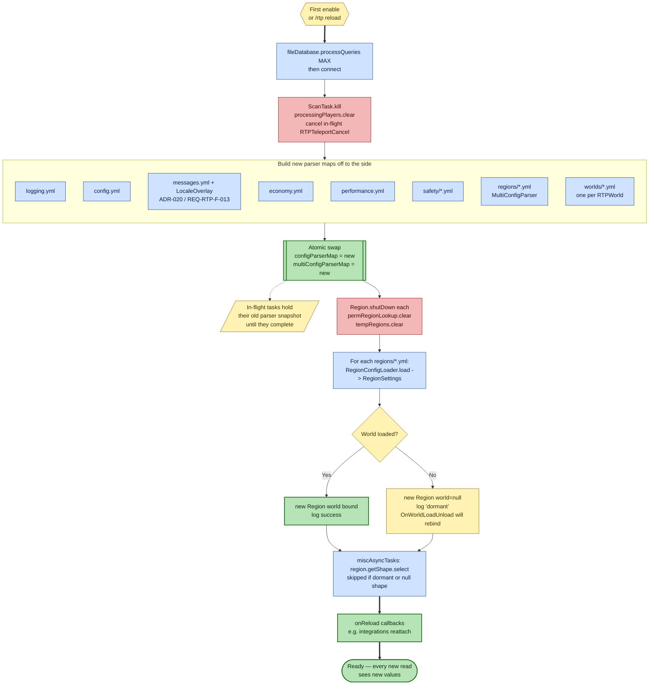

# Configuration load and reload

**Scope of this diagram.** This chart covers the **configuration data flow** — how the YAML files under `plugins/RTP/` become the in-memory `ConfigParser` / `MultiConfigParser` objects that every runtime path reads from, and what happens during `/rtp reload`. This is the single most error-prone surface (most "bug reports" are misread config), so this diagram is the one to open first when a key appears to have no effect. Related-but-separate behavior paths are intentionally **out of scope**:

- **Plugin enable ordering** (when `reloadAction` is first called) — see diagram 07.
- **How a runtime task reads a value** (`getWorldParserValue` vs. direct `ConfigParser.getConfigValue`) — see diagrams 01 / 08 / 09 and `CODE_TOUR.md` §11.
- **Message routing** (`messages.yml` keys → player feedback) — see `CODE_TOUR.md` §7 and `LocaleOverlay` / ADR-020.
- **Persistent storage of player/teleport state** (`YamlFileDatabase`) — see `LESSONS_LEARNED.md` and diagram 02.

> Companion walkthrough: [`CODE_TOUR.md` §13 — Configuration load and reload](../dev/CODE_TOUR.md).

## How to read this chart

- **Single accepting state:** `Done`. Every other node is either preparatory I/O (blue), destructive bookkeeping (red), a data/decision point (yellow), or the atomic swap (green).
- **The reload is not in-place.** New `ConfigParser` / `MultiConfigParser` objects are built in fresh maps, then the `configParserMap` / `multiConfigParserMap` fields are replaced atomically. Any task already holding a reference to the *old* parser continues to see the old values — this is why mid-teleport reloads are safe but a key change "doesn't apply" until the player's current teleport finishes.
- **Dormant regions are normal.** If a region's configured world isn't loaded yet (common with Multiverse-style lazy world loaders), the `Region` is built with a `null` world and rebinds on `WorldLoadEvent` via `OnWorldLoadUnload.rebindWorld`. Shape selection is deferred until the rebind completes.
- **Override resolution is not shown here.** The per-world / per-region override chain (`requirePermission`, `override`, cycle-guard `worldsAttempted` / `regionsAttempted`) lives in diagram 08; this chart only covers how the backing data gets into memory.

## Common repair lenses

1. **"Changed a value, didn't take effect."** Either (a) an in-flight task is still holding the old snapshot — wait one teleport cycle, or (b) the value lives in a per-region/per-world file and the caller is reading the global `ConfigKeys` parser — check `getWorldParserValue` vs. `getParser(ConfigKeys.class)`.
2. **"Reload duplicates regions / leaks regions."** `reloadRegions` calls `Region.shutDown` on every entry before clearing the lookup maps — if a region lingers, its `shutDown` threw or a third party added to `permRegionLookup` after the swap.
3. **"Messages are in English despite `language:` set."** `LocaleOverlay.apply` is a no-op for `"en"` or when the locale file is missing. Check the overlay file path and the `language` key in `config.yml` (ADR-020).
4. **"Teleport mid-reload crashed."** `reloadConfigs` cancels in-flight teleports via `RTPTeleportCancel` and clears `processingPlayers` *before* the parser swap, so tasks don't straddle two parser generations. If a crash reaches the pipeline, the cancel path was skipped (custom entry point bypassing `Configs.reload`).
5. **"Dormant region never activates."** `OnWorldLoadUnload` must fire `WorldLoadEvent` — check that the world is actually being loaded (not just referenced), and that `RegionConfigLoader.detectFallbackConfiguredWorld` returned the correct name.
6. **"First-enable differs from reload."** There is no distinction in this code path: plugin enable calls `reloadAction` the same way `/rtp reload` does. Diagram 07 shows *when* that call happens during enable.

## Source anchors

- `rtp-core/.../configuration/Configs.java` — `reload`, `reloadConfigs`, `reloadRegions`, `reloadAction`, `getWorldParser`, `getWorldParserValue`.
- `rtp-core/.../configuration/ConfigParser.java` — single-file parser.
- `rtp-core/.../configuration/MultiConfigParser.java` — directory-of-files parser (regions, worlds).
- `rtp-core/.../configuration/LocaleOverlay.java` — messages overlay (ADR-020).
- `rtp-core/.../configuration/enums/*.java` — one enum per config category; adding a key = adding an enum constant plus a default in the YAML template.
- `rtp-core/.../selection/region/RegionConfigLoader.java` — `load` + `detectFallbackConfiguredWorld` (dormant detection).
