# 10 — Shutdown and flush lifecycle

## Scope of this diagram

One-shot `onDisable` path for the Bukkit-family entry point `RTPBukkitPlugin` — the symmetric partner of diagram 06. Covers the precise ordering required to (a) stop accepting new work, (b) cancel in-flight teleports, (c) persist cached-location + player data to the SQLite-backed `DatabaseAccessor`, (d) shut down per-region selectors, and (e) release all outstanding chunk tickets without leaking any (S-002).

Out of scope (covered elsewhere):

- Normal per-ticket close during runtime → diagram 03.
- `MemoryTracker` active-GC sweep (runtime leak safety net) → diagram 04.
- Config reload (a *partial* teardown that reuses some of the same primitives) → diagram 09.
- Fabric / other-platform shutdown — this diagram is Bukkit-family only; Folia uses the same path with the global-region-scheduler variant of `RTPScheduler.cancelTask`.
- The synchronous `/reload` pitfall — see `LESSONS_LEARNED.md`.

Companion prose: `docs/dev/CODE_TOUR.md §14`.

## How to read this chart

- Green = the one accepting terminal (`super.onDisable` reached cleanly).
- Red = force-kill / cancel sinks (nothing silently swallowed — S-004 still applies).
- Blue = async / scheduler-owned work that must be drained.
- Yellow = durable-state bookkeeping (DB queues, chunk-ticket map, region maps).
- The **order of the blue/yellow nodes is load-bearing.** The two most common bugs — "cached locations vanished after restart" and "leaked force-loaded chunks after /reload" — are both ordering regressions (see repair lenses 3 and 9).

```mermaid
flowchart TD
    %% Color legend: green=terminal-ok, red=kill/cancel, blue=async-drain, yellow=durable-state
    classDef success fill:#c8f0c8,stroke:#225522,color:#111
    classDef fail fill:#f0c8c8,stroke:#882222,color:#111
    classDef async fill:#c8d8f0,stroke:#223388,color:#111
    classDef data fill:#f0e8a8,stroke:#886622,color:#111

    Start([Bukkit calls onDisable]):::async
    CancelTimers[Cancel commandTimer and commandProcessing]:::fail
    KillAsync[AsyncTeleportProcessing.kill]:::fail
    KillSync[SyncTeleportProcessing.kill]:::fail
    KillScan[ScanTaskProcessing.kill]:::fail
    KillDb[DatabaseProcessing.kill -- stops periodic flush task]:::fail

    RTPStop[RTP.stop entered]:::async
    ShutDiag[diagnosticTimer.shutdown]:::async
    CompleteFutures[Complete all outstanding CompletableFutures]:::async
    CancelInflight[Cancel in-flight TeleportData via RTPTeleportCancel]:::fail

    DbFlush1[SQL accessor flush -- WAL checkpoint]:::data
    Rebuild[rebuildCachedLocationsFromMemory -- authoritative map to rows]:::data
    FlushDirty[flushDirtyCache -- enqueue writes and deletes]:::data
    Drain[processQueries MAX -- drain writeQueue and deleteQueue]:::async
    OrderGuard{{Must happen BEFORE stop.set true -- see LESSONS_LEARNED}}:::data

    StopPipes[miscAsyncTasks.stop and miscSyncTasks.stop]:::fail
    CancelTracked[Cancel all trackedTasks via RTPScheduler]:::fail

    PermRegions[permRegionLookup -- shutDown each then clear]:::data
    TempRegions[tempRegions -- shutDown each then clear]:::data

    StopFlag[databaseAccessor.stop.set true then close]:::data
    CancelAgain[Re-cancel any TeleportData left not completed]:::fail
    ClearProc[processingPlayers.clear]:::data
    ScanKill[ScanTask.kill -- static registry clear]:::fail
    Redis[redisManager.shutdown -- if present]:::fail
    AccStop[serverAccessor.stop -- scheduler + platform hooks]:::fail

    PendingBukkit[Cancel all RTP-owned async Bukkit tasks still pending]:::fail
    RefData[Write referenceData sentinel row then processQueries MAX]:::data
    ReleaseTickets[releaseAllChunkTickets -- S-002 guarantee]:::data
    Super([super.onDisable -- plugin disabled]):::success

    Start --> CancelTimers --> KillAsync --> KillSync --> KillScan --> KillDb --> RTPStop
    RTPStop --> ShutDiag --> CompleteFutures --> CancelInflight --> DbFlush1
    DbFlush1 --> Rebuild --> FlushDirty --> Drain --> OrderGuard --> StopPipes
    StopPipes --> CancelTracked --> PermRegions --> TempRegions --> StopFlag
    StopFlag --> CancelAgain --> ClearProc --> ScanKill --> Redis --> AccStop
    AccStop --> PendingBukkit --> RefData --> ReleaseTickets ==> Super
```

## Repair lenses

1. **"Server hang on stop"** → a blue node is waiting on a future that will never complete. Check `CompleteFutures` and the `processQueries(Long.MAX_VALUE)` drain — if the DB thread already exited, `processQueries` returns fast; if it's mid-batch and another thread set `stop.set(true)` early, the drain dead-ends. The ordering guard between `Drain` and `StopFlag` exists for exactly this reason.
2. **"Cached locations vanished after restart"** → you moved or removed `rebuildCachedLocationsFromMemory` or `flushDirtyCache`, or reordered them relative to `processQueries`. The three must run in order `rebuild → flushDirty → processQueries` **before** `stop.set(true)`. Regression test: `MemoryShapeShutdownTest`.
3. **"Leaked force-loaded chunks after /reload or /stop"** → S-002 violation. `releaseAllChunkTickets` must be the last durable action before `super.onDisable`. If a region's `shutDown()` throws and unwinds past the release call, tickets leak. Wrap risky region teardown, don't skip the release.
4. **"NPE during shutdown"** → usually `RTP.getInstance()` returned null because a prior `onDisable` already ran (Bukkit can call it twice on init failure — see the two bail-out calls at lines 108/119 of `RTPBukkitPlugin`). Every block is guarded by `try { ... } catch (NoClassDefFoundError ignored)` or a null check for this reason; don't remove those guards.
5. **"Teleport-in-progress player stuck after stop"** → `CancelInflight` didn't fire for them. `RTPTeleportCancel` is invoked twice (once early, once after region shutdown) to catch data marked `completed=false` that was added mid-teardown. Both calls are required.
6. **"Scan task still running after disable"** → `ScanTaskProcessing.kill()` cancels the *tick* driver, but the static registry inside `ScanTask` also needs `ScanTask.kill()`. Both are called; removing either leaves a half-dead scan.
7. **"DB file locked on next startup"** → `databaseAccessor.close()` was skipped or ran before `processQueries` finished. The `stop.set(true)` flag gates new work; `close()` releases the JDBC connection; order matters.
8. **"Folia-only shutdown warning about region threads"** → `serverAccessor.stop()` (final blue-ish fail node) must run on the global region scheduler. The Folia accessor handles that internally; don't relocate the call out of `RTP.stop()`.
9. **"`referenceData` row missing"** → the post-`RTP.stop()` block writes a sentinel row (time + zero-UUID) so the next startup can detect a clean shutdown. It runs *after* `RTP.stop()` so it uses the still-open DatabaseAccessor, then calls `processQueries(MAX)` one final time. Do not move it before `RTP.stop()`.

## Source anchors

- `rtp-plugin/src/main/java/io/github/dailystruggle/rtp/bukkit/RTPBukkitPlugin.java` — `onDisable()` (~L184) and early bail-out calls at ~L108 and ~L119.
- `rtp-core/src/main/java/io/github/dailystruggle/rtp/common/RTP.java` — `stop()` (~L382).
- `rtp-core/src/main/java/io/github/dailystruggle/rtp/common/database/DatabaseAccessor.java` — `stop` flag, `flushDirtyCache`, `rebuildCachedLocationsFromMemory`, `processQueries`, `close`.
- Regression tests: `MemoryShapeShutdownTest`, `RTPTest#stop_*`, `SyncTaskProcessingTest` (shared-pipe `stop=true` behavior).
- Background: `docs/dev/LESSONS_LEARNED.md` §"Shutdown ordering", `docs/dev/TRACEABILITY.md` row `REQ-CORE-NF-001`.
