# Configuration write and persist

**Scope of this diagram.** This chart covers the **write path** for runtime configuration changes — what happens between `/rtp config <file> <key>:<value>` (or any other config-mutating command) and a durable on-disk YAML file. It is the companion to diagram 09 (`09-configuration-load-and-reload.md`), which covers the read / reload path; together they cover the full configuration lifecycle. Related-but-separate behavior paths are intentionally **out of scope**:

- **Read-path / reload of the resulting state** — see diagram 09 and `CODE_TOUR.md` §13.
- **Per-attempt teleport reads of config values** — see diagrams 01 / 08.
- **`/rtpadmin` setup-wizard flow** — see [ADR-038](../adr/ADR-038-rtpadmin-setup-wizards.md). A wizard is a *driver* over this lifecycle, not a separate path.
- **Cross-server propagation of config changes** — see [`MULTI_SERVER_PLAN.md`](../dev/MULTI_SERVER_PLAN.md). Each backend persists locally; cross-backend fan-out is independent work.

> Companion documents: target-state spec [`docs/dev/CONFIG_COMMAND_SPEC.md`](../dev/CONFIG_COMMAND_SPEC.md), decision [ADR-037](../adr/ADR-037-harden-rtp-config-commands.md), implementation strategy [ADR-041](../adr/ADR-041-config-command-and-save-implementation.md).

```mermaid
flowchart TD
    %% Color legend: green = durable success state (audit record emitted, on-disk YAML matches in-memory), red = failure / rollback (audit record emitted, no on-disk change), blue = in-memory or disk I/O work, yellow = data / decision point

    Trigger{{/rtp config write<br/>or LanguageCmd<br/>or wizard-driven mutation}}:::data

    Parse[ConfigParameterGrammar.parse<br/>tokens to ParsedInvocation<br/>spec §3.1]:::async
    Authorize[ConfigCommandExecutor.authorize<br/>rtp.config.set.section or umbrella<br/>spec §3.2 / §7]:::async
    ReloadCheck{ReloadCmd holds<br/>per-file write lock?<br/>spec §4.6}:::data
    Validate[ConfigParameterValidator.validateAll<br/>per-parameter + composite invariants<br/>spec §3.3 / §5 / §8.2]:::async
    Snapshot[ConfigTransaction.snapshot<br/>capture FactoryValue map<br/>spec §3.4]:::async
    ApplyMem[ConfigTransaction.apply<br/>mutate in-memory parser<br/>spec §3.5]:::async
    PostApplyValidate[Composite-invariant re-check<br/>after all mutations applied<br/>spec §3.5 / §8.2]:::async
    DryRunFork{dryRun set?<br/>spec §3.7}:::data

    WriteTemp[AtomicConfigWriter.write<br/>1 serialize to target.yml.tmp<br/>2 fsync temp<br/>3 rename over target.yml<br/>4 best-effort parent fsync<br/>spec §4.2]:::async
    TargetedReload[Configs.reloadOne&#40;targetFile&#41;<br/>swap affected parser<br/>per diagram 09]:::async

    AuditOk[[ConfigAuditFormatter.format<br/>RTP.log INFO<br/>outcome = COMMITTED<br/>spec §6]]:::success
    AuditDry[[ConfigAuditFormatter.format<br/>RTP.log INFO<br/>outcome = DRY_RUN_OK<br/>render diff via config.dryRun.&#42;]]:::success
    AuditFail[[ConfigAuditFormatter.format<br/>RTP.log WARNING<br/>outcome = REJECTED or ROLLED_BACK<br/>caller sees config.error.&lt;reasonCode&gt;]]:::fail

    Rollback[ConfigTransaction.rollback<br/>restore snapshot<br/>delete temp file<br/>spec §3.7]:::fail

    Done([Durable on disk<br/>in-memory matches<br/>downstream readers see new values]):::success
    DoneDry([No state change<br/>caller saw preview]):::success
    DoneFail([No state change<br/>caller saw error]):::fail

    %% --- Happy path
    Trigger ==> Parse
    Parse ==> Authorize
    Authorize ==> ReloadCheck
    ReloadCheck -- No --> Validate
    Validate ==> Snapshot
    Snapshot ==> ApplyMem
    ApplyMem ==> PostApplyValidate
    PostApplyValidate ==> DryRunFork
    DryRunFork -- No --> WriteTemp
    WriteTemp ==> TargetedReload
    TargetedReload ==> AuditOk
    AuditOk ==> Done

    %% --- Dry-run path
    DryRunFork -- Yes --> Rollback
    Rollback -.dry-run path.-> AuditDry
    AuditDry ==> DoneDry

    %% --- Failure paths
    Parse -. parse fail .-> AuditFail
    Authorize -. NO_PERMISSION .-> AuditFail
    ReloadCheck -- Yes --> AuditFail
    Validate -. validation fail .-> AuditFail
    PostApplyValidate -. SCHEMA_INVARIANT .-> Rollback
    WriteTemp -. PERSIST_IO .-> Rollback
    TargetedReload -. reload fail .-> Rollback
    Rollback ==> AuditFail
    AuditFail ==> DoneFail

    classDef success fill:#b7e4b7,stroke:#1f6b1f,stroke-width:2px,color:#0b2a0b;
    classDef fail    fill:#f4b7b7,stroke:#8a1f1f,color:#3a0b0b;
    classDef async   fill:#cfe2ff,stroke:#1f4e8a,color:#0b1f3a;
    classDef data    fill:#fff2b3,stroke:#8a6d1f,color:#3a2f0b;
```

## How to read this chart

- **Three accepting states:** `Done` (live commit succeeded), `DoneDry` (dry-run preview succeeded), `DoneFail` (any failure). Every invocation ends in exactly one of them, and every accepting state has emitted exactly one audit record. This is the spec §6 / S-004 guarantee made visible.
- **The seven-stage lifecycle of spec §3 maps 1:1 onto the blue nodes** along the happy path: Parse → Authorize → (reload-check) → Validate → Snapshot → Apply (+ post-apply invariant re-check) → Persist (`WriteTemp` + `TargetedReload`) → Audit. The dashed red transitions show where each stage's failure mode routes — all to `AuditFail` (single record, `WARNING` level, configurable message).
- **Rollback is shared.** Both `SCHEMA_INVARIANT` (caught after the in-memory mutation) and `PERSIST_IO` (caught after the temp file exists) route through `Rollback` before `AuditFail` — `Rollback` restores the snapshot and deletes the temp file. Validation-stage failures and authorization failures take the dashed direct edge to `AuditFail`: no snapshot was taken, nothing to roll back.
- **Dry-run takes the same path** through Parse → Validate → Snapshot → Apply → PostApplyValidate, then forks at `DryRunFork`. The dry-run branch calls `Rollback` (to restore the in-memory state from the snapshot — there is no temp file to delete) and emits the audit record with `outcome = DRY_RUN_OK` and the rendered diff. The caller sees the preview; on-disk state is unchanged.
- **The atomic-rename pattern is one node** (`WriteTemp`) because the four substeps (serialize, fsync, rename, parent-fsync) form a single atomic-by-construction unit from the caller's perspective: either the rename happens (durable) or it doesn't (rollback). The substeps live in `AtomicConfigWriter`; the diagram does not enumerate them to keep the lifecycle visible at one glance.
- **`TargetedReload` failures are rare but possible** (a region rebuild throwing during the post-swap step of diagram 09 because the validator chain accepted state that the rebuild then rejects). Such failures still route through `Rollback` — the temp file has been renamed, so rollback restores the snapshot in memory **and** rewrites the previous YAML through a second `AtomicConfigWriter.write`. This is the only path that performs two atomic renames; it is a graceful-degradation safety net, not a primary path.
- **The reload-check at `ReloadCheck`** is a fast `tryLock(0)` on the per-file write lock (per ADR-041 *Concurrency model*). A contended write returns `RELOAD_IN_PROGRESS` immediately rather than blocking; the reload is allowed to complete, and the admin retries.

## Common repair lenses

1. **"Set a value, no error, but the file didn't change."** Either (a) `--dry-run` was set (check the audit record's `dryRun` field), or (b) a `PERSIST_IO` rollback happened and the failure message was missed in chat — check `Level.WARNING` audit lines around the invocation timestamp.
2. **"Wrote successfully, but the next teleport still sees the old value."** Expected in-flight behavior: a teleport that started before `TargetedReload` holds a pre-write parser snapshot until it completes (same invariant as diagram 09). Wait one teleport cycle.
3. **"`RELOAD_IN_PROGRESS` despite no `/rtp reload` running."** Some other path is holding the per-file write lock — typically a concurrent `/rtp config` to the same file, or a wizard step that hasn't released its transaction yet. Audit records pair to invocations; check who holds the lock by their `targetFile` field.
4. **"Stray `*.yml.tmp` file in `plugins/RTP/`."** A crash between `WriteTemp`'s serialize and rename steps leaves one of these. The startup hook (`AtomicConfigWriter.cleanupStaleTempFiles`, ADR-041 *Startup hook*) deletes them on next plugin enable and logs at `INFO` with `reasonCode = STALE_TEMP_FILE`. If the file persists across a restart, check filesystem permissions.
5. **"Two commands committed but only one is in the audit log."** Spec violation — every invocation emits exactly one record. File a bug; the regression guard is `ReqRtpS004ConfigCommandAuditTest` (ADR-041 *Test scaffolding*).
6. **"Polygon `expand=true` slipped past `/rtp reload`."** Spec gap A7 (composite invariant not yet wired into reload). This is one of the migration-sequencing steps (ADR-041 *Migration sequencing* step 8); if it lands incomplete, the regression guard is `ReloadCmdSchemaValidationTest`.

## Source anchors

Will be populated as ADR-041's *Migration sequencing* steps land:

- `rtp-core/.../commands/config/internal/AtomicConfigWriter.java` — temp + fsync + rename pattern; `cleanupStaleTempFiles` startup hook.
- `rtp-core/.../commands/config/internal/ConfigTransaction.java` — snapshot, apply, persist, rollback.
- `rtp-core/.../commands/config/internal/ConfigCommandExecutor.java` — orchestrates the seven-stage lifecycle.
- `rtp-core/.../commands/config/internal/ConfigParameterValidator.java` — per-parameter + composite invariants.
- `rtp-core/.../commands/config/internal/ConfigParameterGrammar.java` — single source of truth for parse + tab-complete.
- `rtp-core/.../commands/config/internal/ConfigAuditRecord.java`, `ConfigAuditFormatter.java` — audit emission.
- `rtp-core/.../commands/config/SubConfigCmd.java` — delegates to the executor; was the 245-line `onCommand` body.
- `rtp-core/.../commands/reload/ReloadCmd.java`, `SubReloadCmd.java` — schema-checked reload (ADR-041 migration step 8).

Until the implementation lands, this diagram is the contract the implementation is held against; the spec `CONFIG_COMMAND_SPEC.md` is the long-form prose for the same contract, and ADR-041 is the class-layout commitment that delivers it.
