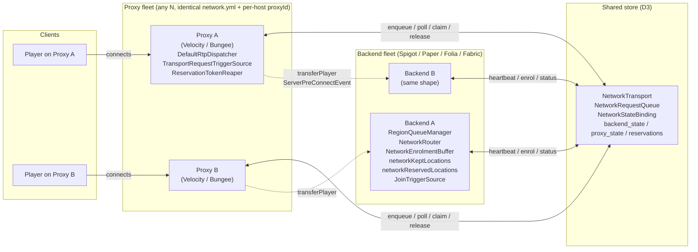
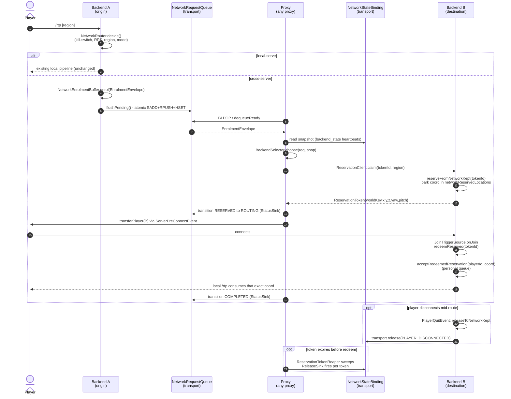
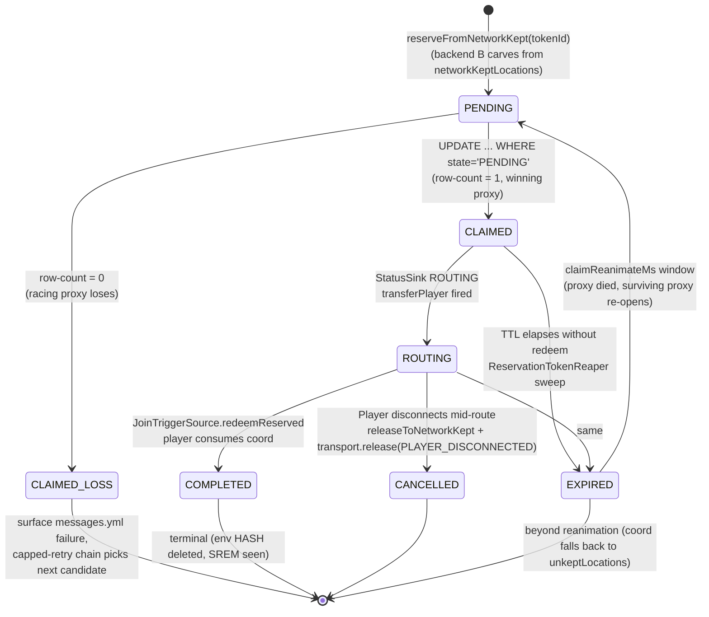
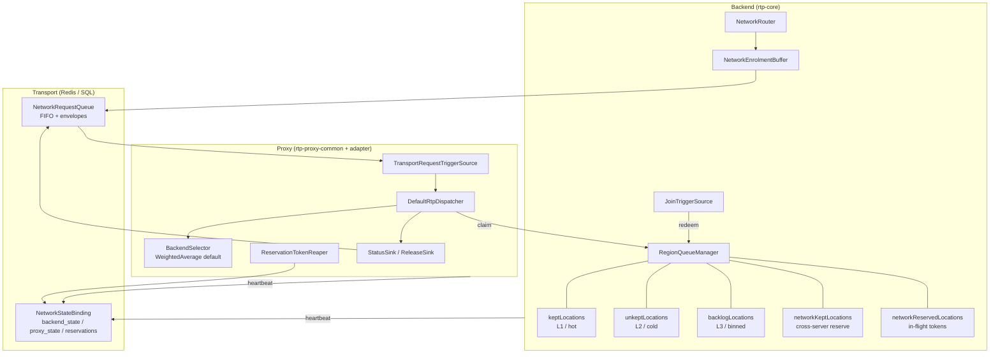
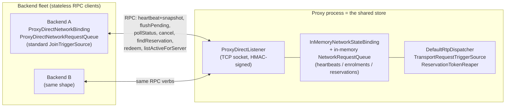

# Network Model (Multi-Server / Multi-Proxy)

Mermaid-rendered overview of RTP's network mode: the topology, the cross-server `/rtp` request lifecycle, and the reservation-token state machine. This doc is a **visual companion** to the normative sources, not a substitute. For the full rationale and acceptance criteria, read:

- [`../dev/MULTI_SERVER_PLAN.md`](../dev/MULTI_SERVER_PLAN.md): roadmap, design rules, config surface.
- [ADR-036](../adr/ADR-036-network-mode-multi-server-multi-proxy.md): umbrella decision.
- [rtp-proxy-ADR-014](../../platforms/rtp-proxy/docs/adr/rtp-proxy-ADR-014-backend-owned-rtp-with-network-queue.md): backend-owned `/rtp` + network wait queue (L6, the current shape).
- [rtp-proxy-ADR-017](../../platforms/rtp-proxy/docs/adr/rtp-proxy-ADR-017-proxy-direct-transport.md) and [rtp-proxy-ADR-019](../../platforms/rtp-proxy/docs/adr/rtp-proxy-ADR-019-proxy-direct-as-remote-store.md): the `proxy-direct` transport (the proxy itself plays the role of the shared store, so cross-server `/rtp` works without Redis or SQL).
- [`../dev/GLOSSARY.md`](../dev/GLOSSARY.md): canonical terms (`backend`, `proxy`, `transport`, `network snapshot`, `backend selector`, `reservation token`).

Diagrams below describe the **L6 architecture** as accepted on 2026-05-21. Earlier L1-L5 shapes (proxy-hosted `/rtp`) are superseded.

---

## 1. Topology

Hub-and-spokes star around a single shared store. Proxies never call each other; backends never call each other. All cross-host coordination flows through the transport. The store has three interchangeable backings selected by `transport.type`: a durable external `redis` server, a durable `sql` database, or `proxy-direct` (the proxy's own in-memory maps, reached over a TCP socket). The diagram below shows the durable case; for the DB-free `proxy-direct` case the `Shared store` box collapses into the proxy process itself (see Section 5).

Key invariants (see *Multi-Proxy Deployment* in `MULTI_SERVER_PLAN.md`):

- No proxy-to-proxy chatter. Hub-and-spokes only.
- "The proxy" always means "some proxy"; any code path that assumes the same proxy observes a side effect it issued is a bug.
- Per-proxy local state (snapshot cache, `recentPicks`) is **advisory only**; safety-load-bearing state lives in the transport.

---

## 2. Cross-Server `/rtp` Request Lifecycle (L6)

The backend owns `/rtp`. The proxy is a dispatch + reservation broker. Walks through the happy path of a player on backend A running `/rtp` and landing on backend B.

Notes:

- Coordinates are resolved on backend B **before** the player transfers (`MULTI_SERVER_PLAN.md` *Coordinate Resolution Timing*). The proxy carries `worldKey + x/y/z/yaw/pitch` in the token; the destination's join handler *consumes*, it does not re-run the pipeline.
- `JoinTriggerSource` is **redeem-first**: if a token is present, it bypasses the normal join-rtp trigger and feeds the personal queue directly.
- The `releaseToNetworkKept` path is bounded; on overflow it falls through to `unkeptLocations` (S-004 attribution preserved).

---

## 3. Reservation Token State Machine

A single coordinate's life from "earmarked on backend B" to "consumed by the player" or "reclaimed by the reaper". Multi-proxy races are resolved by the `WHERE state='PENDING'` row-count guard on the `PENDING` to `CLAIMED` transition.

The `EXPIRED` to `PENDING` reanimation edge is what makes multi-proxy failover work: a token claimed by a dead proxy returns to the pool after `claimReanimateMs`, and any surviving proxy can pick it up without operator intervention. The same primitive covers proxy restart and proxy death (`MULTI_SERVER_PLAN.md` *Reservation tokens under multiple proxies*).

---

## 4. Data Plane Summary

What lives where, at a glance.

The `cacheCap` budget on each region is the upper bound for `keptLocations + networkKeptLocations`; `networkReserveSize` (per-region, default `0`) carves a slice for cross-server use without changing the existing single-server behaviour when set to `0`.

---

## 5. The `proxy-direct` Transport (server-as-database, DB-free)

`proxy-direct` is the third value of `transport.type`, alongside `redis` and `sql`. It exists so a small network (typically an rtp-lite deployment, ADR-024) can run cross-server `/rtp` **without standing up a Redis server or a shared SQL database**. The proxy process itself plays the role the Redis server plays: it owns the shared store, and backends are stateless RPC clients that read and write it over the player-independent TCP socket from [rtp-proxy-ADR-017](../../platforms/rtp-proxy/docs/adr/rtp-proxy-ADR-017-proxy-direct-transport.md).

The key invariant ([rtp-proxy-ADR-019](../../platforms/rtp-proxy/docs/adr/rtp-proxy-ADR-019-proxy-direct-as-remote-store.md)) is that `proxy-direct` is **just another data-management transport**: every cross-server behaviour (region discovery, enrolment, dispatch, reservation, arrival redeem) runs through the same `NetworkTransport` + `NetworkRequestQueue` SPI and the same proxy-side code (`DefaultRtpDispatcher`, `TransportRequestTriggerSource`, `ReservationTokenReaper`, the pre-connect redeem) that the Redis/SQL tiers use. The only thing that changes between `redis` and `proxy-direct` is *where the bytes land*. So the lifecycle (Section 2) and the reservation-token state machine (Section 3) apply unchanged; the `proxy-direct` mode only relocates the store.

Notes:

- The RPC direction is **backend -> proxy only**; the proxy never dials a backend. Proxy-local SPI methods (`claim`, `dequeueReady`, `transition`, `release`, `reapExpired`) run against the proxy's own store and are never sent over the wire.
- A backend `claim` is never issued (the proxy claims); `ProxyDirectNetworkBinding.claim` throws. Backend reservation RPCs (`findReservation` / `redeem`) are dispatched on `RTP.scheduler`'s async tier so no join/tick thread blocks.
- The store is **in-memory and not durable**: it lives only as long as the proxy process. This is the intended trade for the DB-free convenience tier. Multi-proxy stays single-proxy-simple (a backend dials every configured proxy and the first definite answer wins); cross-proxy ownership and durability remain `redis`/`sql` concerns.
- One short-lived socket per RPC call (matching the heartbeat exchange); a keep-alive pool is a possible later optimisation, not required for correctness.

---

## 6. Where to go next

- For per-key config semantics: `network.yml` section of [`MULTI_SERVER_PLAN.md`](../dev/MULTI_SERVER_PLAN.md).
- For the SPI shapes (`NetworkTransport`, `NetworkRequestQueue`, `BackendSelector`, `ReservationClient`): [rtp-proxy-ADR-001](../../platforms/rtp-proxy/docs/adr/rtp-proxy-ADR-001-spi-shape.md) and [rtp-proxy-ADR-014](../../platforms/rtp-proxy/docs/adr/rtp-proxy-ADR-014-backend-owned-rtp-with-network-queue.md).
- For Redis Lua envelope atomicity: [rtp-proxy-ADR-005](../../platforms/rtp-proxy/docs/adr/rtp-proxy-ADR-005-redis-binding.md).
- For SQL binding: [rtp-proxy-ADR-011](../../platforms/rtp-proxy/docs/adr/rtp-proxy-ADR-011-sql-network-state-binding.md).
- For the DB-free `proxy-direct` tier (server-as-database): [rtp-proxy-ADR-017](../../platforms/rtp-proxy/docs/adr/rtp-proxy-ADR-017-proxy-direct-transport.md) and [rtp-proxy-ADR-019](../../platforms/rtp-proxy/docs/adr/rtp-proxy-ADR-019-proxy-direct-as-remote-store.md).
- For glossary disambiguation (`fast cache` vs `kept cache` vs `network wait queue` vs `personal queue`): [`AGENTS.md` *Domain Analogies & Aliases*](../../.junie/AGENTS.md) and [`GLOSSARY.md`](../dev/GLOSSARY.md).
