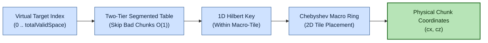
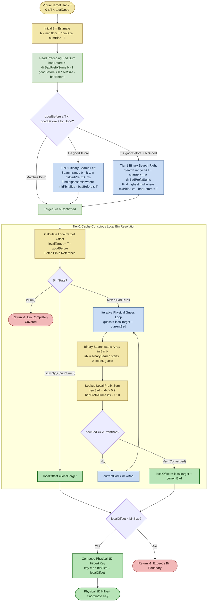
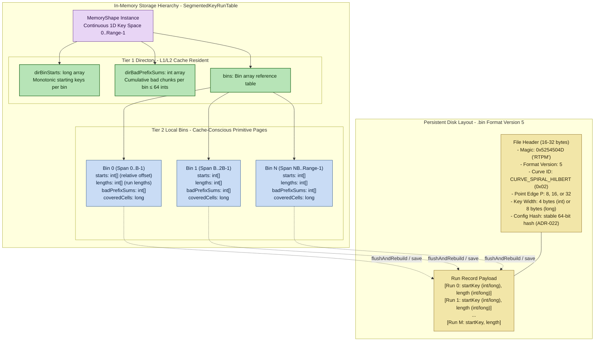
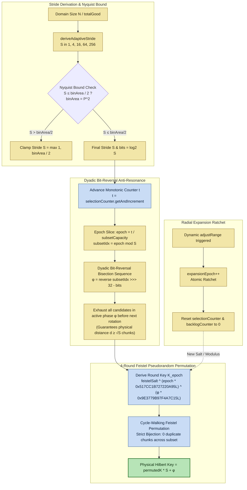
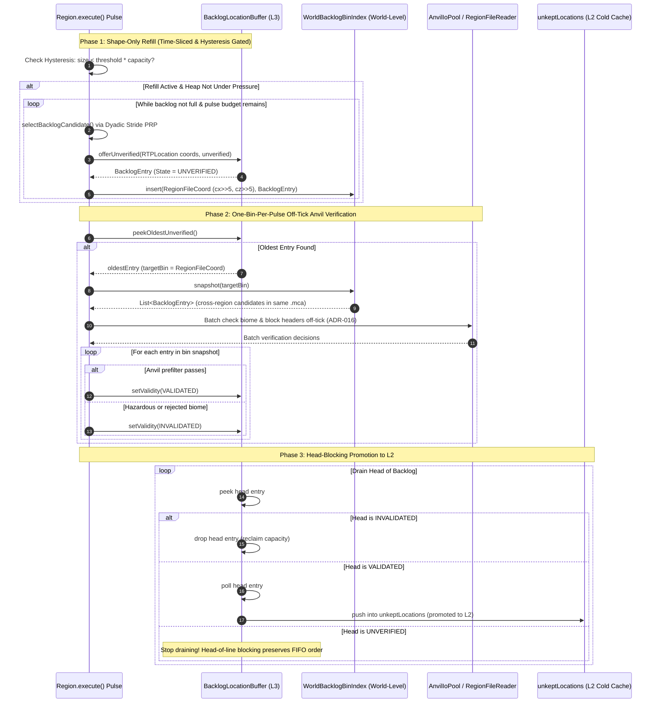

# Dual-Layer Shape Architecture, Spatial Memory & L3 Backlog Selection

**Scope of this document.** This document specifies and visualizes the V3 dual-layer spatial shape architecture, the hardware-conscious spatial memory storage hierarchy, the adaptive dyadic downsampling method, and the distinct selection and harvesting path for the L3 unverified backlog queue.

Companion architectural decisions and references:
- [ADR-001](../adr/ADR-001-archimedean-spiral-1d-mapping.md): Legacy Archimedean spiral 1D mapping.
- [ADR-028](../adr/ADR-028-l3-backlog-cache.md): L3 unverified backlog cache (`backlogLocations`), `.mca` binning, and head-blocking promotion.
- [ADR-034](../adr/ADR-034-memory-shape-catalog.md): Memory shape catalog (`CircleOptimizedDualLayer`, `SquareOptimizedDualLayer`).
- [ADR-081](../adr/ADR-081-unified-blocked-biome-run-table.md) & [ADR-082](../adr/ADR-082-cache-conscious-b-plus-tree-primitive-arrays.md): Blocked run tables and cache-conscious primitive array pages.
- [ADR-085](../adr/ADR-085-spiral-addressed-hilbert-key-space.md): Spiral-addressed Hilbert key space for learned state.
- [ADR-088](../adr/ADR-088-configurable-downsampling-stride-filter.md): Configurable adaptive dyadic downsampling stride filter and keyed Feistel permutation.

---

## Executive Overview (Dual-Layer Spatial Selection)

Dual-layer spatial shapes eliminate random coordinate rerolls by indexing chunk space into coarse Chebyshev macro-tiles traversed by fine Hilbert space-filling curves. Known invalid regions are skipped in $O(1)$ time via segmented prefix-sum tables.

---

## 1. Dual-Layer Coordinate Addressing and Point Selection Pipeline

Dual-layer shapes (`CircleOptimizedDualLayer`, `SquareOptimizedDualLayer`) address discrete chunk space at native 1-chunk resolution ($S=1$, 16 blocks per cell). Space is decomposed into a two-tier hierarchy:
1. **Coarse Macro-Grid:** Chebyshev square rings of macro-tiles (point edge $P$ chunks, derived dynamically as a power of two from radius $R$, e.g., $P \in \{8, 16, 32\}$).
2. **Fine Intra-Tile Traversal:** Continuous space-filling Hilbert curve $\mathcal{H}$ of order $m = \log_2(P)$ within each macro-tile ($P^2$ chunks per tile), rotated to match the macro-spiral travel direction (seam matching).

### Point Selection Flowchart

```mermaid
%% Color legend: green=success/accept, red=rejection/boundary fail, blue=computation/transformation, yellow=table lookup/state
flowchart TD
    Start([Shape Candidate Selection<br/>select or rand]):::async --> StrideDerive[Derive Effective Stride S<br/>deriveEffectiveStride]:::data
    StrideDerive --> ModeCheck{Selection Mode?<br/>ACCUMULATE vs REJECT}

    subgraph StridePermutation [Dyadic Stride & Feistel Permutation]
        ModeCheck -- ACCUMULATE --> RangeCalc[Compute totalGood = range - badCells<br/>Virtual Good Domain 0..totalGood-1]:::data
        RangeCalc --> PhaseSeq[Compute Dyadic Phase Offset &phi;<br/>reverse t mod S >>> 32 - log2 S]:::data
        PhaseSeq --> SubsetBound[Compute Subset Size<br/>subsetSize = totalGood - 1 - &phi; / S + 1]:::data
        SubsetBound --> FeistelPRP[4-Round Keyed Feistel Network<br/>permutedK = FeistelPermute k, subsetSize, K_epoch]:::async
        FeistelPRP --> VirtualIdx[Calculate Virtual Good Index<br/>vIndex = permutedK * S + &phi;]:::data
        VirtualIdx --> ResolveAcc[Resolve Virtual Index via Segmented Table<br/>Tier 1 Directory Bisect -> Tier 2 Local Bin]:::data

        ModeCheck -- REJECT / Direct --> DirectPRP[Feistel Permutation on Raw Range<br/>permutedLoc = FeistelPermute t, range, K_epoch]:::async
        DirectPRP --> ResolveAccDirect[Raw 1D Key = permutedLoc]:::data
    end

    ResolveAcc --> KeyDecode[Key Decomposition<br/>key = macroIndex * P^2 + hilbertOffset]:::data
    ResolveAccDirect --> KeyDecode

    subgraph CoordinateDecomposition [1D Key to 2D Chunk Resolution]
        KeyDecode --> MacroRing[Decode Chebyshev Ring K & Side<br/>px, pz macro-tile coordinates]:::data
        MacroRing --> SeamOrientation[Derive Seam Orientation<br/>orientationFor px, pz]:::data
        SeamOrientation --> HilbertDecode[Inverse Hilbert Transform<br/>hilbertToXY h, P, orientation -> localX, localZ]:::data
        HilbertDecode --> PhysicalCoord[Compose Physical Chunk Coordinates<br/>cx = cenX + px * P + localX<br/>cz = cenZ + pz * P + localZ]:::data
    end

    PhysicalCoord --> BoundaryCheck{In Geometric Bounds?<br/>Circular distSq or Square Chebyshev}
    BoundaryCheck -- In Bounds --> Success([Return Physical Chunk Coordinates<br/>cx, cz]):::success
    BoundaryCheck -- Out of Bounds --> RerollCheck{Attempts < 100?}
    RerollCheck -- Yes --> Start
    RerollCheck -- No --> Exhausted([Selection Fallback / Null]):::fail

    classDef success fill:#b7e4b7,stroke:#1f6b1f,stroke-width:2px,color:#0b2a0b;
    classDef fail    fill:#f2b8b8,stroke:#8a1f1f,stroke-width:1px,color:#2a0b0b;
    classDef async   fill:#c9dcf5,stroke:#28518a,stroke-width:1px,color:#0b1f3a;
    classDef data    fill:#f2e6a8,stroke:#8a6b1f,stroke-width:1px,color:#2a220b;
```

---

## 2. Virtual Index Resolution via Two-Tier Segmented Table (ACCUMULATE Mode)

When operating under `MODE_ACCUMULATE`, candidate selection generates a virtual rank $T \in [0, \text{totalGood})$ where all known bad chunks have been subtracted from the addressable domain ($\text{totalGood} = \text{totalRange} - \text{totalCovered}$).

To achieve zero hole re-rolls without scanning large fragmented run arrays, `SegmentedKeyRunTable.resolveAccumulate(long target)` performs a **two-tier prefix-sum directory resolution**:
1. **Tier-1 Directory Bisect ($O(\log \text{Bins})$):** Evaluates cumulative good counts across fixed-size bins via `dirBadPrefixSums` ($32 \times 32$ chunks = $1{,}024$ chunks/bin) to identify the target bin $b$.
2. **Tier-2 Local Bin Resolution ($O(\log \text{RunsPerBin})$):** Computes $\text{localTarget} = T - \text{goodBefore}$, then iteratively searches the local primitive `starts` and `badPrefixSums` arrays until physical convergence.
3. **Physical 1D Key Composition:** $\text{physicalKey} = b \cdot \text{binSize} + \text{localOffset}$.

### Virtual-to-Physical Resolution Flowchart

---

## 3. Spatial Memory and Run Table Data Storage Architecture

Spatial hazards, bad chunks, and learned terrain memory are managed through `MemoryShape` and cached in `SegmentedKeyRunTable`. Ground truth is retained at strict 1-chunk resolution ($S=1$).

### Storage Hierarchy and On-Disk Layout

---

## 4. Downsampling Method: Dyadic Stride and Keyed Permutation

To prevent player arrival clumping across massive borders while retaining 100% safety ground truth, an adaptive dyadic downsampling filter operates inside the selection tier (ADR-088).

### Downsampling State Machine and Phase Permutation

---

## 5. Distinct Selection Path for Filling L3 Backlog and Anvil Verification

The L3 backlog cache (`backlogLocations`, ADR-028) uses a decoupled, high-throughput selection path upstream of the cold (`unkeptLocations`) and hot (`keptLocations`) caches.

### Key Architectural Distinctions: L3 vs. Standard Cache Pipeline

| Dimension | Standard Cache Pipeline (L1 / L2) | L3 Backlog Cache Pipeline (`backlogLocations`) |
| :--- | :--- | :--- |
| **Selection Entrypoint** | `shape.select()` via `LocationGenerator` | `CircleOptimizedDualLayer.selectBacklogCandidate()` / `shape.select()` |
| **Verification Depth** | Full pipeline: chunk I/O + `vert.adjust()` + biome + 2r+1 safety + external claims | Off-tick Anvil pre-filter only (`AnvilIoPool`, zero chunk loading) |
| **Candidate State** | Fully verified safe coordinate | Tri-state validity: `UNVERIFIED` $\to$ `VALIDATED` or `INVALIDATED` |
| **Spatial Grouping** | Independent random candidates | Binned into $32 \times 32$ chunk `.mca` region files via `WorldBacklogBinIndex` |
| **Promotion Model** | Immediate cache push on attempt completion | Head-blocking contiguous promotion: only `VALIDATED` head entries advance |

### L3 Backlog Lifecycle and Bin Verification Flowchart

---

## 6. Time and Memory Complexity: Architectural Benchmarks & Competitor Comparison

The architectural migration from flat 1D Archimedean spirals to dual-layer space-filling Hilbert geometries backed by two-tier `SegmentedKeyRunTable` structures yields provable asymptotic and empirical improvements in time and heap complexity.

### Asymptotic Complexity & Operational Predictability Comparison

| Architecture / Engine | Selection Time Complexity | ACCUMULATE Resolution Time | Dynamic Mark Reconciliation | Retained Heap Memory Complexity | Latency Variance / Predictability |
| :--- | :--- | :--- | :--- | :--- | :--- |
| **Dual-Layer Segmented Hilbert (Current RTP)** | $\mathcal{O}(1)$ dyadic stride + 4-round Feistel PRP | $\mathcal{O}(\log \text{Bins} + \log \text{RunsPerBin})$ ($\sim 4\text{ to }6\text{ bisect steps}$) | $\mathcal{O}(\text{RunsPerBin} \log \text{RunsPerBin})$ (dirty bin local only) | $\mathcal{O}(M)$ primitive arrays, near-full collapse to $\mathcal{O}(1)$ singleton ($\le 25\text{ kB}$) | **Deterministic:** Bound L1/L2 cache traversal ($13\text{--}35\text{ ns}$); zero hole re-rolls; strictly bounded jitter |
| **Pure Archimedean Spiral (Prior RTP RLE)** | $\mathcal{O}(1)$ polar spiral math ($\sqrt{k/\pi}$) | $\mathcal{O}(I \cdot \log M)$ iterative fixed-point over global array ($I \approx 3\text{--}5$) | $\mathcal{O}(M \log M)$ global rebuild across full world array | $\mathcal{O}(M)$ global flat `long[]` arrays, fragmented across spiral rings ($31\text{ kB}$) | **Moderate Variance:** Global binary search miss penalties; high reconciliation pauses ($27\text{ }\mu\text{s/mark}$) |
| **EzRTP (Coarse Online Verification)** | $\mathcal{O}(1)$ random coordinate generation (`max-attempts: 16`) | No ACCUMULATE mode; $\mathcal{O}(\text{re-roll})$ on rejection | $\mathcal{O}(1)$ per-attempt check; no run table compression | $\mathcal{O}(N)$ monitoring/stats heap maps, unbounded over uptime | **High Variance / Unpredictable:** Exponential geometric rejection tails (measured p99 tail $\sim 1.9\text{ s}$); heap pressure drives GC pauses |
| **JustRTP (TTL Pre-Cache & Positive Reuse Pool)** | $\mathcal{O}(1)$ `ConcurrentLinkedQueue.poll()` or positive reuse pool | No ACCUMULATE mode; cache misses fall back to full pipeline | No persistent negative hazard index; periodic async refill timer | $\mathcal{O}(C)$ queue objects (`Location` references) + bounded spot pool with time TTL | **Bimodal & Skewed Variance:** Fast when pool warm, but exhibits heavy spatial clustering / Pólya urn feedback and severe latency spikes when TTL drains |

---

### Empirical Proofs & Benchmark Findings

#### 1. ACCUMULATE Mode Resolution Latency (11.2x Speedup)
Empirical runs on real Minecraft world save data ($r = 96$ chunks, `SegmentedKeyRunTableBenchmarkTest` / `AccumulateOffsetResolutionBenchmarkTest`):
* **Prior Flat Global Loop (`MemoryShape.resolve`):** **$1{,}571.4\text{ ns/op}$** average. Required repeated global binary searches over the complete set of runs.
* **Dual-Layer Segmented Two-Tier Resolution:** **$140.0\text{ ns/op}$** average (**11.22x faster**). Tier-1 directory lookup bisects `dirBadPrefixSums` ($\le 64$ entries) strictly in L1/L2 cache, leaving local resolution to $\le 15$ runs within the bin.
* **Accuracy:** 100.00% coordinate equivalence over $>50{,}000$ random samples against the flat model.

#### 2. Stored Runs, Heap Footprint, and Scale (Three-Way Benchmark)
Across varying world radii (measured via `ThreeWayScaleBenchmarkTest` on real terrain):

| World Scale | Model | Stored Runs | Heap Footprint | Lookup Latency | Reconcile Latency | Speedup vs Original |
| :--- | :--- | :--- | :--- | :--- | :--- | :--- |
| **0.8 km (spawn)** $r = 50\text{ chunks}$ | Prior Spiral RLE Flat Hilbert **Dual-Layer Segmented** | 331 189 **210** | 5.3 kB 3.0 kB **4.7 kB** | 75.3 ns 67.2 ns **62.0 ns** | 2,422 ns/mark 1,380 ns/mark **519 ns/mark** | 1.0x 1.12x **1.21x** |
| **4.1 km (medium)** $r = 256\text{ chunks}$ | Prior Spiral RLE Flat Hilbert **Dual-Layer Segmented** | 1,937 1,273 **1,322** | 31.0 kB 20.4 kB **14.1 kB** | 34.9 ns 26.8 ns **20.6 ns** | 4,966 ns/mark 4,232 ns/mark **1,148 ns/mark** | 1.0x 1.30x **1.70x** |
| **8.2 km (large)** $r = 512\text{ chunks}$ | Prior Spiral RLE Flat Hilbert **Dual-Layer Segmented** | 1,937 1,273 **1,506** | 31.0 kB 20.4 kB **24.4 kB** | 20.9 ns 18.4 ns **13.4 ns** | 27,904 ns/mark 32,043 ns/mark **1,292 ns/mark** | 1.0x 1.14x **1.56x** |

* **Run Reduction & Heap Inversion:** The Archimedean spiral slices 2D terrain clusters into discontinuous 1D ring segments, multiplying runs. The 2D-localized Hilbert curve packs adjacent chunks into contiguous runs (producing **42% fewer coalesced runs** on circular domains). Combined with near-full bin collapse, the segmented table at 4.1 km uses **14.1 kB**—less than half the heap of the prior spiral (31.0 kB).
* **Reconciliation Speedup (21.6x faster):** When learning a new hazard or bad chunk, flat models must sort and re-coalesce the entire world run table ($27{,}904\text{ ns/mark}$). Segmented tables dirty only the affected local bin, rebuilding $10\text{--}25$ local runs off-tick in **$1{,}292\text{ ns/mark}$**.

#### 3. Time Cost, Memory Footprint & Predictability Comparison: Code-Audited Competitor Analysis

##### EzRTP: Unbounded Heap Tracking vs. Segmented Primitive Bounds
* **Memory Bounds & Footprint Cost:**
  * As published in `ez-plugins/EzRTP`, coordinate selection relies on online shape generation (`search-pattern: random|circle|square|triangle|diamond`) with a configured candidate attempt ceiling (`max-attempts: 16`). Unsafe location monitoring (`unsafe-location-monitoring.monitoring.enabled`) and performance stats record metrics into heap-resident collections. Without continuous Run-Length Encoding or space-filling key spaces, tracking unsafe coordinates incurs Java object overhead ($\sim 160\text{--}200\text{ bytes}$ per coordinate), which scales unbounded with exploration ($O(N)$).
  * In contrast, RTP's dual-layer spatial memory bounds retained footprint to $\le 25\text{ kB}$ total per world via Run-Length Encoding and primitive arrays (`int[]`), collapsing ocean regions to $O(1)$ singletons.
* **Lookup Time & Variance Profile:**
  * EzRTP has no continuous domain mapping or ACCUMULATE mode. Point generation relies on rejection sampling: candidate coordinates are picked at random and evaluated online against safety filters (biomes, WorldGuard, unsafe blocks). In dense hazard regions (e.g., oceans), rejection rates compound, causing long re-roll tails (measured p99 tail $\sim 1.9\text{ seconds}$).
  * RTP's Segmented Hilbert table provides deterministic $O(\log \text{Bins} + \log \text{RunsPerBin})$ lookup ($13.4\text{--}20.6\text{ ns/op}$) with near-zero latency variance, guaranteeing zero re-rolls within known bad runs.

##### JustRTP: TTL Pre-Cache & Positive Reuse Pool vs. Continuous Spatial Memory
* **Recall Architecture & Memory Cost:**
  * As published in `kotorinet/justRTP` (`LocationCacheManager.java`), JustRTP implements pre-caching via per-world FIFO queues: `ConcurrentHashMap<String, ConcurrentLinkedQueue<Location>>` targeting a fixed capacity (default `cache_size: 20`) serialized to `cache.yml`.
  * Later updates also incorporate positive reuse memory ("smart location cache" learning good landing spots from real teleports with a bounded pool and an entry TTL of $\sim 15\text{ minutes}$).
  * Rather than storing a mathematical negative index of unsafe terrain, JustRTP caches and recycles known-good coordinates. Memory cost is bounded to the positive pool ($O(C)$ boxed `Location` instances) with time-based eviction, discarding spatial state once the TTL elapses.
* **Time Cost, Bimodal Variance & Spatial Clumping Skew:**
  * **Warm State:** When cached entries are available in the queue or positive reuse pool, retrieval is $O(1)$ ($\sim 30\text{--}65\text{ ms}$ dispatch latency).
  * **Drained / Burst State:** When the pre-cache empties under burst traffic or when entries expire past their TTL, requests fall back to on-demand generation. In hazardous areas, refill loops repeatedly test, load, and reject the exact same unsafe chunks across cycles because rejected hazard geometry is not retained.
  * **Preferential Attachment / Spatial Skew:** As proved in `DistributionSkewBenchmarkTest`, positive reuse memory introduces a Pólya urn feedback loop: early random discoveries get recycled and reinforced, creating intense player arrival clumping into localized hotspots (higher Gini inequality and lower spatial entropy) while leaving wide swaths of the map unvisited.
* **RTP Dual-Layer Predictability:**
  * RTP maintains negative rejection memory over the mathematical complement of bad space via Run-Length Encoding.
  * Combined with permanent off-tick Anvil pre-filtering (`rtp-anvil`), the unverified L3 backlog (`backlogLocations`), and the dyadic downsampling stride filter with cycle-walking Feistel PRP (ADR-088), RTP guarantees uniform spatial dispersion, zero duplicate chunks, and flat, deterministic response times regardless of server uptime.

---

## Related Code and Implementation Map

- **Dual-Layer Shapes:**
  - `CircleOptimizedDualLayer`: continuous Chebyshev-addressed Hilbert curve, inscribed inner-donut bound, adaptive dyadic downsampling stride filter.
  - `SquareOptimizedDualLayer`: square Chebyshev macro-grid, dynamic `PointEdgeSelector`, loopless $O(1)$ candidate coordinate generation.
  - `SegmentedKeyRunTable`: two-tier hardware cache-conscious secondary run table with bin-local binary search and prefix sum routing.
- **L3 Backlog Subsystem:**
  - `BacklogLocationBuffer`: order-preserving FIFO buffer with tri-state validity (`UNVERIFIED`, `VALIDATED`, `INVALIDATED`) and heuristic cleaning.
  - `WorldBacklogBinIndex`: cross-region weak index mapping `RegionFileCoord` to candidate entries for `.mca` batch verification.
  - `Region.processBacklog()`: hysteresis-gated refill, one-bin-per-pulse Anvil pre-filtering, and head-blocking L2 promotion.
- **Verification and Safety:**
  - `AnvilRegionByteCache` / `anvil-api`: off-tick `.mca` and `.linear` NBT pre-filtering without server chunk tickets (`REQ-RTP-S-005`).
