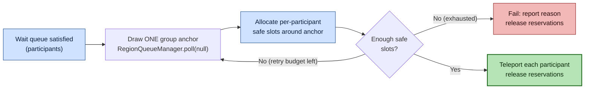
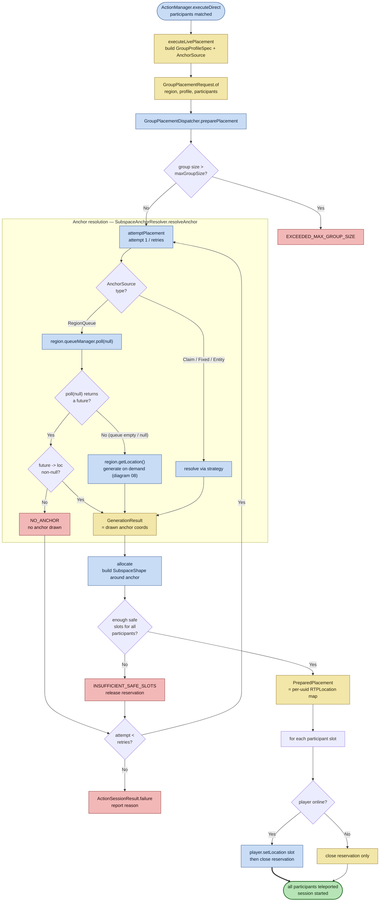

# Group placement — anchor draw and per-participant teleport

**Scope of this diagram.** This chart covers the multi-participant placement path used by scripted actions (`challenge`, `scatter`, and any action with `placement` enabled) — i.e., how a *group* of already-agreed participants is turned into a set of nearby, safe landing slots and teleported together. It starts once a wait queue is satisfied (`ActionManager.executeDirect`) and ends when every online participant has been teleported and their chunk reservations released.

A key point that trips people up: the group path does **not** poll a location per player. It draws **one anchor** for the whole group and then lays out per-participant slots around that anchor. The anchor is drawn from the region's shared kept/hot queue — the *same* pre-warmed pool that single `/rtp` teleports consume (diagram 02) — via `RegionQueueManager.poll(null)`. The `null` uuid means "no owning player, just give me an anchor," which is why this reuses random-placement machinery even though the participants (the senders) are the ones ultimately teleported.

Related-but-separate behavior paths are intentionally **out of scope** here:

- **Single-player `/rtp`** — funnels through `poll(uuid)` and the teleport pipeline (diagram 01), not the group engine.
- **Per-attempt candidate selection** — how one `(x, y, z)` is proposed/validated lives in diagram 08; the group engine consumes its `GenerationResult` as the anchor.
- **Chunk ticket lifecycle** (`ChunkReservation`, `MemoryTracker`) — see diagram 03.
- **Action gates / wait-queue matchmaking** — how participants are matched before placement is action-engine logic, not placement.

---

## Executive Overview (Group Placement Flow)

A satisfied action hands its participant list to the group engine. One anchor is drawn from the region queue (falling back to on-demand generation when the queue is empty), safe per-participant slots are allocated around it, and each online participant is teleported to their slot; reservations are released on every exit path.

---

## Detailed Group Placement Flowchart

How to read this chart:

- **One anchor, many slots.** `poll(null)` draws a single anchor for the whole group; the participants (the challenge senders) are placed at per-participant slots laid out around it by `allocate`, not by each polling their own location. This is the difference from single `/rtp`, which polls `poll(uuid)`.
- **`poll(null)` must never throw.** The region queue's per-player structures (`fastLocations`, `perPlayerLocationQueue`) are `ConcurrentHashMap`s, which reject `null` keys. `poll(UUID)` guards the uuid: a `null` uuid skips those lookups and falls through to the shared `keptLocations`. Before this guard, `poll(null)` threw an NPE that was swallowed upstream (the anchor future never completed), so a matched group logged `resolveAnchor: ... strategy=RegionQueueAnchorSource` and then silently stalled — no teleport, no feedback. That silence is the tell: exactly one of the three `resolveAnchor` follow-up logs (`poll resolved anchor`, `poll returned null`, `falling back to getLocation`) must always appear.
- **Empty queue is not failure.** When `poll(null)` returns `null` (empty pre-warmed queue on a fresh server), the resolver falls back to `region.getLocation()` and generates an anchor on demand (diagram 08). The group path only fails when generation yields `NO_ANCHOR` or too few safe slots persist across the retry budget.
- **Reservations are released on every exit path.** Whether a participant is online (teleport then close) or offline (close only), and whether allocation succeeds or fails, the anchor/slot `ChunkReservation`s are closed (S-002; diagram 03).
- **Retries are bounded.** `attemptPlacement` re-draws a fresh anchor only on `INSUFFICIENT_SAFE_SLOTS`, up to `GroupProfileSpec.retries()` (ADR-097). Other reasons fail fast.
- **Slot selection is candidate-pool → validate → separate, not a pre-committed lattice.** `SubspaceShape.selectSafeSlots(Async)` enumerates one candidate world column per not-known-bad chunk in the block-radius footprint (`footprintCandidateColumns`), consulting the parent `MemoryShape`'s `isKnownBad` mapping — for dual-layer shapes this is the ACCUMULATE good-cell consult over the intersecting bins; for a generic `MemoryShape` it degrades to a per-chunk query. Because hazard memory is *incomplete*, the pool is **oversampled** (the dispatcher requests `max(n*4, 8)` candidates, not `n`) so on-demand column validation + global verifiers can absorb attrition. `minSeparation` is deliberately **not** applied during enumeration: it is enforced afterward by `SubspaceShape.selectBySeparation` over the *validated* pool (a greedy pass seeded from the anchor), because the final layout depends on which candidates actually validate. The proven-good anchor column is always evaluated first, except under an annular distribution mask (nearplayer/nearclaim) that deliberately excludes the center.
- **Why the earlier version silently placed zero slots.** The previous naive XZ-lattice + point `isKnownBad` could false-exclude an entire footprint around a demonstrably-valid anchor, returning `0 slots (required N)` on every retry. Group-placement tests mocked `Region` so `getShape()` was `null` and this parent-shape path was never exercised — the regression test `SubspaceShapeTest#testRealDualLayerParentPlacesSeparatedSlots` now drives a real `SquareOptimizedDualLayer` parent so the mapping is covered.
- **Diagnosing a live `0 slots (required N)` run.** The production validator (`RegionCandidateValidator`) reads only *resident* chunks and fails closed for any non-resident column, so a zero-slot result has three distinct causes that the logs now distinguish. After warming, the dispatcher logs `chunk warming complete (F futures, R/T footprint chunks resident)` and the selector logs `subspace candidate validation: G of C enumerated columns passed on-demand validation`. Read them together: `C == 0` means the footprint pre-filter starved the pool (a separate `candidate enumeration produced ...` line fires); `R` low means warming did not populate the chunk cache (caching problem); `R` high but `G == 0` means chunks are resident yet every column is rejected by the vertical adjustor / `SafetyScan` / global verifiers (a real safety/config rejection, not a caching gap).

Related code:

- `rtp-core`: `ActionManager.executeLivePlacement`, `GroupPlacementDispatcher` (`preparePlacement` / `attemptPlacement` / `allocate`), `SubspaceAnchorResolver`, `RegionQueueManager.poll`, `Region.getLocation`.
- `rtp-api`: `GroupPlacementRequest`, `GroupPlacementResult`, `GroupProfileSpec`, `AnchorSource`, `GenerationResult`.
- ADRs: [ADR-095](../adr/ADR-095-subspace-anchor-providers-and-near-teleport-primitives.md) (anchor providers), [ADR-097](../adr/ADR-097-per-action-pre-validated-caches-and-bounded-retries.md) (bounded retries), [ADR-093](../adr/ADR-093-declarative-scripted-actions-via-core-confinement-and-subspace-placement.md) (scripted actions).
- Requirements: `REQ-RTP-S-002` (no permanently force-loaded chunks), `REQ-RTP-S-004` (no silent failures) — see [`TRACEABILITY.md`](../dev/TRACEABILITY.md).
