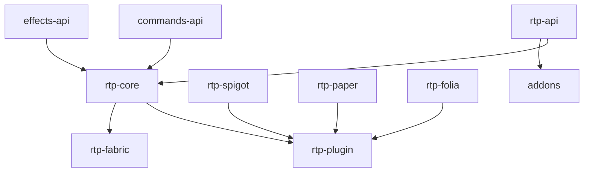

# Project Architecture

**Current Plugin Version:** `3.0.0-beta`

For a high-level overview of the plugin's reliability guarantees and bounded execution architecture, see [System Architecture and High-Reliability Design](DESIGN.md).
For the full requirements-to-code traceability matrix (Req ID → design decision → implementing class → test), see [TRACEABILITY.md](TRACEABILITY.md).
For actor definitions and stakeholder goals, see [STAKEHOLDERS.md](STAKEHOLDERS.md).
For term definitions, see [GLOSSARY.md](GLOSSARY.md).
For the rationale behind key architectural decisions (why, not just what), see [Architecture Decision Records](../adr/README.md).

The RTP (Random Teleport) plugin is built with a multi-module architecture to ensure scalability, ease of maintenance, and compatibility with various server software environments such as Spigot, Paper, Folia, and Fabric.

## Module Breakdown

### Core & API Modules
* **rtp-api**: Contains the interfaces, APIs, and shared models used by the plugin and external integrations. Addon developers should compile against this module.
* **rtp-core**: Contains the core logic of the plugin. This includes region management, random location selection algorithms (shapes), queue management, database interactions, and memory tracking. It is agnostic of the specific server platform.
* **commands-api**: A unified command framework (formerly external) now integrated to handle multi-platform command structures, including Brigadier on Fabric.
* **effects-api**: A unified visual/particle effects framework (formerly external) now integrated for cross-platform visual consistency.

### Platform Adapters
These modules implement platform-specific features to maximize performance on their respective servers while maintaining a unified core codebase.
* **rtp-spigot**: The adapter for standard Spigot servers, implementing Bukkit/Spigot-specific event handling and chunk loading.
* **rtp-paper**: The adapter for Paper servers, utilizing Paper-specific APIs for enhanced performance, such as asynchronous chunk loading.
* **rtp-folia**: The adapter for Folia servers, handling Folia's unique region-based multithreading to ensure teleports and tasks run safely on the correct regional thread.
* **rtp-fabric**: The adapter for Fabric servers, bridging the core logic to the Fabric modding environment and Minecraft's Brigadier command system.

### Plugin Entry Points
* **rtp-plugin**: The main entry point for Bukkit-based platforms (Spigot, Paper, Folia). It bridges `rtp-core` and the platform-specific adapters.
* **rtp-fabric**: Acts as its own entry point for the Fabric modding environment.

### Addons
* **addons**: A directory containing subprojects that integrate RTP with external plugins. These examples (e.g., `RTP_ClaimPluginIntegrations`, `RTP_Glide`, `RTP_Iris_integration`) demonstrate how to utilize `rtp-api` to extend the plugin's capabilities.

## Module Dependency Graph

> **Dependency rule:** `rtp-core` and `rtp-api` must never import platform-specific classes (Bukkit, Spigot, Paper, Folia, Fabric). This is enforced by ArchUnit tests.

## Key Concepts

* **Regions**: The world is divided into manageable teleport regions. Each region handles its own teleport queue and shape parameters.
* **Shapes**: Mathematical structures (circle, square, rectangle) governing how random points are generated. They support various distributions (normal, flat, exponential) for tailored teleport selection algorithms.
* **Queue System**: Pre-generating and validating random locations before they are needed ensures teleports are instant for the end-user.
