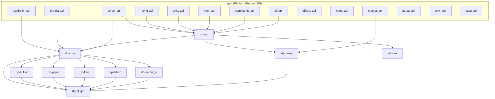

# Project Architecture

**Current Plugin Version:** `@version@`

For a high-level overview of the plugin's reliability guarantees and bounded execution architecture, see [System Architecture and High-Reliability Design](../../resource/LeafRTP/docs/dev/DESIGN.md).
For the full requirements-to-code traceability matrix (Req ID → design decision → implementing class → test), see [TRACEABILITY.md](../../resource/LeafRTP/docs/dev/TRACEABILITY.md).
For actor definitions and stakeholder goals, see [STAKEHOLDERS.md](../../resource/LeafRTP/docs/dev/STAKEHOLDERS.md).
For term definitions, see [GLOSSARY.md](../../resource/LeafRTP/docs/dev/GLOSSARY.md).
For the rationale behind key architectural decisions (why, not just what), see [Architecture Decision Records](../adr/README.md).

The RTP (Random Teleport) plugin is built with a multi-module architecture to ensure scalability, ease of maintenance, and compatibility across server and proxy environments: Spigot, Paper, Folia, Fabric ([rtp-fabric-ADR-002](../../platforms/fabric/docs/adr/rtp-fabric-ADR-002-platform-in-scope.md)), NeoForge ([rtp-neoforge-ADR-002](../../platforms/neoforge/docs/adr/rtp-neoforge-ADR-002-neoforge-platform-in-scope.md)), and Velocity / BungeeCord proxies ([leafrtp-ADR-022](../../resource/LeafRTP/docs/adr/leafrtp-ADR-022-network-mode-multi-server-multi-proxy.md)), with a Java 17 bytecode baseline for shared modules and MC 26.x+ deobfuscated runtime support ([ADR-113](../adr/ADR-113-java-17-baseline-and-26x-support-boundary.md)).

## Module Breakdown

### Core & API Modules

> **Building a standalone plugin or mod?** All 14 `api/*` libraries below are published to Maven Central and JitPack with zero `rtp-core` dependencies. See [`../FOR_PLUGIN_AUTHORS.md`](../FOR_PLUGIN_AUTHORS.md) for the 5-file multi-platform plugin blueprint and [`../../api/README.md`](../../api/README.md) for the standalone SDK catalog.

* **rtp-api**: Contains the public interfaces, APIs, and shared models used by the plugin and external integrations ([leafrtp-ADR-008](../../resource/LeafRTP/docs/adr/leafrtp-ADR-008-rtp-api-separate-module.md), [leafrtp-ADR-034](../../resource/LeafRTP/docs/adr/leafrtp-ADR-034-two-tier-api-extension-model.md)). Addon developers compile against this module.
* **rtp-core**: Contains the platform-neutral core logic of the plugin: region management, random location selection algorithms (shapes), 3-tier queue management (`Hot` / `Cold` / `Backlog`), stochastic cost modeling (`predict`), database interactions, and memory tracking (`MemoryTracker`). Internal packages are structured in a 4-tier Directed Acyclic Graph (DAG) to eliminate SonarQube package tangles and isolate domain algorithms from execution pipelines ([ADR-115](../adr/ADR-115-package-dag-disentanglement-and-decision-preservation-hypergraph.md); see [Package Architecture](../../resource/LeafRTP/docs/architecture/16-package-dag-and-decision-preservation-graph.md)).
* **anvil-api** (`api/anvil-api`): Standalone, platform-neutral off-tick region decoder and prefilter framework ([anvil-api-ADR-001](../../api/anvil-api/docs/adr/anvil-api-ADR-001-anvil-subsystem.md), [anvil-api-ADR-002](../../api/anvil-api/docs/adr/anvil-api-ADR-002-multi-format-region-support.md)). Defines the `RegionFileReader` SPI and ships the built-in Anvil reader (`.mca` / Zlib / LZ4), decoded off the main thread. Addons may register other formats through `RegionFormatRegistry` or a `RegionFileReaderProvider` service; files in an unregistered format (e.g. `.linear`) are ignored and their chunks fall back to the platform's live async chunk load.
* **bit-api** (`api/bit-api`): Standalone, plugin-agnostic Built-In Test (PBIT/CBIT/IBIT) contract, findings model, code registry, and CLI runner ([leafrtp-ADR-091](../../resource/LeafRTP/docs/adr/leafrtp-ADR-091-built-in-test-for-configuration-and-the-action-engine.md)).
* **bstats-api** (`api/bstats-api`): Dependency-free bStats v2 metrics client SPI ([bstats-api-ADR-001](../../api/bstats-api/docs/adr/bstats-api-ADR-001-dependency-free-client.md)).
* **commands-api** (`api/commands-api`): Unified platform-neutral command-tree framework and Brigadier bridge ([commands-api-ADR-001](../../api/commands-api/docs/adr/commands-api-ADR-001-brigadier-bridge.md)).
* **config-bit-api** (`api/config-bit-api`): Declarative YAML comment-directive (`@type`, `@options`, `@range`, `@pattern`), cross-file reference, distance-constraint, and locale-key parity PBIT validation library layered on `yaml-api`, `bit-api`, and `units-api` ([ADR-064](../adr/ADR-064-comment-directives-for-finite-value-domains.md), [leafrtp-ADR-091](../../resource/LeafRTP/docs/adr/leafrtp-ADR-091-built-in-test-for-configuration-and-the-action-engine.md)).
* **effects-api** (`api/effects-api`): Unified cross-platform visual, sound, potion, and hologram effects framework ([effects-api-ADR-003](../../api/effects-api/docs/adr/effects-api-ADR-003-platform-split-bukkit-fabric.md), including the `effects-api-fabric-unobf` carrier per [effects-api-ADR-006](../../api/effects-api/docs/adr/effects-api-ADR-006-fabric-obf-unobf-split.md)).
* **maps-api** (`api/maps-api`): Platform-neutral runtime cartography, heatmap, and Mermaid chart rendering SPI ([maps-api-ADR-003](../../api/maps-api/docs/adr/maps-api-ADR-003-maps-api-module.md)).
* **menu-api** (`api/menu-api`): Cross-platform declarative menu descriptor, session, token redemption, and anvil/text prompt SPI layered on `server-api` and `commands-api` ([ADR-035](../adr/ADR-035-interactive-menu-command-mirrors.md), [ADR-044](../adr/ADR-044-written-book-menu-renderer.md), [leafrtp-ADR-031](../../resource/LeafRTP/docs/adr/leafrtp-ADR-031-menu-builders-behind-server-accessor.md)).
* **metrics-api** (`api/metrics-api`): Platform-portable runtime telemetry SPI (`Metrics`, `MetricsBinding`, `MetricsSnapshot`, `FoliaRegionSample`; [metrics-api-ADR-001](../../api/metrics-api/docs/adr/metrics-api-ADR-001-module-extraction.md)).
* **predict-api** (`api/predict-api`): Zero-dependency stochastic estimation (`EwmaEstimator`, `BernoulliEstimator`, `EwmaLinearFit`) and adaptive control (`ComparativeCostGovernor`, `BudgetPacer`, `AimdLimiter`) library ([ADR-109](../adr/ADR-109-empirical-cost-governor-for-anvil-prefilter.md), [ADR-114](../adr/ADR-114-thread-weighted-inflight-deduplication-cost-model.md), [ADR-115](../adr/ADR-115-package-dag-disentanglement-and-decision-preservation-hypergraph.md)).
* **server-api** (`api/server-api`): Platform-neutral server identity, `PlatformFamily` capability gating, logging, and regional/async task scheduling SPI (`ServerAccessor`, `ServerAccessors`, `TaskScheduler`, `TaskHandle`; [effects-api-ADR-008](../../api/effects-api/docs/adr/effects-api-ADR-008-effects-through-neutral-server-accessor.md)).
* **tags-api** (`api/tags-api`): Zero-dependency Minecraft block and biome tag JSON resolver ([tags-api-ADR-001](../../api/tags-api/docs/adr/tags-api-ADR-001-block-tags-and-state-predicates-in-safety-lists.md)).
* **units-api** (`api/units-api`): Dependency-free temporal, spatial (`DistanceParser`), and data-size unit parsers re-exported by `rtp-api` ([ADR-113](../adr/ADR-113-java-17-baseline-and-26x-support-boundary.md)).
* **yaml-api** (`api/yaml-api`): In-house zero-dependency YAML parser, writer, and comment-preserving configuration substrate ([yaml-api-ADR-001](../../api/yaml-api/docs/adr/yaml-api-ADR-001-replace-simpleyaml-with-internal-snakeyaml-wrapper.md), [yaml-api-ADR-002](../../api/yaml-api/docs/adr/yaml-api-ADR-002-yaml-comment-preservation-block-only.md)).

### Platform Adapters
These modules (located under `platforms/`) implement platform-specific features to maximize performance on their respective servers and proxies while maintaining a unified core codebase ([ADR-010](../adr/ADR-010-versioned-platform-adapter-submodules.md), [ADR-103](../adr/ADR-103-multi-version-platform-adapter-deduplication.md)). For detailed requirements, function specifications, and lifecycle contracts when creating a new server adapter, see [SERVER_ADAPTER_GUIDE.md](../../resource/LeafRTP/docs/dev/SERVER_ADAPTER_GUIDE.md).
* **rtp-bukkit** (`platforms/bukkit`): Adapter for standard Spigot servers, implementing Bukkit/Spigot event handling, plugin chunk tickets, and Anvil prefilter integration.
* **rtp-paper** (`platforms/paper`): Adapter for Paper servers, utilizing Paper's native asynchronous chunk loading APIs.
* **rtp-folia** (`platforms/folia`): Adapter for Folia servers, handling region-based multithreading, per-region slice budgeting ([rtp-folia-ADR-002](../../platforms/folia/docs/adr/rtp-folia-ADR-002-per-region-work-division-on-folia.md)), and count-bound execution ([rtp-folia-ADR-001](../../platforms/folia/docs/adr/rtp-folia-ADR-001-countbound-taskpipe-on-folia.md)).
* **rtp-fabric** (`platforms/fabric`): Adapter for Fabric servers across obfuscated (`1.20.x`, `1.21.x`) and unobfuscated (`26.x`) carriers, bridging `rtp-core` to the Fabric modding runtime and Brigadier ([rtp-fabric-ADR-002](../../platforms/fabric/docs/adr/rtp-fabric-ADR-002-platform-in-scope.md)).
* **rtp-neoforge** (`platforms/neoforge`): Adapter for NeoForge servers (`1.21.x` and `26.x`), compiling against Mojang-mapped runtime names and bridging `rtp-core` to NeoForge lifecycle events and Brigadier ([rtp-neoforge-ADR-002](../../platforms/neoforge/docs/adr/rtp-neoforge-ADR-002-neoforge-platform-in-scope.md), [rtp-neoforge-ADR-001](../../platforms/neoforge/docs/adr/rtp-neoforge-ADR-001-platform-in-scope.md)).
* **rtp-proxy** (`platforms/proxy`): Multi-server proxy coordination layer (`rtp-proxy-common`, `rtp-proxy-velocity`), providing cross-backend load balancing (`BackendSelector`), reservation token state machines, and Redis/SQL/in-memory network state bindings ([leafrtp-ADR-022](../../resource/LeafRTP/docs/adr/leafrtp-ADR-022-network-mode-multi-server-multi-proxy.md)).

### Plugin Entry Points & Unified Packaging
* **rtp-plugin**: The unified distribution assembly module and Bukkit-family entry point ([leafrtp-ADR-003](../../resource/LeafRTP/docs/adr/leafrtp-ADR-003-rtp-plugin-bridge-module.md)). It shades and merges `rtp-core`, the `api/*` SPI modules, the Bukkit/Paper/Folia adapters, the Fabric/NeoForge carriers, the Velocity proxy adapter, and the bundled addons into a single multi-loader jar.
* **rtp-fabric**: Supplies the `ModInitializer` entry point (`RTPFabricMod`) for the Fabric modding environment.
* **rtp-neoforge**: Supplies the `@Mod` entry point (`RTPNeoForgeMod`) for the NeoForge modding environment.
* **rtp-proxy-velocity**: Supplies the `@Plugin(id = "rtp")` entry point (`RtpVelocityPlugin`) for the Velocity proxy runtime.

### Addons
* **addons**: Subprojects that extend RTP via `rtp-api` and the platform-agnostic `RTPAddon` ServiceLoader SPI ([leafrtp-ADR-010](../../resource/LeafRTP/docs/adr/leafrtp-ADR-010-addons-as-external-gradle-projects.md), [leafrtp-ADR-040](../../resource/LeafRTP/docs/adr/leafrtp-ADR-040-platform-agnostic-addon-spi.md)). Bundled addons are packaged inside the distribution jar under `bundled-addons/` and self-extract into `<pluginDir>/addons/` on first run:
  * **LeafRTPClaimAddon**: Bundles third-party land-claim and protection checkers behind `addons/integrations.yml` toggles ([leafrtp-ADR-051](../../resource/LeafRTP/docs/adr/leafrtp-ADR-051-claim-integrations-extracted-to-bundled-addon.md), superseding [leafrtp-ADR-012](../../resource/LeafRTP/docs/adr/leafrtp-ADR-012-claim-plugin-integrations-folded-into-plugin.md); [leafrtp-ADR-088](../../resource/LeafRTP/docs/adr/leafrtp-ADR-088-claim-checkers-compile-against-published-apis.md)).
  * **LeafRTPGuiAddon**: Multi-loader (`rtp-gui-common`, `rtp-gui-bukkit`, `rtp-gui-fabric`, `rtp-gui-neoforge`, `rtp-gui`) destination picker GUI bound to bare `/rtp` ([leafrtp-ADR-039](../../resource/LeafRTP/docs/adr/leafrtp-ADR-039-bare-rtp-root-action.md)).
  * **LeafRTPActionAddon**: Declarative scripted actions, subspace anchor placement, and region confinement ([leafrtp-ADR-073](../../resource/LeafRTP/docs/adr/leafrtp-ADR-073-declarative-scripted-actions-via-core-confinement-and-subspace-placement.md), [leafrtp-ADR-074](../../resource/LeafRTP/docs/adr/leafrtp-ADR-074-subspace-anchor-providers-and-near-teleport-primitives.md), [leafrtp-ADR-075](../../resource/LeafRTP/docs/adr/leafrtp-ADR-075-per-action-pre-validated-caches-and-bounded-retries.md), [leafrtp-ADR-076](../../resource/LeafRTP/docs/adr/leafrtp-ADR-076-declarative-command-parameters-permissions-and-defaults.md)).
  * **LeafRTPCountdownAddon**: Canonical reference template demonstrating `rtp-api` addon structure.
  * **LeafRTPRiftAddon**: Reference `effects-api` prototype registering the client-side `RIFT` warmup dissolve effect.
  * Note: The standalone `RTP_Glide` addon was folded into `effects-api` as the `GLIDE` effect ([effects-api-ADR-001](../../api/effects-api/docs/adr/effects-api-ADR-001-glide-effect.md)); the experimental `RTP_Iris_integration` addon was retired because no dedicated integration is required to teleport into Iris-generated worlds.

## Module Dependency Graph

```mermaid
graph TD
    subgraph SPI ["api/* (Platform-Neutral SPIs)"]
        server-api
        units-api
        yaml-api
        commands-api
        bit-api
        config-bit-api
        menu-api
        predict-api
        effects-api
        maps-api
        metrics-api
        bstats-api
        anvil-api
        tags-api
    end

    server-api --> rtp-api
    menu-api --> rtp-api
    units-api --> rtp-api
    yaml-api --> rtp-api
    commands-api --> rtp-api
    bit-api --> rtp-api
    config-bit-api --> rtp-core
    predict-api --> rtp-core

    rtp-api --> rtp-core
    SPI --> rtp-core

    rtp-core --> rtp-bukkit
    rtp-core --> rtp-paper
    rtp-core --> rtp-folia
    rtp-core --> rtp-fabric
    rtp-core --> rtp-neoforge
    rtp-api --> rtp-proxy
    metrics-api --> rtp-proxy

    rtp-core --> rtp-plugin
    rtp-bukkit --> rtp-plugin
    rtp-paper --> rtp-plugin
    rtp-folia --> rtp-plugin
    rtp-fabric --> rtp-plugin
    rtp-neoforge --> rtp-plugin
    rtp-proxy --> rtp-plugin

    rtp-api --> addons
```

> **Dependency rule:** `rtp-core` and `rtp-api` shall not import platform-specific classes (Bukkit, Spigot, Paper, Folia, Fabric, NeoForge, Velocity). This boundary is enforced mechanically by ArchUnit tests (`RTPArchitectureTest`).

## Package Architecture (`rtp-core`)

All 78 packages within `rtp-core` are organized into a strict 4-tier Directed Acyclic Graph (DAG) to eliminate SonarQube package tangles and guarantee modular separation (ADR-115):
- **Tier 1 (Foundation & Schemas):** Immutable config records (`configuration.schema`), domain enums (`configuration.enums`), math tables, and SPI contracts (`tools.contracts`). Zero outgoing core dependencies.
- **Tier 2 (Domain Engines & Storage):** Spatial math and memory curves (`selection.region.selectors.*`), resource tracking (`tools.MemoryTracker`), and database accessors (`database.*`). Depends strictly on Tier 1.
- **Tier 3 (Execution Pipelines):** Teleport pipelines (`tasks.teleport`), background pregen (`PregenTask`), and action coordination (`action.*`). Depends on Tier 2 and Tier 1.
- **Tier 4 (Orchestration & Ingress):** Leaf command trees (`commands.*`), interactive book menus, web editor channels, and the composition root (`RTP.java`).

For the package DAG diagram, seam decoupling patterns, and decision traceability specifications, see [`../architecture/16-package-dag-and-decision-preservation-graph.md`](../../resource/LeafRTP/docs/architecture/16-package-dag-and-decision-preservation-graph.md).

## Key Concepts

* **Regions**: The world is divided into manageable teleport regions. Each region handles its own teleport queue and shape parameters.
* **Shapes**: Mathematical structures (circle, square, rectangle) governing how random points are generated. They support various distributions (normal, flat, exponential) for tailored teleport selection algorithms.
* **Queue System**: Pre-generating and validating random locations before they are needed ensures teleports are instant for the end-user.
