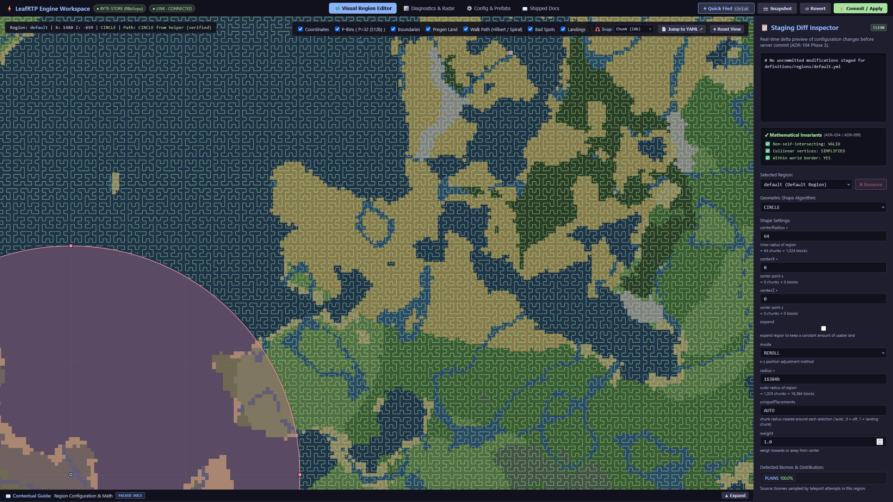
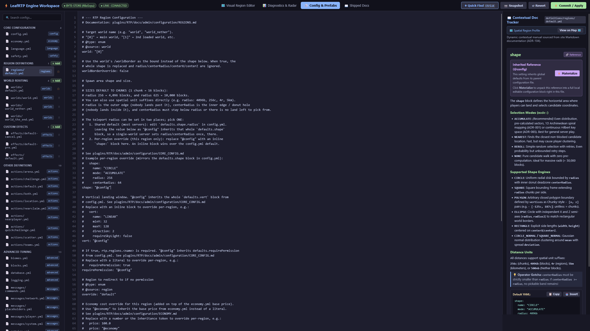
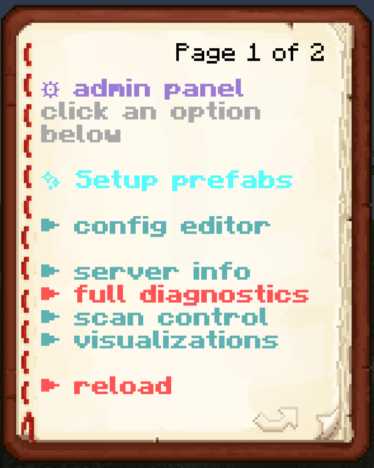
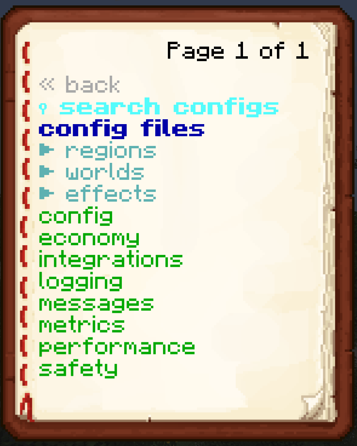
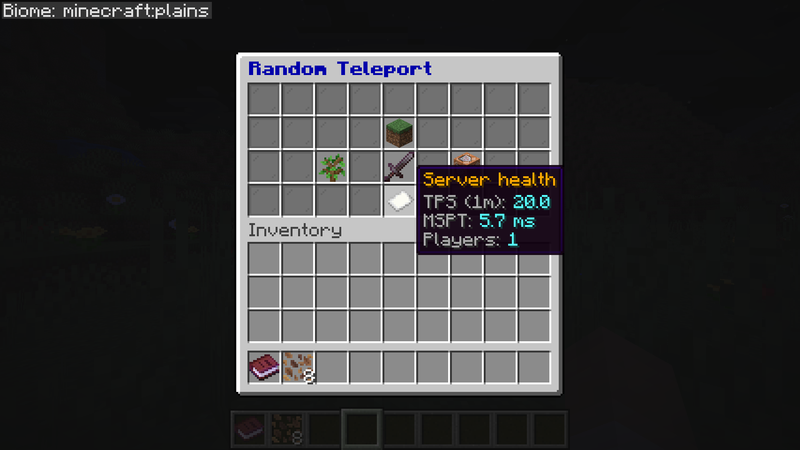
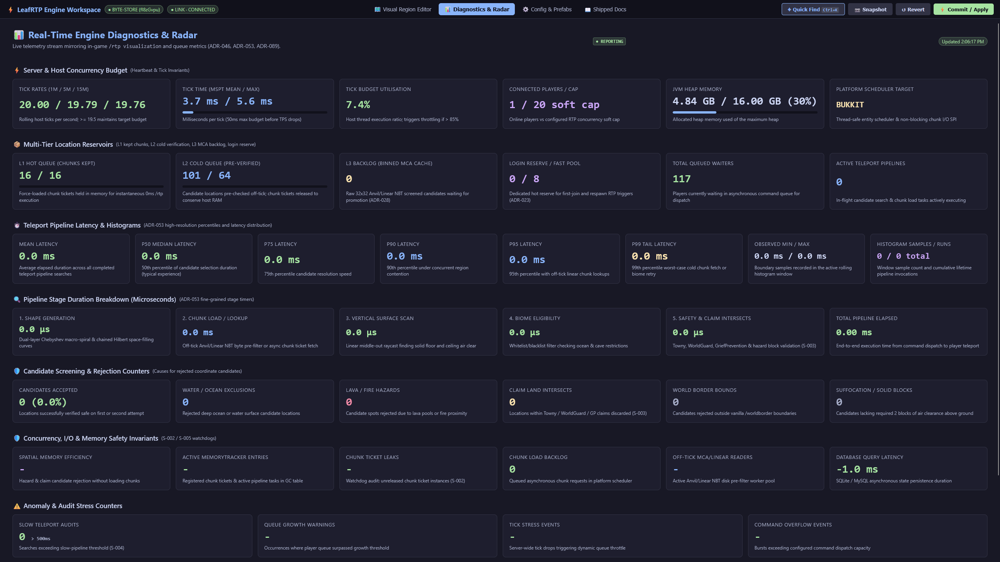
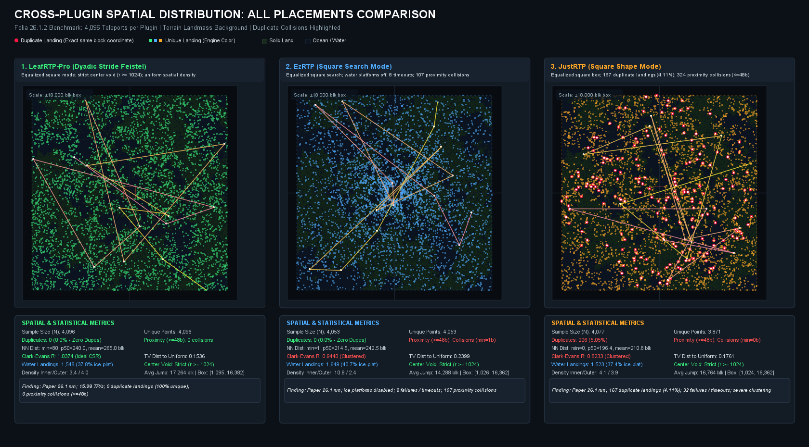
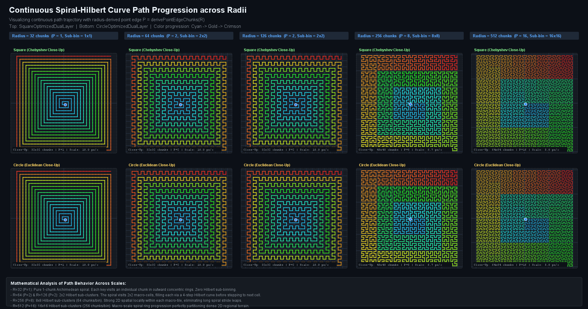
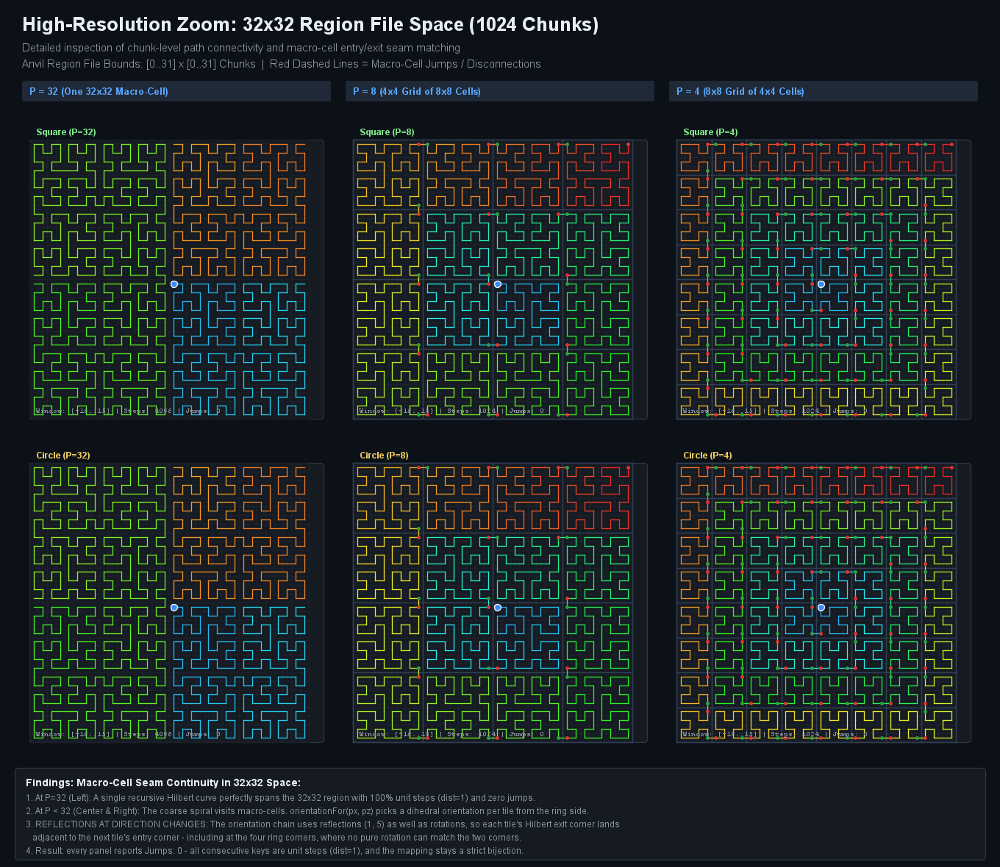
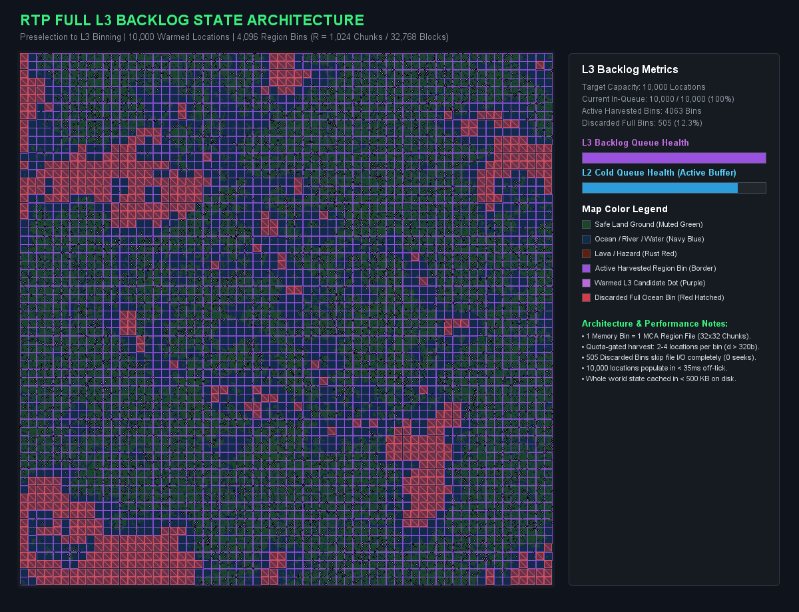

<!--
Single source for every storefront page (BuiltByBit paid + free, Modrinth, Hangar).
Never paste this file anywhere directly. Build it with
    python scripts/release/build_front_pages.py
and use the files in scripts/release/generated/ (gitignored, so build before use):
paste the two .bbcode files into BuiltByBit by hand; release.yml builds and pushes
the Modrinth and Hangar pages. CI fails if any target doesn't build (`--check`).

Markers, each alone on its line, nestable (written here without the comment
delimiters, because a closing delimiter would end this note):
  kind: promo | purchase   ... /kind   what the block IS; POLICY in the script decides
                                       which targets keep it (promo is dropped on
                                       Modrinth and Hangar)
  only: <targets>          ... /only   audience copy for the listed targets
  not: <targets>           ... /not    audience copy for every other target
  targets: bbb-pro, bbb-lite, modrinth, hangar; aliases: bbb, markdown
  {{name}} and {{jar}} expand per target (LeafRTP-Pro on bbb-pro, LeafRTP elsewhere).
Hangar does not allow paid-edition advertising: anything about paying goes in a
`kind: promo` block. The build also fails if a Modrinth or Hangar page still
mentions Pro, buying, sponsorship or a price.

Voice (RULES.md D-006): first person, plain, no sales language. One person
maintains this as a community project; write like that, not like a company.
Prefer numbers and caveats over adjectives. ASCII punctuation only.
Images: local relative paths (e.g. ); build_front_pages.py
validates existence on disk and rewrites them to raw.githubusercontent.com URLs.

Architecture & Layout (Invariant 3-Zone Utility Hierarchy):
To eliminate churn between beginner accessibility and engineering precision,
the document is partitioned into three non-overlapping functional zones. Do not
blur boundaries between zones when updating copy:

Zone 1: Verified Outcomes & Universal Guarantees (Above the Fold)
  - Audience: 100% of visitors (evaluators, beginners, power users).
  - Scope: Title, badges, 'What it is', platform compatibility, 'The short version'.
  - Rule: State empirical outcomes only (0 stalls, 0 failed teleports, off-tick,
    6 ms median /rtp-to-arrival latency on Paper, single jar). Use the same
    measured figure everywhere it appears. Zero algorithmic exposition or
    derivations here.

Zone 2: Operational On-Ramp & Zero-Friction Migration (Immediate Action)
  - Audience: Action-oriented server operators ready to deploy or switch.
  - Scope: 6-step quick-start install, /rtp config import (zero-friction switch),
    /rtp admin setup / web editor, common setups, player & admin features.
  - Rule: Maximize net utility by minimizing time-to-deployment. An admin should
    be able to get a safe, lag-free setup running without scrolling past this zone.

Zone 3: Architectural Proof & Technical Transparency (Deep Foundation)
  - Audience: Folia operators, network architects, skeptics, and engineers.
  - Scope: Full benchmark tables (harness in helpers/StressTestRTP/), scatter
    charts, spatial memory benchmarks, Anvil .mca pre-filter, quality gates, and FAQ.
  - Rule: Retain 100% mathematical and technical precision. Never dilute or
    summarize; keep deep derivations inside collapsible 
 blocks or
    docs site links so rigor is fully preserved without imposing cognitive load
    on Zone 1 and 2 readers. Head-to-head competitor comparisons live strictly
    in the Performance section.

Listing metadata (for the marketplace form fields, not emitted):
  Paid BuiltByBit title:  "LeafRTP-Pro"   tagline: "Off-tick Random Teleportation engine"
  Free title:             "LeafRTP"       tagline: "Off-tick random teleport engine with spatial memory"
  (Modrinth's short description still reads "Fast Random Teleportation for everyone,
   configurable and extensible" - update it there to match.)
-->

# {{name}}: Random Teleport

## What it is

**{{name}} is a `/rtp` command.** It teleports a player to a random, safe spot in the world and tries to cost the server as little as possible while doing it. I've worked on it in my own time since 2021. The benchmarks and the test harness are in the repo, and every number below can be rerun from them.

<!-- only: bbb-pro -->
<!-- kind: promo -->
This listing is how you pay for support. The code is the same as the [free download](https://modrinth.com/plugin/rtpv3) and all of it is MIT licensed. Paying doesn't unlock anything in the plugin; details are in [What paying gets you](#what-paying-gets-you) below.
<!-- /kind -->
<!-- /only -->
<!-- only: bbb-lite -->
<!-- kind: promo -->
There is also a paid LeafRTP-Pro listing on BuiltByBit. It's the same code; paying for it gets you priority support and early builds, and nothing in the plugin is locked.
<!-- /kind -->
<!-- /only -->
<!-- only: modrinth -->
One jar for Paper, Folia and Spigot (1.20+), Fabric (needs Fabric API) and NeoForge (1.21.1+), up to 26.x, and it also loads as a Velocity plugin for cross-server `/rtp`. Java 21+.
<!-- /only -->
<!-- only: hangar -->
On Paper all candidate checking runs off the tick thread. On Folia, candidates are screened against the region files first, nothing waits on a synchronous chunk load, and only the final block check of a loaded chunk runs on its region thread. The same jar also loads on Velocity for cross-server `/rtp`.
<!-- /only -->

### The short version

- [**Zero lag spikes**](https://dailystruggle.github.io/RTP/admin/configuration/PERFORMANCE/): 0 ticks over 50 ms at 5 teleports a second; disk files are pre-checked off-tick before any chunk loads.
- [**Instant teleports**](https://dailystruggle.github.io/RTP/site/why/#background-processing-and-memory): 6 ms median from `/rtp` to arrival on Paper, served from pre-verified candidate queues.
- [**Holds 100 teleports a second**](#performance): 35,113 of 35,113 succeeded across three 2-minute runs on Linux; the server slowed but stayed up.
- [**Even player spread**](https://dailystruggle.github.io/RTP/site/why/): Zero duplicate landings in 4,096 runs without tracking player coordinates.
- [**Persistent memory**](https://dailystruggle.github.io/RTP/admin/configuration/TTL/): Remembers oceans, lava, and claims across server restarts.
- [**One-command import**](https://dailystruggle.github.io/RTP/admin/MIGRATION/#migrating-from-competitor-plugins-betterrtp-justrtp-ezrtp-jakesrtp): Auto-translates BetterRTP, EzRTP, and JustRTP configs.
- [**Web workspace**](https://dailystruggle.github.io/RTP/admin/WEB_EDITOR_GUIDE/): Tune region borders, configs, and live engine radar in your browser (`/rtp editor`).
- [**One jar**](https://dailystruggle.github.io/RTP/admin/QUICK_START/): Runs on Paper, Folia, Spigot, Fabric, NeoForge, and Velocity.
- [**Portals & events**](https://dailystruggle.github.io/RTP/admin/ACTIONS/): Ready-to-use templates for step-in portals, party scatter, and 1v1 arenas.
- [**Exploit-safe**](https://dailystruggle.github.io/RTP/admin/CLAIM_PLUGIN_COMPATIBILITY/): Fail-closed claim checks, PvP damage cancel, zero open firewall ports.

Benchmark comparisons and hardware metrics are in [Performance](#performance).

## Common setups

Most people just want `/rtp` to work without lagging the server. Past that, these work natively without extra plugins:

- [**Spawn portals & launch pads**](https://dailystruggle.github.io/RTP/admin/ACTIONS/): Step-in trigger zones over portal frames or launch pads run teleports with countdown holograms, sounds, and particle trails.
- [**Group & party scatter**](https://dailystruggle.github.io/RTP/admin/ACTIONS/): The bundled `scatter.yml` action disperses queued parties to safe spots with guaranteed spacing (`minSeparation` blocks apart).
- [**First-join random spawn**](https://dailystruggle.github.io/RTP/admin/RECIPES/#rtp-on-first-join-random-spawn-for-new-players): Grant `rtp.onevent.firstjoin` to scatter new players across the wilderness on login; the login reserve cache keeps a destination pre-warmed so entry feels instant.
- [**1v1 and 2v2 PvP matchmaking**](https://dailystruggle.github.io/RTP/admin/ACTIONS/): Bundled `challenge.yml`, `arena.yml`, and `teams.yml` actions queue and pair players for 1v1 duels or 2v2 squad battles into temporary bounded arenas with countdowns, border constraints, and automatic cleanup.
- [**Near-player & claim hunting**](https://dailystruggle.github.io/RTP/admin/ACTIONS/): Bundled `nearplayer.yml` and `nearclaim.yml` actions land players safely near random players or town and claim perimeters (`anchor: entity`, `anchor: claimboundary`) without inline claim-plugin overhead.
- [**Sky drops**](https://dailystruggle.github.io/RTP/admin/configuration/REGIONS/): A `Fixed` vertical adjustor at Y=250+ pairs with a slow-falling potion effect for aerial parachute drops.
- [**Survival and resource worlds**](https://dailystruggle.github.io/RTP/admin/configuration/REGIONS/#spacing-repeats-and-worst-case-by-mode): Destinations do not repeat within a run (0 of 4,096 landings within 48 blocks), preventing base hunting without tracking players.

---

## Install

**Requirements:** Java 21+. Paper, Folia, Spigot on 1.20+, or Fabric / NeoForge on 1.21.1+, up to 26.x.

1. Drop `{{jar}}` into `plugins/` (or `mods/`).
2. Type `/rtp`.

**Customize (optional):**
- **Chat wizard:** `/rtp admin setup`
- **Web workspace:** `/rtp editor` (visual map tuning, YAML editor, live radar)
- **YAML files:** `plugins/RTP/` (`radius: 10km`, `cooldown: 30s`)
- **Migrate:** `/rtp config import <BetterRTP|EzRTP|JustRTP>`

(Advanced database, network proxy, and cache tuning: see the [admin guide](https://dailystruggle.github.io/RTP/FOR_SERVER_ADMINS/).)

---

## Features

### Setting it up

All configuration routes edit the same underlying files, accept human units (`radius: 10km`, `cooldown: 30s`), and hot-reload via `/rtp reload`.

- [**Web Workspace**](https://dailystruggle.github.io/RTP/admin/WEB_EDITOR_GUIDE/) (`/rtp editor`): Complete browser admin suite with zero port forwarding. Drag region boundaries on a visual map, edit YAML with built-in docs, and monitor real-time engine radar.
- [**In-Game Admin Book**](https://dailystruggle.github.io/RTP/admin/configuration/IN_GAME_CONFIG/#1-the-interactive-admin-panel-rtp-admin) (`/rtp admin`): Clickable operator book to inspect queues, reload configs, and test regions in Minecraft.
- [**Chat Wizard**](https://dailystruggle.github.io/RTP/admin/QUICK_START/#guided-setup-rtp-admin-setup) (`/rtp admin setup`): 60-second guided questionnaire sizing regions to world borders with automatic backups.
- [**Config Import**](https://dailystruggle.github.io/RTP/admin/MIGRATION/) (`/rtp config import`): Translates worlds, radii, and cooldowns from BetterRTP, EzRTP, and JustRTP.
- [**Spatial Pregeneration**](https://dailystruggle.github.io/RTP/admin/configuration/TTL/) (`/rtp scan`): Pre-screens region files off-tick to discover oceans, lava, and claims ahead of time.
- [**Live Visualizations**](https://dailystruggle.github.io/RTP/admin/configuration/IN_GAME_CONFIG/#c-diagnostics--monitoring) (`/rtp visualization`): Renders boundaries, biome layouts, and candidate heatmaps directly onto held in-game maps.
- [**Engine Diagnostics**](https://dailystruggle.github.io/RTP/admin/QUICK_START/#diagnostics-rtp-info) (`/rtp info`): Live queue depth, latency percentiles, and per-region generation rates.

*Visual region editor: live terrain overlay, polygon boundaries, and landing candidate previews.*

*In-browser settings editor: contextual setting descriptions, instant validation, and staged diffs.*

 

*`/rtp admin`: the operator book and its config file list.*

### For players

- **`/rtp` and `/wild`**: to the world's default region, or pick a region, world or biome (`/rtp region:<name>`, `/rtp biome:<biome>`). `/rtp back` returns players to their prior location.
- **Menus & custom items**: `/rtp menu` provides an interactive player book on Paper, Folia, Fabric and NeoForge (chat pages on Spigot) for teleporting or picking a region, world or biome. The bundled GUI addon provides a chest-based destination picker with at-a-glance barrier indicators for blocked destinations, customizable hover lore, and prefix routing for custom items (`ia:`, `oraxen:`, `nexo:`, `hdb:`, Base64 heads, and CustomModelData; see [item compatibility](https://dailystruggle.github.io/RTP/admin/CUSTOM_ITEMS/)).
- **Per-player queues** (`rtp.personalqueue`): personal reserve queues alongside the shared queue so high concurrency never delays an individual player's teleport.
- **Effects**: particles, sounds, fireworks, potions, titles, action bar notices, console or player commands, and holograms on every teleport phase, gated by `rtp.effect.<stage>.*` permissions. Holograms use the 1.19.4+ text display entity directly; DecentHolograms and HolographicDisplays are supported if present.
- **Landing platforms & safety**: temporary landing platforms with automatic decay (preventing ocean, void, or mid-air falls), post-teleport invulnerability window, movement-cancel, damage-cancel, countdown holograms, and warmup messages.

*`/rtp menu`: in-game chest menu with live server health and destination selection.*

### Gameplay and worlds

- **Regions**: any number per world with customizable shape (Square, Circle, Rectangle, Polygon), radius, center, curve weighting, vertical bounds, world override, permission gate, and price. Vertical adjustors (Linear, Jump, Fixed) for sky islands, void worlds, aerial parachute drops, and Nether ceilings. A world's `override` key (`definitions/worlds/<name>.yml`) routes Nether or End teleports to designated safe worlds.
- **Arrival schematics**: drop a Sponge `.schem` named after a region into `plugins/RTP/advanced/schematics/` and every teleport into that region pastes it centered on the landing spot. Decoded in-house, no WorldEdit needed, and claim-aware.
- **Auto-RTP on events**: join, first join, respawn, world change, move, and teleport (`rtp.onevent.*`). A login reserve cache keeps destinations ready so join-time teleports feel instantaneous.
- **Economy**: charge per `/rtp` through Vault, per-region pricing, refund on cancel, and `rtp.free` permission bypass.
- **PvP / combat-tag gate**: off by default; refuses or delays `/rtp` for players who recently dealt or took PvP damage. Includes built-in tracking or hooks into PvPManager, CombatLogX, or Simple Combat Log if installed.
- **Command blocks and console**: the same unified command parser handles player, console, and command-block callers.

### Portals, party scatter & PvP duels

Built-in templates turn random teleportation into portals and events without extra minigame plugins:

- **Step-in portals**: Configurable trigger zones for portals and launch pads with countdown holograms, particles, and sounds.
- **Party scatter**: Disperses queued parties simultaneously with guaranteed block spacing between teammates.
- **1v1 & 2v2 duels** (`/rtp action challenge <player>`): Temporary bounded arenas with border constraints, countdowns, and automatic match cleanup.
- **Anchor drops**: Land players near friends (`anchor: entity`) or outside town claims (`anchor: claimboundary`).
- **Event scripts**: Trigger console commands, titles, sounds, or potion effects on match start, boundary violation, or finish.

*Templates and configuration options: [Actions & arenas guide](https://dailystruggle.github.io/RTP/admin/ACTIONS/).*

### Claims and safety

- **Claim plugins**: 16 on Bukkit / Paper / Folia through the bundled claim addon (GriefDefender, GriefPrevention, Lands, WorldGuard, TownyAdvanced, SaberFactions, FactionsBridge, HuskClaims, HuskTowns, PlotSquared, RedProtect, CrashClaim, KingdomsX, Residence, UltimateClaims, MinePlots), plus FTB Chunks and Open Parties and Claims on Fabric / NeoForge. Claim checks run in the async pipeline, off the teleport tick. You can add your own through `RegionVerifierRegistry` with one lambda.
- **Claim- and faction-anchored destinations**: an action can land players relative to their own town, claim or faction land (`anchor: claimboundary`, `anchor: faction`). Towny, GriefPrevention and SaberFactions / FactionsUUID boundaries work out of the box; others plug in through `ClaimBoundaryProvider`. The anchor stays put while it's inside the claim and is recomputed at most once per cooldown, which keeps destination anchors stable every time land changes hands.
- **Safety filter**: `safety.yml` takes plain materials, block-state predicates (`OAK_SLAB[waterlogged=true]`), numeric ranges (`WATER[level>=5]`), vanilla and datapack block tags (`#minecraft:leaves`) and wildcards (`*[waterlogged=true]`). Grammar is in the details below.

### Networks

- **Cross-server `/rtp`**: Velocity with plugin messaging, or SQL / Redis for reservation tokens. Tested nightly on the in-repo devstack: 2 Velocity proxies, 2 lobbies, 2 backends behind Redis.

### For developers

- **API and addons**: `rtp-api` (pre / mid / post teleport hooks, region verifiers, config, scheduling) and `effects-api`. Addons compile against `rtp-api` only and load through a `ServiceLoader` SPI; one addon jar runs on Spigot, Paper, Folia, Fabric and NeoForge. The bundled addons (GUI picker, claim integrations, Countdown reference, scripted actions) unpack into `plugins/RTP/addons/` on first run; delete one from that folder to turn it off. Their source, and the Rift warmup-effect addon's, is under `addons/` as a starting point.
- **Swappable parts**: server backend, economy, location validity, shapes, world border, PvP checks, region file format and commands can all be replaced through SPI.
- **PlaceholderAPI**: queue depth (total / public / personal), last-teleport coordinates, player status.
- **bStats**: on by default; anonymous usage counts help me decide which platforms to spend time on.

---

## Performance

An rtp plugin's cost hides inside server API calls, and a profiler files it under generic chunk functions. The public harness in [`helpers/StressTestRTP/`](https://github.com/dailystruggle/RTP/tree/V3/helpers/StressTestRTP) attributes it back to the plugin. Rig: Ryzen 9 3900X for every row of the first table; the open-loop stress test further down ran on a second, Linux rig. Each other plugin ran on the latest version it supported at the time of the run, with cooldowns, delays and countdowns zeroed and its queue on at its default size where it has one. LeafRTP ran at its recommended settings.

<!-- only: bbb -->
Both LeafRTP downloads are built from the same code, and the LeafRTP rows apply to either.
<!-- /only -->

The metrics that matter most to server operators are **throughput under load** (clearing player surges without queues), **player latency** (instant response), **server tick health** (MSPT and zero lag spikes), and **spatial dispersion** (preventing base-hunting clustering).

About half of random candidates in Minecraft are ocean, lava or void. Traditional search algorithms load chunks to check candidates, incurring heavy chunk generation and synchronous tick stalls. LeafRTP pre-filters candidates directly against `.mca` region files off-tick and maintains a pre-verified candidate reservoir, eliminating search-induced chunk loading and main-thread lag spikes.

**Paper 26.2 & Folia 26.2 Benchmark Comparison (4,096 teleports per plugin, 16k radius circle, 3 clients):**

Peak throughput is measured under unpaced burst saturation (Paper Test A: `20261008-003310`). Responsiveness, tick stability, total main-thread CPU, and spatial landing dispersion are measured under steady-state 5.0 TP/s pacing (Paper Test B: `20261008-024412`). Folia status is from the same paced workload on Folia 26.2 (Folia Test B: `20261008-052141`). Latency is dispatch to arrival.

| Plugin | Max Tested Throughput | Latency p50 / p99 | MSPT p50 / max | Ticks > 50 ms | Total Main-Thread CPU | Landing Pairs <= 48 blocks | Nearest Pair | Folia 26.2 Status |
|---|---|---|---|---|---|---|---|---|
| **LeafRTP** | **42.15 TP/s** (harness limit) | 6 / **14 ms** | **16.4 / 24.5 ms** | **0** | **227 s** (0.26 cores) | **0** (random: 81) | **70.0 blocks** | **Native** (4,096 / 4,096, 0 timeouts) |
| JakesRTP | 23.20 TP/s | **0** / 76 ms | 28.8 / 92.1 ms | 271 | 285 s (0.32 cores) | 127 (random: 84) | 4.5 blocks | Not tested (no Folia support declared) |
| BetterRTP | 9.22 TP/s | 203 / 898 ms | 27.9 / 166.6 ms | 329 | 248 s (0.27 cores) | 126 (random: 84) | 2.2 blocks | Fails (6 of 6 warm-up attempts threw) |
| HuskHomes | 8.37 TP/s | 264 / 626 ms | 21.1 / 37.8 ms | 0 | 298 s (0.33 cores) | 105 (random: 82) | 2.2 blocks | Native (4,095 / 4,096, 1 timeout) |
| EzRTP | 7.91 TP/s | 171 / 923 ms | 25.7 / 49.4 ms | 0 | 261 s (0.29 cores) | 142 (random: 129) | 4.1 blocks | Fails (1,415 successes, 949 timeouts; 10.9% water) |
| JustRTP | 4.43 TP/s | 345 / 2,729 ms | 23.4 / 36.3 ms | 0 | 395 s (0.37 cores) | 129 (random: 85) | 4.0 blocks | Degraded (2.25 of 5 TP/s offered, 31 timeouts) |

- **Max tested throughput:** LeafRTP finished all 4,096 teleports in 97 seconds (42.15 TP/s) with requests sent back to back. Read that as a floor, not a ceiling: the 3-client harness ran out before LeafRTP did. The next highest was JakesRTP at 23.20 TP/s. With 48 bots on the Linux rig below, LeafRTP completed 96-99 TP/s against 100 offered.
- **Main-thread CPU vs. rate:** Main-thread CPU is reported as total CPU consumed across the entire 4,096-teleport phase. Expressing main-thread CPU "per teleport" is rate-dependent because background server tick work accumulates over elapsed wall time (at 42 TP/s saturation, LeafRTP consumed only 9.9 ms per teleport, whereas at 5 TP/s steady pacing it reflects ~0.26 continuous core utilization). Total phase CPU and MSPT accurately reflect real server workload.
- **Latency & lag spikes:** At 5 TP/s, LeafRTP answered from its pre-verified queue at a 6 ms median, dispatch to arrival, and no tick went over 50 ms. In the same run BetterRTP logged 329 ticks over 50 ms (max 166.6 ms) and JakesRTP 271 (max 92.1 ms).
- **Spacing:** In the paced run each other plugin landed 105-142 pairs of arrivals within 48 blocks of each other, more than a random scatter over the same land gives (82-129), with nearest pairs of 2.2-4.5 blocks. LeafRTP had **0 pairs within 48 blocks** against 81 expected at random, and its closest two arrivals were 70.0 blocks apart.
- **Folia** (`20261008-052141`, same 5 TP/s pacing): LeafRTP completed 4,096 of 4,096 and HuskHomes 4,095 of 4,096. BetterRTP threw `Cannot retrieve chunk asynchronously` on 6 of 6 warm-up attempts and was dropped from the run. EzRTP threw the same exception from `getHighestBlockYAt` on region threads; after that, 2 of the 3 test clients stayed stuck in an active attempt for the rest of the phase, which hit the 1,800 s cap with 1,415 successes and 949 timeouts.

**Open-loop stress test, Linux (Paper 26.2, Threadripper 7970X, Ubuntu, Java 25, 16 GB heap, 48 bot accounts):**

The runs above wait for each teleport before sending the next, so a slow plugin is never asked for more than it can answer. Here the harness sends `/rtp` at a fixed rate per stage whether or not earlier ones have finished. A stage passes if at least 95% of the offered rate completes, MSPT p95 stays at or under 50 ms, and at most 1% of attempts time out or error. The stress point is the highest stage that passes.

| Plugin | Offered | Achieved | Failed | Latency p50 / p99 | MSPT p95 | Min TPS | Result | Run |
|---|---|---|---|---|---|---|---|---|
| **LeafRTP** | 100 TP/s | **98.7 TP/s** | **0 / 11,843** | 63 / 778 ms | 103.3 ms | 8.6 | Fails MSPT only | `20261009-054148` |
| **LeafRTP** | 100 TP/s | **97.7 TP/s** | **0 / 11,722** | 86 / 948 ms | 111.1 ms | 7.5 | Fails MSPT only | `20261009-070736` |
| LeafRTP, all six plugins loaded | 100 TP/s | 96.2 TP/s | 0 / 11,548 | 129 / 967 ms | 121.8 ms | 7.3 | Fails MSPT only | `20261009-044336` |
| EzRTP | 5 TP/s | 4.98 TP/s | 0 / 299 (both runs) | 155-156 / 908-918 ms | 23.3-23.7 ms | 20.0 | Passes (stress point) | `20261009-051201`, `-063819` |
| EzRTP | 10 TP/s | 7.2-7.7 TP/s | 23-28% timed out | 2,261-2,710 / 4,809-4,813 ms | 26.4-27.4 ms | 19.9-20.0 | Fails | same two runs |
| EzRTP | 20 TP/s | 8.2-8.3 TP/s | 37-38% timed out | 3,505 / 4,357-4,415 ms | 29.2-29.3 ms | 16.6-19.9 | Fails | same two runs |

- **LeafRTP at 100 TP/s:** no failed teleports in 35,113 and the server stayed up. What ran out first was the tick budget, not the plugin: MSPT p95 went to 103-122 ms and TPS dipped to 7-9. So 100 TP/s is past LeafRTP's stress point on this rig, and I haven't yet measured where between 5 and 100 the 50 ms line sits. Latency here includes waiting for a free bot and for a ~100 ms tick before the command reaches LeafRTP.
- **EzRTP** passed 5 TP/s in both runs. Asked for 10 or 20 it completed about 8 TP/s and timed out on 23-38% of attempts while MSPT stayed under 30 ms, so its limit is its own pipeline, not server load. That matches its 7.91 TP/s ceiling on the 3900X.
- **BetterRTP, HuskHomes, JustRTP and JakesRTP** have no Linux result yet. A bug in my overnight driver loaded the wrong plugin set for their runs, so those rows measured a server without the plugin and I threw them out. They'll be added after a rerun.

Full benchmark tables (including chunk I/O diagnostics, process CPU, JFR memory allocations, and historical runs) are in [`RESULTS.md`](https://github.com/dailystruggle/RTP/blob/V3/helpers/StressTestRTP/RESULTS.md), and complete architectural analysis is in the [harness notes](https://github.com/dailystruggle/RTP/blob/V3/helpers/StressTestRTP/PRE_WRITEUP.md).

*Real-time engine diagnostics and radar: live tick budget, multi-tier location reservoirs, pipeline latency percentiles, stage duration breakdown, and safety watchdogs.*

The region-file check needs terrain that already exists; a chunk that has never been generated has to be generated whichever plugin asks for it.

*Where each plugin landed 4,096 players in the Paper 26.2 run (`20261008-003310`), every one set to the same 1,024 to 16,384 block circle around 0,0. The green box under each panel is the LeafRTP region shape that gives the same distance-from-center spread, so any of these distributions is a config change in LeafRTP, not a different plugin. Each config is replayed through LeafRTP's own shape code over the same terrain: LeafRTP and BetterRTP match CIRCLE, EzRTP and HuskHomes match CIRCLE_NORMAL, and JustRTP and JakesRTP match the spiral power curve.*

**Caveats.** The 3900X table used 3 clients with up to 4 teleports in flight, which is a small load; LeafRTP's 42.15 TP/s there is where that harness stopped. The Linux stress test used 48 idle bots with server view distance capped at 2: real connections and chunk sends, but not 48 players moving and building. It is n=3 for LeafRTP (one run with every plugin loaded) and n=2 for EzRTP, and its CPU-per-teleport columns lack an idle baseline, so I don't quote them here. Heap reached the 16 GB limit in all three LeafRTP 100 TP/s runs; I haven't yet separated retention from G1 simply not collecting until it has to. The Folia watchdog count reproduced across two runs; everything else in the 3900X table is n=1. Hardware, view distance, world state (how much of it is unsafe, whether it's pregenerated) and other plugins will move the numbers. The other plugins update often; if a number here is out of date, open a GitHub issue with a repro or a doc link and I'll correct it. Each plugin ran at its defaults, which is what most servers actually run. The harness measures dispatch-to-arrival latency, per-attempt cost, and success rate as defined above; it does not measure claim-plugin compatibility or safety rules.

Full methodology, per-run analyses, and the runs not shown here (equalized-radius Folia, pinned-heap GC profiling, the wide-radius single-plugin run): [`helpers/StressTestRTP/`](https://github.com/dailystruggle/RTP/tree/V3/helpers/StressTestRTP). Video of `/rtp` on a custom world generator: [youtu.be/V0NyNK9JydM](https://youtu.be/V0NyNK9JydM).

---

## How it works

### Spatial memory

About 35-65% of typical Minecraft terrain is unsafe to land on (oceans, lava, void). LeafRTP remembers rejected ground across server restarts so it never spends time checking dead ground twice. Locations are mapped in constant time, and `/rtp scan` pregenerates spatial memory off-tick. Mathematical derivations and distribution benchmarks: [Why LeafRTP exists](https://dailystruggle.github.io/RTP/site/why/).

### Region-file pre-filter

An Anvil (`.mca`) pre-filter reads biome and block data directly from region files on disk. Unloaded candidates are checked and rejected off-tick without chunk loading. The files reflect actual world terrain, preserving custom generators (Iris, Terra, datapacks) and modified ground. When the pre-filter cannot answer (unpopulated chunk, unknown format), it falls back to the server engine's async chunk API within a strict tick budget.

### Pre-verified cache

Safe destinations are verified in advance and held in background queues. Answering `/rtp` serves an already-checked coordinate without waiting for chunk generation; on Paper the median from command to arrival was 6 ms in the paced benchmark. Automatic sweeps release chunk tickets from abandoned teleports, so nothing stays force-loaded past its reservation window.

### Spacing between players

Destinations cycle systematically across available land without repeats. Consecutive landings are separated by hundreds of blocks automatically (minimum 70 blocks at 16k radius in Paper 26.2 benchmarks), protecting player bases from `/rtp` spam without needing to track player coordinates. Each region shuffle uses a random seed generated at startup, preventing players from predicting landing spots from the world seed. Full dispersion statistics and repetition rules: [Regions guide](https://dailystruggle.github.io/RTP/admin/configuration/REGIONS/#spacing-repeats-and-worst-case-by-mode).

### No shaded dependencies

I don't shade libraries. The SQL connection pool, Redis client, cross-server messaging, bStats and region-file reader are written in-house on plain Java. The web workspace connects outward to an ephemeral relay (like spark and LuckPerms) rather than embedding an HTTP server daemon, so there are no open listening ports and no library version conflicts.

### Cartography, image exports, and visual diagnostics

LeafRTP includes a standalone mapping engine (`maps-api`) that generates live in-game maps and high-resolution diagnostic images without main-thread chunk I/O:

- **High-resolution image exports** (`/rtp visualization export <type>`): Exports standalone PNG and BMP image files to `plugins/RTP/charts/` (biomes, hazards, heatmaps, pipeline composites).
- **Comprehensive diagnostic charts** (`/rtp visualization export comprehensive`): Renders an all-in-one panel combining biome layouts, hazard overlays, candidate markers, and player spread metrics.
- **Held in-game maps** (`/rtp visualization`): Real-time biome layouts, rejected terrain, and candidate heatmaps on held Minecraft map items.
- **External web map integration**: Non-blocking tile providers and vector region borders for Dynmap, BlueMap, and Pl3xMap via `maps-api` and `anvil-api`.

### Chunk loading, by platform

- **Paper** and forks (Purpur, Pufferfish, Leaf, Leaves, DivineMC): `World#getChunkAtAsync`; falls back to a main-thread load only if async loading returns no chunk.
- **Folia**: Pre-filter runs before the Region Scheduler; rejected candidates never hop a thread. Safe candidates load through Folia's async API and teleport through the Entity Scheduler.
- **Spigot** (and Arclight / Mohist): `.mca` pre-filter off-tick. Throughput is capped by Spigot's chunk generator, and unreadable candidates cost one on-tick chunk load.
- **Fabric** and **NeoForge**: In-tree adapters running the same core engine.

<b>Visual proof: how LeafRTP prevents clumping and base hunting</b>

These charts are generated directly from the visualizer test fixtures in `rtp-core`, asserting candidate distribution and spacing against real-world terrain:

**Even coverage across all radii.** The selector balances wide progression with localized coverage, filling territory smoothly from small 32-chunk zones up to 512-chunk regions without center crowding or edge starvation.

**Continuous local stepping.** Zooming into a single 32x32 Anvil region file (1,024 chunks), candidate evaluation steps chunk-by-chunk with zero disconnected leaps, keeping disk reads localized in memory cache.

**Guaranteed player separation.** Comparing unconstrained random search (where 35.8% of players land within render distance of an existing arrival) against LeafRTP's spaced distribution (0% within 8 chunks, minimum 16-chunk separation). Players never land on top of each other.

**Pre-screened candidate reservoir.** In a 32,768-block world with 10,000 cached candidates, 505 ocean-only region files are discarded directly from the map header without reading chunk data from disk. Candidates are spread evenly across all viable land.

*For complete mathematical proofs, algorithm benchmarks, and unit test code, see [Shape Algorithm Verification](https://dailystruggle.github.io/RTP/site/shape-algorithms/) and [Why LeafRTP Exists](https://dailystruggle.github.io/RTP/site/why/).*

<b>Testing and quality gates</b>

Coverage floors fail the build when they're missed, and a floor can't be lowered without a commit. Gates that don't enforce yet say so in their row. Coverage percentages are from the `-Pcoverage` run of 2026-09-15. The badge at the top is SonarCloud's whole-tree number, which includes the platform adapters and addons these per-module gates leave out; it reads lower than the table.

| Module | Instruction / branch measured | Enforced floor | Target (90 / 80) |
|---|---|---|---|
| `metrics-api` | 100% / 94.6% | 0.95 / 0.85 | met |
| `tags-api` | 98.2% / 90.9% | 0.95 / 0.85 | met |
| `yaml-api` | 97.0% / 88.1% | 0.92 / 0.80 | met |
| `rtp-api` | 95.7% / 81.3% | 0.90 / 0.80 | met |
| `maps-api` | 94.7% / 82.1% | 0.90 / 0.78 | met |
| `commands-api` | 93.6% / 80.3% | 0.90 / 0.80 | met |
| `anvil-api` | 90.5% / 80.5% | 0.86 / 0.75 | met |
| `rtp-core` | 81.6% / 65.8% | 0.80 / 0.64 | not met (branch coverage still climbing) |
| `rtp-proxy-common` | 87.0% / 68.8% | 0.85 / 0.67 | not met (branch coverage still climbing) |

Safety-critical packages inside `rtp-core` have higher floors on top of the module number: the teleport pipeline at 0.87 / 0.75, region selection at 0.82 / 0.68, and world-border math at 0.99 / 0.89.

| Gate | What it enforces | Where it runs |
|---|---|---|
| Test suite | over 650 committed JUnit test classes; `rtp-core` alone has roughly 3,700 test cases | `gradle.yml` on every push and pull request |
| Mutation testing (PIT) | weekly PIT run over the teleport pipeline, region cache and world-border packages; the scheduled teleport-pipeline shard gates at 40% while I work toward 60% | `mutation-testing.yml` |
| Safety prohibitions | one automated test per prohibition (unsafe destinations, force-loaded chunks, claim bypass, swallowed teleport failures, main-thread chunk I/O, null-guard no-ops on the public API, hardcoded failure messages), plus ArchUnit layering and chunk-ticket rules | `gradle.yml` |
| Changed-line coverage | new and modified lines must be >= 80% covered | `gradle.yml` (`scripts/diff-coverage.py`) |
| Static analysis | SpotBugs plus a PMD ruleset with a project-specific rule that flags blocking constructs | `gradle.yml` (`-PstaticAnalysis`) |
| Binary API compatibility | japicmp check against a released baseline is wired up but not enforcing yet: the configured baseline isn't a published version and the check skips. Removals follow a 2-minor deprecation policy | `gradle.yml` (japicmp) |
| Dependency CVEs | OWASP dependency-check fails at CVSS >= 4 on the scanned files; scanning the resolved Gradle dependency graph and shaded jar isn't in place yet | `dependency-check.yml`, weekly and on dependency changes |
| Release provenance | SLSA build provenance on every release; GitHub releases also carry a CycloneDX SBOM and SHA-256 / SHA-512 checksums | `release.yml`, `release-bbb.yml` |
| Runtime acceptance | nightly multi-server devstack: 2 Velocity proxies, 2 lobbies, 2 backends over Redis, on Velocity + Paper + Folia + Fabric (MC 1.21.11, Java 25) and NeoForge (MC 1.21.1, Java 21) | `devstack-acceptance.yml` |
| Encoding and docs | tracked text files scanned for UTF-8 mojibake; the docs site builds from the same tree | `gradle.yml`, `docs.yml` |

**What I haven't finished.** `rtp-core` and `rtp-proxy-common` are still under the 90 / 80 branch target; their floors sit a point or two under the measured numbers and only ever go up. What's left in `rtp-core` is mostly platform bootstrap and dispatch code, which I'm covering from the nightly devstack instead of with mock-only tests. Spigot, NeoForge, BungeeCord and non-LTS Java have no scheduled live CI suite and are listed as best-effort.

---

## Why I made it

I started this project for the fun of solving a hard problem. Inspired by 3Blue1Brown math videos and tired of hearing about "server lag" every time someone typed `/rtp`, I took up a personal challenge: mathematically prove that spatial memory was a viable solution using a custom space-filling curve to distribute candidates evenly without rerolling.

The rest of the engine grew in stages as I developed as an engineer:
- **v1:** Proved the math. Built the space-filling spiral to map 2D territory uniformly, eliminating duplicate coordinate picks and clumping without tracking player positions.
- **v2:** Tackled initial SPI models and platform compatibility, though latency degraded significantly in the process.
- **v3:** Rebuilt for platform agnosticism and maintainable architecture. Switched from chunk forceloading to ticketing, added explicit task tracking and self-managed cleanup to prevent memory leaks, expanded scope through modular SPIs and serverless testability, and set rules for AI tooling: I design the seams and make the decisions recorded in the ADRs, and AI writes code inside those seams (repetitive wrappers, platform APIs I didn't know well, unit tests, devstack YAML) that I review before it lands.
- **3.3.0:** Hardened the engine with static analysis, fuzzing, mutation testing, and deep CPU/memory profiling to eliminate bottlenecks and reach current benchmark speeds.

Architecture decisions, benchmarks, and design history are recorded in the [Architecture Decision Records](https://dailystruggle.github.io/RTP/adr/) and [Why LeafRTP Exists](https://dailystruggle.github.io/RTP/site/why/). What AI tooling writes here, and what it isn't used for (system design, code review, git operations), is documented in [AI Usage](https://github.com/DailyStruggle/RTP/blob/V3/docs/dev/AI_USAGE.md).

<!-- only: bbb-pro -->
<!-- kind: promo -->
---

## What paying gets you

Same code, config and commands as the free download, under the same MIT licence. Nothing in the plugin is locked; most of the development has been on my own dime, so paying shows support and buys dedicated support in response:

| This listing | Free download |
|---|---|
| Priority on my support queue | Community support, best effort |
| New Minecraft versions and platforms first | Stable builds, once they've settled here |
| Shows support and buys dedicated support in response | - |

New platforms and backends go out here first because they need hands-on support while they settle, and this is the only place I promise that. Once something is stable it goes to the free channel. A native BungeeCord proxy adapter is planned; for now BungeeCord networks use plugin messaging on the backend.

Switching between the free download and this one is a jar swap. Config, data files and commands stay the same.
<!-- /kind -->
<!-- /only -->

---

<b>Commands, permissions, configuration files</b>

**Commands** (aliases: `/rtp`, `/wild`):

| Command | Description | Permission |
| --- | --- | --- |
| `/rtp` / `/wild` | Random teleport to the default region for your current world (or the GUI picker, if that addon is installed) | `rtp.use` |
| `/rtp region:<name>` | Teleport to a named region | `rtp.region` / `rtp.regions.*` |
| `/rtp world:<world>` | Teleport within a specific world | `rtp.world` / `rtp.worlds.*` |
| `/rtp player:<name>` | Teleport another player | `rtp.other` |
| `/rtp biome:<biome>` | Teleport to a chosen biome | `rtp.biome` / `rtp.biome.*` |
| `/rtp action <name> [player]` | Trigger a scripted action, arena, or matchmaking duel | `rtp.action` / `rtp.action.<name>` |
| `/rtp action cancel [action]` | Leave a matchmaking queue or cancel an action entry | `rtp.action.cancel` |
| `/rtp back` | Return to where you were before the last `/rtp` | `rtp.back` |
| `/rtp centerx=<x> centerz=<z> radius=<r>` | One-off overrides for this call; units allowed (`radius=10km`) | `rtp.params` |
| `/rtp menu` | Player book menu | `rtp.use` |
| `/rtp admin` | Operator book menu | `rtp.menu.admin` |
| `/rtp editor [local\|trust\|apply]` | Web editor link, offline copy, browser trust, token apply | `rtp.editor` |
| `/rtp info` | Operator diagnostics | `rtp.info` |
| `/rtp reload [file]` | Reload all configuration, or one file | `rtp.reload` |
| `/rtp config <file> view\|set <k>=<v>` | View or set a config key, then reload | `rtp.config` |
| `/rtp config import [source] [path=<dir>] [overwrite=true]` | Translate another rtp plugin's config; never overwrites without `overwrite=true` | `rtp.config` |
| `/rtp config import permissions [source] [apply=true]` | Dry-run the LuckPerms commands that copy BetterRTP, JustRTP or EzRTP nodes onto `rtp.*`; `apply=true` runs them | `rtp.config` |
| `/rtp admin setup <world\|gameplay\|perf\|preview\|confirm>` | Guided first-time setup from prefabs | `rtp.admin.setup` |
| `/rtp scan start\|pause\|resume\|reset\|cancel` | Offline spatial memory pregeneration (was `/rtp fill` in 2.x) | `rtp.scan` |
| `/rtp visualization [held\|export <type>]` | Render live held map charts or export high-resolution PNG/BMP diagnostic images | `rtp.admin` |

**Permissions** (full set in `plugin.yml`):

| Permission | Default | Grants |
| --- | --- | --- |
| `rtp.use` | `true` | Use `/rtp` and `/wild` |
| `rtp.see` | `true` | Tab-complete `/rtp` |
| `rtp.free` | `op` | Skip the Vault charge |
| `rtp.params` | `op` | Per-call overrides (`centerx=`, `centerz=`, `radius=`) |
| `rtp.personalqueue` | `false` | Reserve a per-player pre-warmed location |
| `rtp.onevent.*` | `false` | Auto-RTP on join / firstjoin / respawn / changeworld / move / teleport |
| `rtp.back` | `op` | `/rtp back` (not declared in `plugin.yml`; op by server default) |
| `rtp.editor` | `op` | `/rtp editor` and its subcommands (not declared in `plugin.yml`; op by server default) |
| `rtp.servers.*` | `true` | Cross-server destinations in network mode (was `op` before 3.3.0) |
| `rtp.admin` | `op` | `/rtp clear`, plus `rtp.reload`, `rtp.config`, `rtp.scan`, `rtp.info` and `rtp.menu.admin` |
| `rtp.admin.setup` | `op` | `/rtp admin setup` wizard |
| `rtp.*` | `op` | Everything |

**Configuration files** under `plugins/RTP/`. Every file reloads at runtime (`/rtp reload`) and accepts human units like `10km` or `30s`. Most servers only edit the core files:

| File | Controls | Example keys |
| --- | --- | --- |
| `config.yml` | Delays, cooldowns, move-cancel distance | `teleportDelay`, `teleportCooldown`, `cancelDistance` |
| `definitions/regions/<name>.yml` | Shape, radius, center, price, permissions | `shape`, `radius`, `price`, `requirePermission` |
| `safety.yml` | Unsafe blocks (lava, water) and block tags | `unsafeBlocks`, `airBlocks` |
| `economy.yml` | Vault pricing and cancellation refunds | `price`, `refundOnCancel` |
| `definitions/actions/<name>.yml` | Portals, party spacing, and arena bounds | `minSeparation`, `confinement.damage` |

(Advanced database, network proxy, custom biomes, and message templates come pre-configured with optimal defaults. See the [full configuration guide](https://dailystruggle.github.io/RTP/admin/configuration/CONFIGURATION/) for details.)

**Soft dependencies (all optional):** Vault (for the economy charge), PlaceholderAPI, and the claim, combat-tag and hologram plugins listed above. PaperLib is no longer needed.

<b>safety.yml token grammar</b>

Six token shapes can be mixed freely in `unsafeBlocks` and `airBlocks`:

- **Plain material:** `LAVA`, `MAGMA_BLOCK`.
- **Material + state predicate:** `OAK_SLAB[waterlogged=true]`. Multiple predicates AND together: `OAK_SLAB[waterlogged=true,type=top]`.
- **Numeric range predicate:** `WATER[level>=5]`, `LIGHT[level<8]`. Fails open on a missing or non-numeric value.
- **Vanilla block tag:** `#minecraft:leaves`, `#minecraft:fire`, `#minecraft:campfires`. Expanded from the server's live block-tag registry when the config loads; datapack and modded tags work too.
- **Tag + state predicate:** `#minecraft:slabs[waterlogged=true]`.
- **Wildcard + state predicate:** `*[waterlogged=true]`: one line instead of listing every waterloggable block.

Unknown tags and properties fail open: a config written for a newer MC version still loads on an older one. Malformed tokens are never silent: `[WARNING] [safety.yml] rejected token '<token>': <reason>`. Block states are only read when a token needs them, and plain-material configs cost nothing extra. Plain-material entries from an older `safety.yml` keep working unchanged.

<b>FAQ</b>

**Q: Will players land on top of each other or in each other's bases?**
A: No. A spot doesn't come up again until the shuffle has cycled, and on regions past about 720 blocks of radius consecutive spots are at least 256 blocks apart. See [Spacing between players](#spacing-between-players).

**Q: How does it avoid lagging the server?**
A: Most `/rtp` calls are served from a queue of locations checked before anyone typed the command. The queue refills off the main thread: it skips ground it has already rejected and checks the rest against the region files before loading any chunk. Details are in [How it works](#how-it-works).

**Q: Is it complicated to set up?**
A: No. Sizing and configuring your regions takes a couple of minutes through the guided setup wizard (`/rtp admin setup`), the web workspace (`/rtp editor`), or in-game book (`/rtp admin`). If you are migrating from another plugin, `/rtp config import` translates your existing files automatically.

**Q: How is the web editor secured? Does it open ports on my server?**
A: No. The web editor opens zero listening ports on your server. It communicates outbound-only via TLS to an ephemeral WebSocket relay, or over a token-gated loopback socket (`127.0.0.1`) for local edits. All messages require RSA-2048 signatures with strictly increasing sequence counters and single-use, expiring trust nonces.

**Q: Why is it called "LeafRTP" now instead of just "RTP"?**
A: "RTP" is the generic name for random teleport, and the old name was just the function. That worked for years with older search and word of mouth (passing 400k downloads under that name), but current search and marketplace indexes lump it in with every other random-teleport plugin, command and forum thread, and it stopped showing up. "LeafRTP" is a name that points at this plugin. The `/rtp` command, `rtp-api`, config paths and data files stay exactly as they were, and nothing changes for existing installs.

**Q: Does it work on Folia?**
A: Yes. How it loads chunks there is under [Chunk loading, by platform](#chunk-loading-by-platform). In the Folia benchmarks it had 0 watchdog stalls.

**Q: How do I set up teleportation between worlds?**
A: Resolution order: the player's current world (or the `world:` parameter) -> that world's target region -> the region's target world. See the admin guide.

**Q: Do you support triangle / diamond region shapes?**
A: Use the `Polygon` shape. A triangle is a 3-vertex polygon and a diamond is a rotated square.

**Q: Do I need Chunky or another pre-generator?**
A: No, but they work well together. `/rtp scan` walks a region off-tick, verifies safety and generates chunks that aren't on disk yet while recording which sectors are unsafe. Run Chunky first if you want the whole map on disk up front; scan then reads those chunks through the region-file pre-filter.

**Q: Iris / Terra / custom datapack generators, or a world upgraded from an older version?**
A: Yes. Region files are read directly: modded and namespaced IDs are kept, and `/rtp biome:<x>` matches what's on disk. Plugins that use the live noise-map lookup get this wrong after a version migration. Chunks that were never populated fall back to a live load.

**Q: What about the Linear (.linear) region format?**
A: Region pre-filtering reads standard Anvil (`.mca`) files directly because 4 KiB sectors allow random-access chunk checks without decompressing whole regions or shading third-party libraries. For `.linear` or any other unsupported format, the pre-filter returns `UNKNOWN` and falls back to live chunk loading on the server engine. The reader is pluggable through `RegionFileReader` SPI for addons.

**Q: I'm on NeoForge.**
A: There's a native NeoForge adapter for 1.21.x / 26.x running the same core as every other platform. I test it less than the Bukkit family and Fabric, and broader testing on the 26.x carrier is still ongoing. If you hit something there, it goes to the front of my list.

**Q: I'm on Forge.**
A: Run Arclight or Mohist and use this jar. A native Forge adapter isn't planned.

**Q: Memory and MSPT: should I worry?**
A: MSPT, no. Spatial memory stays compact (about 26 bytes per sector segment). Locations kept in the hot queue hold chunk tickets so teleports are instant, and `MemoryTracker` makes sure those tickets are released. Under heap pressure (`maxHeapPercent`, or under 512 MB free) background filling pauses and the held tickets are dropped back to cold storage, which frees the pinned chunks right away.

**Q: Can I use ItemsAdder, Oraxen, Nexo, or CustomModelData in the GUI menu?**
A: Yes. Icon strings in `guimenu.yml` accept prefix routing for `ia:<id>`, `oraxen:<id>`, `nexo:<id>`, `hdb:<id>`, `head:<player>`, `base64:<hash>`, and `<MATERIAL>:<cmd>`. Because commercial plugins carry closed-source licenses and commercial price tags, automated CI cannot run proprietary binaries; testing relies on mock contract stubs and open-source equivalents, so third-party proprietary compatibility is maintained on a best-effort basis. If an item plugin is absent or changes unexpectedly, LeafRTP degrades gracefully to vanilla fallback materials without crashing. See [Custom Item & Menu Integration](https://dailystruggle.github.io/RTP/admin/CUSTOM_ITEMS/).

<!-- only: bbb-pro -->
<!-- kind: promo -->
**Q: Should I pay for this or use the free download?**
A: The free one, unless you want priority support or early builds. The code is the same.
<!-- /kind -->
<!-- /only -->

**Q: How do I report a bug?**
A: Open a GitHub issue with your server version, LeafRTP version, platform, the relevant config files and the error from the log. The [admin guide](https://dailystruggle.github.io/RTP/FOR_SERVER_ADMINS/) has a full reproduction template.

<b>Support</b>

<!-- not: bbb-pro -->
Support is me, in my spare time, so it's best effort.

- I help with bugs and config questions once you've had a look at the admin guide.
- A bug report needs: server version, LeafRTP version, platform, `config.yml`, `regions/`, `safety.yml`, and the relevant part of the server log. If something's missing I'll ask for it.
- "It doesn't work" isn't something I can act on. Tell me what you did, what you expected, and what happened instead.
- There's no guaranteed response time. Safety bugs (bad landings, chunk leaks, claim bypasses) get looked at first.
- Feature requests go in GitHub issues.
<!-- /not -->
<!-- only: bbb-pro -->
<!-- kind: promo -->
Support comes from me, the person who wrote the code.

- Tickets from this listing go ahead of free-download tickets, and this is where early-access platforms and backends get supported while they settle.
- Response time: 24-72 h on weekdays. Safety bugs go first regardless.
- Bug reports with server version, plugin version, platform, configs and log lines get fixed fastest. Most setup questions are answered in the admin guide.
- Feature requests go in GitHub issues.
<!-- /kind -->
<!-- /only -->

---

## Links

- [**Documentation site**](https://dailystruggle.github.io/RTP/): every doc in one searchable place
- [**Admin and configuration guide**](https://dailystruggle.github.io/RTP/FOR_SERVER_ADMINS/): install, configure, command reference
- [**Addon / API developer guide**](https://dailystruggle.github.io/RTP/FOR_ADDON_DEVELOPERS/): `rtp-api` and examples
- [**Changelog**](https://github.com/dailystruggle/RTP/blob/V3/CHANGELOG.md)
- [**Source on GitHub**](https://github.com/dailystruggle/RTP): issues, contributions, the benchmark harness
<!-- only: bbb-pro -->
- [**Free download**](https://modrinth.com/plugin/rtpv3)
<!-- /only -->
