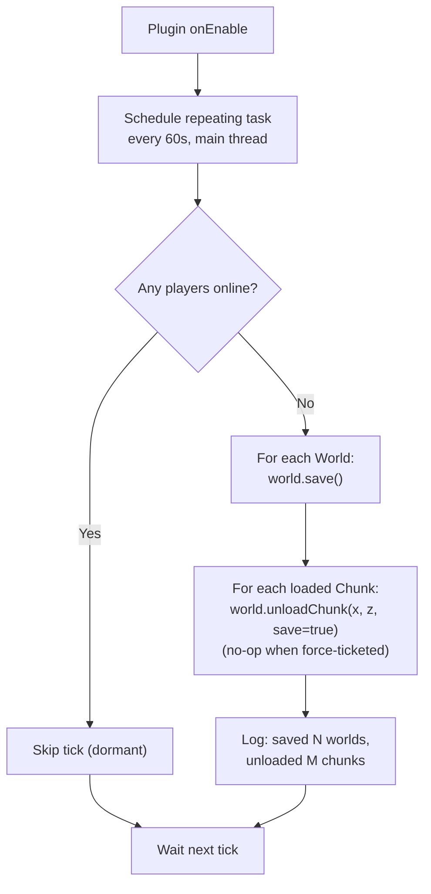
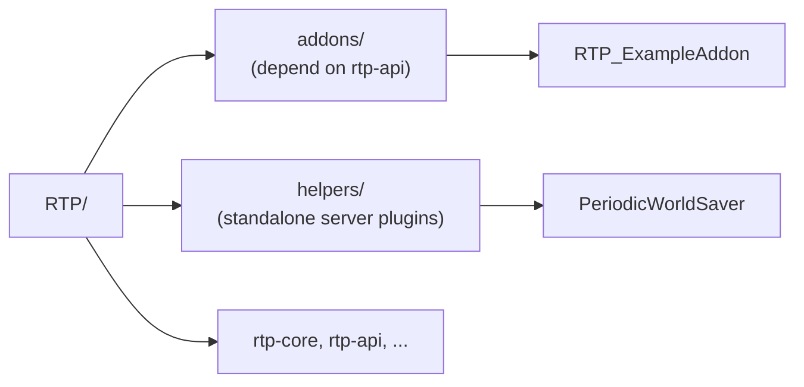

# PeriodicWorldSaver

A standalone Spigot helper plugin that keeps server RAM bounded during
unattended pre-generation runs (Chunky, WorldBorder fill, custom
generators — anything) and prevents shutdown from freezing on a giant
final save.

This plugin lives under [`helpers/`](..), **not** under `addons/`. It
does not depend on `rtp-api`, `rtp-core`, or any specific pre-generation
plugin — it is useful on any Spigot server.

---

## Why this exists

Empirically (Spigot 1.20.1 + Chunky, observed 2026-05-01 — see
[`docs/dev/LESSONS_LEARNED.md`](../../docs/dev/LESSONS_LEARNED.md)
*Pre-Generation & Shutdown*), Bukkit's built-in autosave
(`ticks-per.autosave` in `bukkit.yml`) **does not persist chunks
produced by Chunky** while the server is running. The `world/region/`
directory does not grow during multi-hour Chunky runs even with
`ticks-per.autosave` lowered from `6000` → `600`. Every restart, Chunky
begins from scratch as if the prior run produced nothing. `/stop`
freezes for minutes on the final flush — that flush is the first and
only attempt to persist the entire run, and it can't complete in time.

Most likely cause: Chunky's generated chunks either aren't flagged
dirty in the way Bukkit's autosave checks, or Chunky's own chunk
tickets keep them held so the "save on unload" path never fires. Either
way, the result is the same — chunks live and die in RAM unless
something forces a full `World.save()`.

**This plugin's primary job is the periodic `World.save()`.** Calling
`World.save()` directly bypasses the dirty-flag / unload-driven save
paths and writes everything resident to disk. After installing this
plugin, `region/` grows steadily during the Chunky run and `/stop`
returns promptly.

The accompanying `unloadChunk` sweep is **secondary**. It returns
`false` on essentially every Chunky-ticketed chunk and only catches the
small tail Chunky has already released. It is cheap and harmless, so
we keep it, but it is not what fixes the shutdown freeze.

---

## What it does

Once a minute, on the main thread:

1. If **any player is online** → no-op. (Unloading chunks near a player
   would cause visible chunk re-loads, and player-attended sessions are
   not the target workload.)
2. Otherwise:
   1. Call `World.save()` on every loaded world.
   2. Walk every loaded chunk and call `World.unloadChunk(x, z, true)`
      on it. The server keeps chunks held by force-tickets (spawn
      chunks, plugin tickets) loaded — `unloadChunk` is a no-op in that
      case, which is the intended behaviour.
   3. Log a one-line summary: worlds saved, chunks unloaded.

On `onDisable()` (i.e. `/stop`), one final save + sweep runs so a
manual shutdown mid-pregen still benefits.

The plugin is **pre-generator-agnostic**: it does not detect, depend on,
or coordinate with Chunky / WorldBorder / any other tool. Its single
trigger is "no players online".

### Hardcoded values

| Value | Reason |
|---|---|
| Scan cadence: 60 s | Long enough to amortise over a generator's I/O bursts; short enough that RAM never runs away for more than one minute. |
| "Players online" threshold: 0 | Per design assumption: pre-generation runs unattended. |
| Save mode on unload: `true` | Pairs with the preceding `World.save()`; the second pass is effectively free. |

There is **no `config.yml`**. To disable the helper, remove the JAR.

---

## Runtime model



---

## Directory placement



`helpers/` is reserved for standalone server-side utilities that:

- do **not** depend on `rtp-api` / `rtp-core`,
- are useful with or without RTP installed,
- have a lifecycle independent of RTP releases.

Mixing this plugin into `addons/` would broaden that directory's
contract from "RTP integrations" to "anything we ship". A separate
`helpers/` keeps each directory's contract crisp and gives future
helper plugins a stable home.

---

## Assumptions

This plugin is intentionally narrow. It is correct only when:

- **Pre-generation runs while the server is empty.** If admins AFK
  in-world during pre-gen, the sweep stays dormant and resident chunks
  accumulate as before. Log them off before pre-gen.
- **No other plugin treats arbitrary loaded chunks as durable state
  without a ticket.** Chunks held by force-tickets are preserved
  automatically; anything else is fair game.

If either assumption breaks, replace this helper with a configurable
build instead of bolting flags onto it.

---

## Folia / Paper / Fabric

- **Spigot, Paper**: supported.
- **Folia**: not supported. Folia's region threading model means the
  main-thread sweep here would throw `ThreadAccessException`. A Folia
  variant would need to use `RegionScheduler` per chunk and is out of
  scope for this helper. (See RTP's own Folia adapter for the patterns.)
- **Fabric**: not applicable — this is a Bukkit plugin.

---

## Build

From the repository root:

```powershell
.\gradlew :helpers:PeriodicWorldSaver:build
```

The JAR lands at
`helpers/PeriodicWorldSaver/build/libs/PeriodicWorldSaver-<version>.jar`.

Drop it into the server's `plugins/` directory. No configuration step.

---

## Operational guidance

1. Set `ticks-per.autosave: 600` in `bukkit.yml` (every 30 s) — keeps
   the dirty set small so each unload's `save = true` is cheap.
2. Make sure no players are logged in before starting your
   pre-generator (Chunky `/chunky start`, WorldBorder `/wb fill`,
   etc.).
3. Watch the server log for lines like
   `PeriodicWorldSaver: saved 3 worlds, unloaded 4128 chunks`.
   Steady-state RAM should plateau instead of climbing.
4. When pre-generation finishes, `/stop` should return promptly — the
   resident chunk set has been kept small the whole time.

---

## Non-goals

- Replacing or wrapping vanilla autosave.
- Tuning per world or per region.
- Detecting any specific pre-generator's progress (start / pause /
  finish events).
- Doing anything when players are online.

If you need any of the above, fork this plugin or open a discussion
before adding flags here. "No configuration" is the design.
